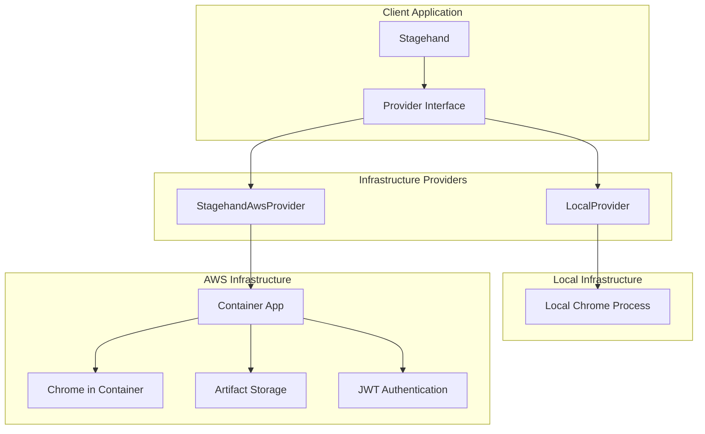
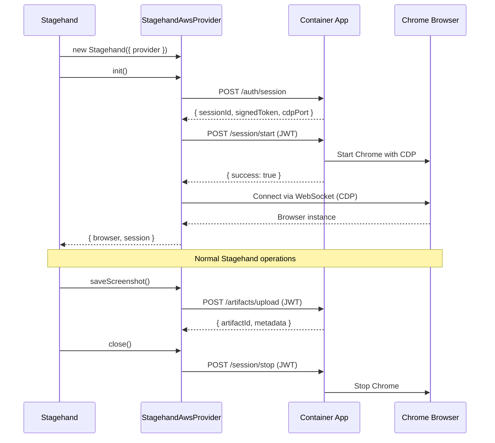

# WallCrawler

AI-powered browser automation framework built as a monorepo. WallCrawler extends Playwright with natural language commands via LLM integration, replacing fragile CSS selectors with AI-powered web interactions.

## 🏗️ Architecture Overview

WallCrawler uses a **provider-based architecture** that allows you to run browser automation on different infrastructure providers while maintaining the same API.



## 🚀 Quick Start

### Choose Your Infrastructure

**Local Development:**

```typescript
import { Stagehand } from '@wallcrawler/stagehand';
import { LocalProvider } from '@wallcrawler/infra/local';

const provider = new LocalProvider();
const stagehand = new Stagehand({ provider });
```

**AWS Production:**

```typescript
import { Stagehand } from '@wallcrawler/stagehand';
import { StagehandAwsProvider } from '@wallcrawler/infra/aws';

const provider = new StagehandAwsProvider({
  baseUrl: 'https://your-container-app.com',
  apiKey: 'your-api-key',
});
const stagehand = new Stagehand({ provider });
```

### Basic Usage

Once you have a provider, the API is identical across all infrastructures:

```typescript
await stagehand.init();
await stagehand.page.goto('https://example.com');

// AI-powered browser automation
await stagehand.page.act('Click the sign up button');
await stagehand.page.act('Type "john@example.com" in the email field');

// Extract structured data
const data = await stagehand.page.extract({
  instruction: 'Get the page title and description',
  schema: {
    title: 'string',
    description: 'string',
  },
});

// Take screenshots
const screenshot = await stagehand.saveScreenshot({
  name: 'signup-page.png',
  fullPage: true,
});

await stagehand.close();
```

## 📦 Monorepo Structure

```
packages/
├── stagehand/                    # Core AI browser automation library
├── demos/nextjs-local/          # Next.js demo application
├── infra/
│   ├── local/                   # Local development provider
│   ├── aws/                     # AWS cloud provider
│   └── common/                  # Shared infrastructure interfaces
└── deploy/
    └── aws-cdk/                 # AWS CDK deployment templates
        └── src/container-app/   # Container application for AWS
```

## 🔧 AWS Integration Deep Dive

### Container App Architecture

The AWS provider connects to a containerized application that manages browser sessions, providing a clean alternative to external browser services:



### Container App Endpoints

The container app provides a Browserbase-compatible API:

| Endpoint                  | Method | Purpose                          |
| ------------------------- | ------ | -------------------------------- |
| `/auth/session`           | POST   | Create signed session (JWT)      |
| `/session/start`          | POST   | Start browser session            |
| `/session/stop`           | POST   | Stop browser session             |
| `/session/info`           | GET    | Get session information          |
| `/artifacts/upload`       | POST   | Upload files (screenshots, etc.) |
| `/artifacts/list`         | GET    | List session artifacts           |
| `/artifacts/download/:id` | GET    | Download specific artifact       |
| `/health`                 | GET    | Health check                     |

### JWT Authentication Flow

WallCrawler uses a robust JWT authentication pattern:

1. **API Key Authentication**: Initial auth with your API key
2. **Signed Session Creation**: Get JWT token for browser session
3. **Session Token Usage**: Use JWT for all browser operations
4. **WebSocket Authentication**: JWT passed in WebSocket connection

### Artifact Management

Screenshots, downloads, and other files are managed through the artifact system:

```typescript
// Save a screenshot
const screenshot = await stagehand.saveScreenshot({
  name: 'page-capture.png',
  fullPage: true,
});

// List all artifacts for the session
const artifacts = await stagehand.getArtifacts();

// Download a specific artifact
const data = await stagehand.downloadArtifact(screenshot.id);
```

## 🛠️ Development Setup

### Prerequisites

- Node.js 18+
- pnpm 10.11.0+
- Docker (for AWS container development)
- At least one LLM provider (OpenAI, Anthropic, or Ollama)

### Installation

```bash
# Install dependencies
pnpm install

# Build all packages
pnpm build

# Install Playwright browsers
npx playwright install
```

### Environment Configuration

Create `.env.local` files with LLM provider credentials:

```bash
# OpenAI
OPENAI_API_KEY=sk-your-key
OPENAI_MODEL=gpt-4o

# Anthropic
ANTHROPIC_API_KEY=sk-ant-your-key
ANTHROPIC_MODEL=claude-3-5-sonnet-20241022

# AWS Provider
WALLCRAWLER_BASE_URL=http://localhost:8080
WALLCRAWLER_API_KEY=your-api-key
AWS_REGION=us-east-1
```

### Development Commands

```bash
# Root level commands
pnpm dev                 # Start all packages in development mode
pnpm build               # Build all packages
pnpm test                # Run tests across all packages
pnpm lint                # Run ESLint across all packages
pnpm typecheck           # TypeScript checking across packages

# Demo application
cd packages/demos/nextjs-local
pnpm dev                 # Start Next.js development server

# Container app (AWS)
cd packages/deploy/aws-cdk/src/container-app
npm start                # Start container application
```

## 🔄 Migration Guide

### From Local to AWS

**Before:**

```typescript
import { LocalProvider } from '@wallcrawler/infra/local';
const provider = new LocalProvider();
```

**After:**

```typescript
import { StagehandAwsProvider } from '@wallcrawler/infra/aws';
const provider = new StagehandAwsProvider({
  baseUrl: 'https://your-container-app.com',
  apiKey: 'your-api-key',
});
```

## 🧪 Testing

Run tests across all packages:

```bash
pnpm test                # All tests
pnpm test:unit          # Unit tests only
pnpm test:integration   # Integration tests only
```

Test specific providers:

```bash
# Test local provider
cd packages/infra/local && pnpm test

# Test AWS provider
cd packages/infra/aws && pnpm test

# Test core Stagehand
cd packages/stagehand && pnpm test
```

## 📊 Core Features

### AI-Powered Automation

- **act()**: Perform actions with natural language
- **extract()**: Extract structured data with Zod schemas
- **observe()**: Analyze page elements
- **agent()**: Autonomous multi-step tasks

### Infrastructure Flexibility

- **Local Provider**: Development with local Chrome
- **AWS Provider**: Production-ready containerized browsers
- **Plugin Architecture**: Easy to add new providers

### Production Features

- **JWT Authentication**: Secure session management
- **Artifact Management**: Screenshots, downloads, file storage
- **Session Resumption**: Continue existing browser sessions
- **Health Monitoring**: Built-in health checks and monitoring
- **Caching**: LLM response caching for performance

## 📚 Documentation

- [Stagehand Core API](./packages/stagehand/README.md)
- [AWS Provider Guide](./packages/infra/aws/README-stagehand.md)
- [Local Provider Guide](./packages/infra/local/README.md)
- [Demo Applications](./packages/demos/nextjs-local/README.md)
- [AWS Deployment](./packages/deploy/aws-cdk/README.md)

## 🤝 Contributing

1. Fork the repository
2. Create a feature branch
3. Make your changes
4. Add tests for new functionality
5. Run `pnpm lint && pnpm typecheck && pnpm test`
6. Submit a pull request

## 📄 License

MIT License - see [LICENSE](./LICENSE) for details.

## 🆘 Support

- **Issues**: [GitHub Issues](https://github.com/your-org/wallcrawler/issues)
- **Discussions**: [GitHub Discussions](https://github.com/your-org/wallcrawler/discussions)
- **Documentation**: Check package-specific READMEs
- **Examples**: See `packages/demos/` for working examples

---

Built with ❤️ by the WallCrawler team
