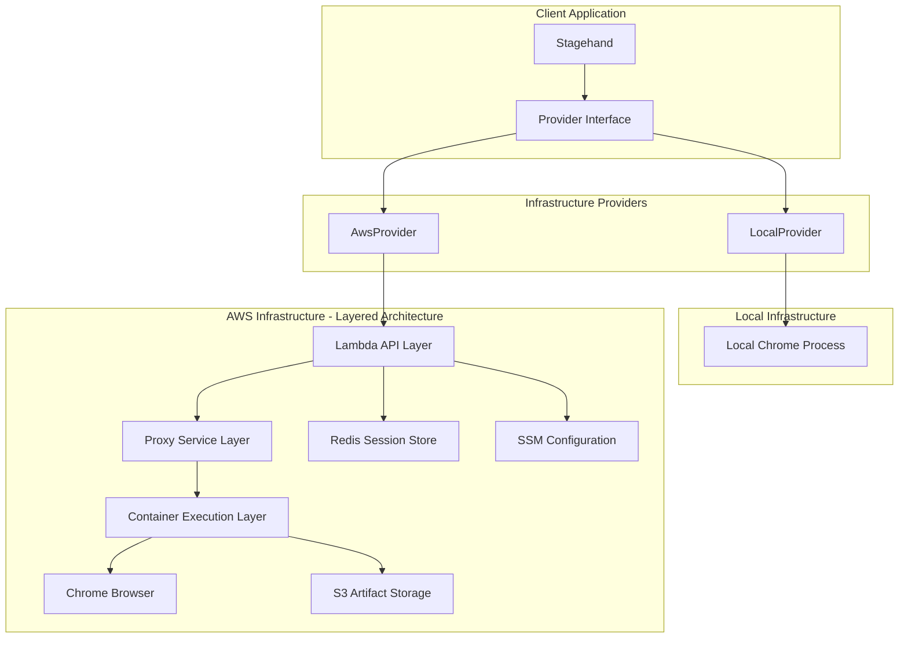
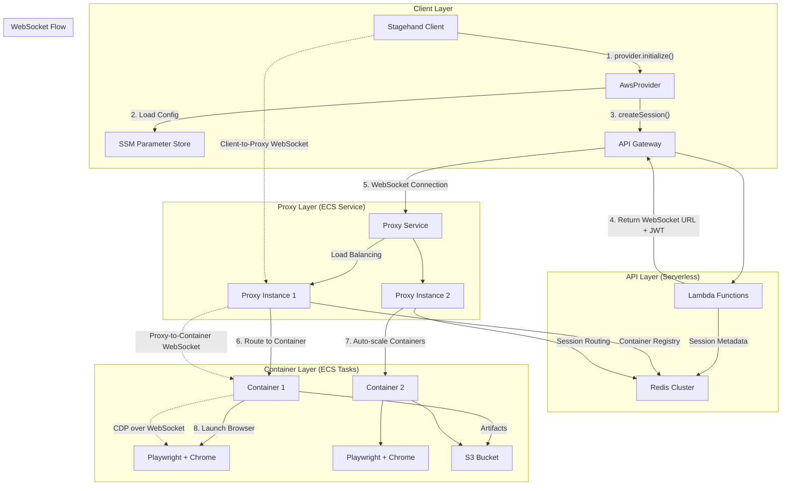
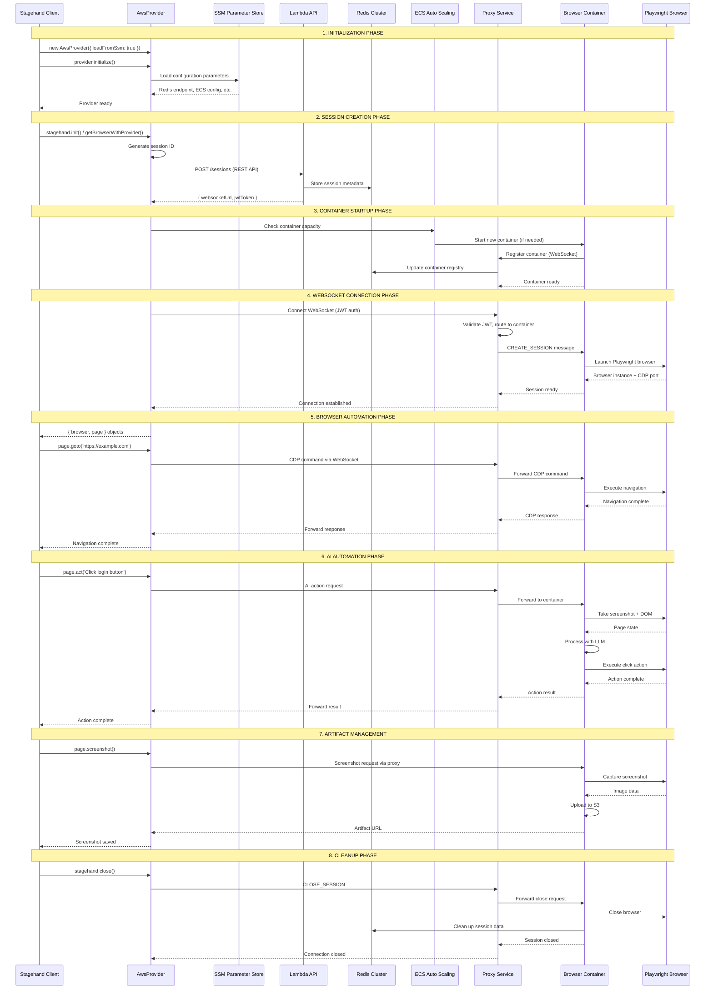
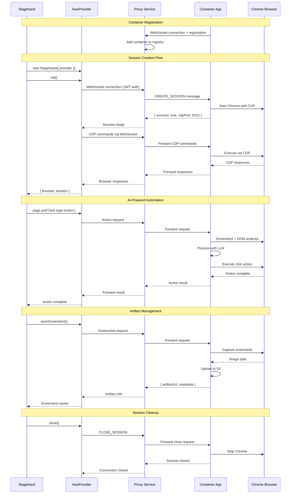

# WallCrawler

AI-powered browser automation framework built as a monorepo. WallCrawler extends Playwright with natural language commands via LLM integration, replacing fragile CSS selectors with AI-powered web interactions.

## 🏗️ Architecture Overview

WallCrawler uses a **provider-based architecture** that allows you to run browser automation on different infrastructure providers while maintaining the same API. The AWS provider implements a sophisticated multi-layer architecture with WebSocket proxying, distributed session management, and auto-scaling browser containers.

### High-Level Architecture



### AWS Provider Detailed Architecture

The AWS provider implements a three-layer architecture that provides scalability, security, and fault tolerance:



### Complete Initialization and Session Flow

This diagram shows the complete flow from `Stagehand.init()` to browser automation:



### Two-Hop WebSocket Architecture

WallCrawler implements a sophisticated two-hop WebSocket pattern for maximum scalability and security:

#### 1. Client-to-Proxy WebSocket (External)

- **Authentication**: JWT tokens with session validation
- **Load Balancing**: Distributes across multiple proxy instances
- **Security**: TLS encryption, API key validation
- **Session Routing**: Routes to appropriate container based on session ID

#### 2. Proxy-to-Container WebSocket (Internal)

- **Container Registry**: Established during container startup
- **Health Monitoring**: Automatic failover for unhealthy containers
- **Message Forwarding**: Transparent CDP command proxying
- **Auto-scaling Integration**: Triggers container scaling based on load

### Key Architectural Benefits

**Scalability**

- Containers auto-scale based on demand
- Load balancing across proxy instances
- Stateless session management via Redis

**Security**

- Multi-layer authentication (API key + JWT)
- Network isolation between client and containers
- Secure artifact storage with signed URLs

**Fault Tolerance**

- Health monitoring at all layers
- Automatic container recovery
- Session persistence across failures

**Performance**

- Redis-based session caching
- Connection pooling and reuse
- Parallel container execution

## 🚀 Quick Start

### Choose Your Infrastructure

**Local Development:**

```typescript
import { Stagehand } from '@wallcrawler/stagehand';
import { LocalProvider } from '@wallcrawler/infra/local';

const provider = new LocalProvider();
const stagehand = new Stagehand({ provider });
```

**AWS Production (Recommended - Automatic Configuration):**

```typescript
import { Stagehand } from '@wallcrawler/stagehand';
import { AwsProvider } from '@wallcrawler/infra/aws';

// Simple configuration - everything else loaded from SSM
const provider = new AwsProvider({
  region: 'us-east-1',
  apiKey: 'your-wallcrawler-api-key',
  loadFromSsm: true, // Automatically loads config from AWS Parameter Store
});

await provider.initialize(); // Must call before using
const stagehand = new Stagehand({ provider });
```

**AWS Production (Manual Configuration):**

```typescript
import { Stagehand } from '@wallcrawler/stagehand';
import { AwsProvider } from '@wallcrawler/infra/aws';

const provider = new AwsProvider({
  region: 'us-east-1',
  apiKey: 'your-api-key',
  ecsClusterName: 'your-cluster',
  ecsTaskDefinition: 'your-task-def',
  subnetIds: ['subnet-123', 'subnet-456'],
  securityGroupIds: ['sg-789'],
  redis: {
    endpoint: 'your-redis-cluster.cache.amazonaws.com',
  },
});

await provider.initialize();
const stagehand = new Stagehand({ provider });
```

### Basic Usage

Once you have a provider, the API is identical across all infrastructures:

```typescript
// Initialize AWS provider (required for AwsProvider)
if (provider.type === 'aws') {
  await provider.initialize();
}

await stagehand.init();
await stagehand.page.goto('https://example.com');

// AI-powered browser automation
await stagehand.page.act('Click the sign up button');
await stagehand.page.act('Type "john@example.com" in the email field');

// Extract structured data
const data = await stagehand.page.extract({
  instruction: 'Get the page title and description',
  schema: {
    title: 'string',
    description: 'string',
  },
});

// Take screenshots
const screenshot = await stagehand.saveScreenshot({
  name: 'signup-page.png',
  fullPage: true,
});

await stagehand.close();
```

### Advanced Usage

For direct provider control (e.g., managing infrastructure tasks):

```typescript
// Advanced: Direct provider access for custom workflows
const taskInfo = await provider.startAutomationTask({
  sessionId: 'session-123',
  userId: 'user-456',
  environment: 'dev',
  region: 'us-east-1',
});
```

## 📦 Monorepo Structure

```
packages/
├── stagehand/                    # Core AI browser automation library
├── demos/nextjs-local/          # Next.js demo application
├── infra/
│   ├── local/                   # Local development provider
│   ├── aws/                     # AWS cloud provider
│   └── common/                  # Shared infrastructure interfaces
└── deploy/
    └── aws-cdk/                 # AWS CDK deployment templates
        ├── src/lambda/          # Serverless API functions
        ├── src/proxy-service/   # WebSocket proxy service
        └── src/container-app/   # Browser container application
```

## 🔧 AWS Integration Deep Dive

### Component Responsibilities

#### 1. Lambda API Layer (Serverless)

- **Session Management**: Create/validate sessions via REST API
- **Authentication**: Validate API keys and generate JWT tokens
- **Configuration**: Load infrastructure config from SSM
- **Metadata Storage**: Store session metadata in Redis

#### 2. Proxy Service Layer (ECS Service)

- **WebSocket Routing**: Route client connections to containers
- **Load Balancing**: Distribute sessions across available containers
- **Container Registry**: Track healthy container instances
- **Message Forwarding**: Proxy CDP commands between client and containers

#### 3. Container Application Layer (ECS Tasks)

- **Browser Management**: Launch and manage Playwright browsers
- **CDP Handling**: Process Chrome DevTools Protocol commands
- **Artifact Storage**: Upload screenshots and files to S3
- **Session Lifecycle**: Handle session creation, management, and cleanup

### Container App Architecture

The container app provides a production-ready browser automation environment:



### WebSocket Message Protocol

The proxy service handles different message types for session management:

```typescript
// Session creation
{
  type: 'CREATE_SESSION',
  sessionId: 'session-123',
  userMetadata: { userId: 'user-456' }
}

// CDP command forwarding
{
  type: 'CDP_COMMAND',
  method: 'Runtime.evaluate',
  params: { expression: 'document.title' }
}

// AI action requests
{
  type: 'AI_ACTION',
  action: 'act',
  instruction: 'Click the login button',
  options: { waitFor: 'networkidle' }
}

// Session cleanup
{
  type: 'CLOSE_SESSION',
  sessionId: 'session-123'
}
```

### AWS Infrastructure Components

#### Lambda Functions

- **create-session.ts**: Handle session creation and JWT generation
- **get-session.ts**: Retrieve session information and status
- **list-sessions.ts**: List active sessions for monitoring

#### Proxy Service Features

- **Multi-container routing**: Route sessions to least loaded containers
- **Health monitoring**: Detect and handle container failures
- **Connection pooling**: Reuse WebSocket connections efficiently
- **Auto-scaling integration**: Trigger container scaling based on queue depth

#### Container Application Endpoints

| Endpoint           | Method | Purpose                     |
| ------------------ | ------ | --------------------------- |
| `/health`          | GET    | Container health check      |
| Internal WebSocket | -      | Receive commands from proxy |
| Chrome CDP         | -      | Communicate with browser    |

### JWT Authentication Flow

WallCrawler uses a robust JWT authentication pattern:

1. **API Key Authentication**: Initial auth with your API key via Lambda
2. **Signed Session Creation**: Lambda generates JWT token for WebSocket session
3. **WebSocket Authentication**: JWT passed in WebSocket connection headers
4. **Session Validation**: Proxy validates JWT and routes to appropriate container

### Configuration Management

#### SSM Parameter Store Integration

When using `loadFromSsm: true`, the provider automatically loads configuration from AWS Systems Manager:

| Parameter Path                                             | Description                 |
| ---------------------------------------------------------- | --------------------------- |
| `/{projectName}/{environment}/redis-endpoint`              | ElastiCache Redis endpoint  |
| `/{projectName}/{environment}/ecs-cluster-name`            | ECS cluster name            |
| `/{projectName}/{environment}/ecs-browser-task-definition` | Browser task definition ARN |
| `/{projectName}/{environment}/vpc-private-subnet-ids`      | JSON array of subnet IDs    |
| `/{projectName}/{environment}/container-security-group-id` | Security group ID           |
| `/{projectName}/{environment}/s3-bucket-name`              | S3 bucket name              |

### Artifact Management

Screenshots, downloads, and other files are managed through the S3-integrated artifact system:

```typescript
// Save a screenshot
const screenshot = await stagehand.saveScreenshot({
  name: 'page-capture.png',
  fullPage: true,
});

// List all artifacts for the session
const artifacts = await stagehand.getArtifacts();

// Download a specific artifact
const data = await stagehand.downloadArtifact(screenshot.id);
```

## 🛠️ Development Setup

### Prerequisites

- Node.js 18+
- pnpm 10.11.0+
- Docker (for AWS container development)
- At least one LLM provider (OpenAI, Anthropic, or Ollama)

### Installation

```bash
# Install dependencies
pnpm install

# Build all packages
pnpm build

# Install Playwright browsers
npx playwright install
```

### Environment Configuration

Create `.env.local` files with LLM provider credentials:

```bash
# OpenAI
OPENAI_API_KEY=sk-your-key
OPENAI_MODEL=gpt-4o

# Anthropic
ANTHROPIC_API_KEY=sk-ant-your-key
ANTHROPIC_MODEL=claude-3-5-sonnet-20241022

# AWS Provider
WALLCRAWLER_API_KEY=your-api-key
AWS_REGION=us-east-1
```

### Development Commands

```bash
# Root level commands
pnpm dev                 # Start all packages in development mode
pnpm build               # Build all packages
pnpm test                # Run tests across all packages
pnpm lint                # Run ESLint across all packages
pnpm typecheck           # TypeScript checking across packages

# Demo application
cd packages/demos/nextjs-local
pnpm dev                 # Start Next.js development server

# Container app (AWS)
cd packages/deploy/aws-cdk/src/container-app
npm start                # Start container application

# Proxy service (AWS)
cd packages/deploy/aws-cdk/src/proxy-service
npm start                # Start proxy service
```

## 🔄 Migration Guide

### From Local to AWS

**Before:**

```typescript
import { LocalProvider } from '@wallcrawler/infra/local';
const provider = new LocalProvider();
```

**After:**

```typescript
import { AwsProvider } from '@wallcrawler/infra/aws';
const provider = new AwsProvider({
  region: 'us-east-1',
  apiKey: 'your-api-key',
  loadFromSsm: true, // Load config automatically
});
await provider.initialize(); // Required for AWS
```

### Runtime Considerations

**Bun Compatibility**: Stagehand core checks for Bun runtime and throws an error since Playwright doesn't support Bun. However, this only affects client code - AWS containers should use Node.js runtime for proper Playwright support.

**Container Runtime**: Ensure your AWS containers use Node.js, not Bun, even if your client application uses Bun for other purposes.

## 🧪 Testing

Run tests across all packages:

```bash
pnpm test                # All tests
pnpm test:unit          # Unit tests only
pnpm test:integration   # Integration tests only
```

Test specific providers:

```bash
# Test local provider
cd packages/infra/local && pnpm test

# Test AWS provider
cd packages/infra/aws && pnpm test

# Test core Stagehand
cd packages/stagehand && pnpm test
```

## 📊 Core Features

### AI-Powered Automation

- **act()**: Perform actions with natural language
- **extract()**: Extract structured data with Zod schemas
- **observe()**: Analyze page elements
- **agent()**: Autonomous multi-step tasks

### Infrastructure Flexibility

- **Local Provider**: Development with local Chrome
- **AWS Provider**: Production-ready containerized browsers
- **Plugin Architecture**: Easy to add new providers

### Production Features

- **JWT Authentication**: Secure session management
- **Artifact Management**: Screenshots, downloads, file storage
- **Session Resumption**: Continue existing browser sessions
- **Health Monitoring**: Built-in health checks and monitoring
- **Auto-scaling**: Dynamic container scaling based on demand
- **Load Balancing**: WebSocket connection distribution
- **Fault Tolerance**: Automatic recovery and failover

## 📚 Documentation

- [Stagehand Core API](./packages/stagehand/README.md)
- [AWS Provider Guide](./packages/infra/aws/README.md)
- [Local Provider Guide](./packages/infra/local/README.md)
- [Demo Applications](./packages/demos/nextjs-local/README.md)
- [AWS Deployment](./packages/deploy/aws-cdk/README.md)

## 🤝 Contributing

1. Fork the repository
2. Create a feature branch
3. Make your changes
4. Add tests for new functionality
5. Run `pnpm lint && pnpm typecheck && pnpm test`
6. Submit a pull request

## 📄 License

MIT License - see [LICENSE](./LICENSE) for details.

## 🆘 Support

- **Issues**: [GitHub Issues](https://github.com/your-org/wallcrawler/issues)
- **Discussions**: [GitHub Discussions](https://github.com/your-org/wallcrawler/discussions)
- **Documentation**: Check package-specific READMEs
- **Examples**: See `packages/demos/` for working examples

---

Built with ❤️ by the WallCrawler team
