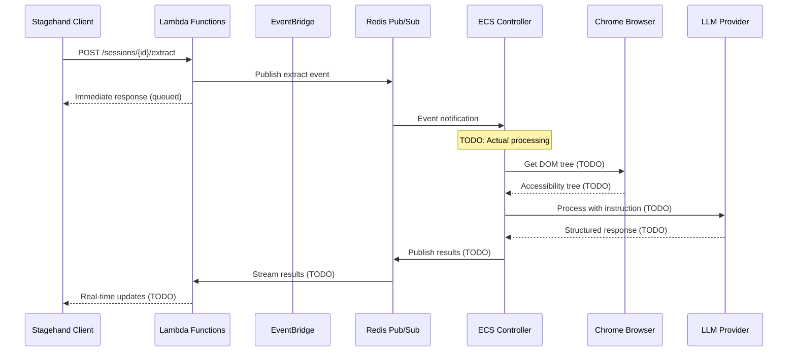

# API Mode Implementation Guide

## Overview

This document outlines the remaining implementation work to complete Wallcrawler's **API Mode**, where Lambda functions serve as API endpoints and the ECS controller performs actual DOM processing and LLM interactions. This approach provides full Stagehand compatibility while maintaining centralized browser control.

## Current Implementation Status

### ✅ **Completed Components**

| Component                      | Status   | Description                                                |
| ------------------------------ | -------- | ---------------------------------------------------------- |
| **API Endpoints**              | Complete | All Stagehand-compatible Lambda functions implemented      |
| **EventBridge Architecture**   | Complete | Async session lifecycle with retry logic                   |
| **Session Management**         | Complete | Enhanced state with audit trails and lifecycle tracking    |
| **ECS Browser Infrastructure** | Complete | Chrome with CDP access, frame capture, WebSocket streaming |
| **Basic Event Handling**       | Complete | Placeholder handlers for LLM operations                    |

### 🚧 **In Progress / Missing Components**

| Component                         | Status  | Priority | Description                                          |
| --------------------------------- | ------- | -------- | ---------------------------------------------------- |
| **Accessibility Tree Extraction** | Missing | High     | CDP-based DOM tree extraction and processing         |
| **LLM Client Integration**        | Missing | High     | OpenAI/Anthropic clients with structured responses   |
| **Element Resolution**            | Missing | High     | XPath mapping and element selector generation        |
| **Action Execution Engine**       | Missing | High     | CDP command execution for browser actions            |
| **Streaming Result Handling**     | Missing | Medium   | Real-time result streaming back to Lambda functions  |
| **Error Handling & Retry**        | Missing | Medium   | Robust error handling for LLM and browser operations |
| **Multi-step Agent Workflows**    | Missing | Low      | Complex autonomous agent execution                   |

## Architecture Overview

### Current API Mode Flow



## Required Implementation Work

## 1. Accessibility Tree Extraction

### **Current State**

```go
// ECS controller has placeholder handlers
func (c *Controller) handleExtractRequest(ctx context.Context, event map[string]interface{}) {
    // TODO: Implement actual extraction logic
    result := map[string]interface{}{
        "success": true,
        "data": map[string]interface{}{
            "extracted": "Sample data - implement actual LLM processing",
        },
    }
    c.publishResult(ctx, "extract_result", result)
}
```

### **Required Implementation**

```go
// Add CDP accessibility tree extraction
func (c *Controller) getAccessibilityTree(ctx context.Context, selector string) (*AccessibilityTree, error) {
    // 1. Enable CDP Accessibility domain
    // 2. Call Accessibility.getFullAXTree
    // 3. Build hierarchical tree structure
    // 4. Generate XPath mappings
    // 5. Filter by selector if provided
    // 6. Return structured tree for LLM processing
}

type AccessibilityTree struct {
    Nodes       []AccessibilityNode `json:"nodes"`
    XPathMap    map[string]string   `json:"xpathMap"`
    SimplifiedTree string           `json:"simplifiedTree"`
}

type AccessibilityNode struct {
    NodeID      string            `json:"nodeId"`
    Role        string            `json:"role"`
    Name        string            `json:"name,omitempty"`
    Description string            `json:"description,omitempty"`
    Value       string            `json:"value,omitempty"`
    Children    []string          `json:"children,omitempty"`
    Properties  map[string]interface{} `json:"properties,omitempty"`
}
```

### **Technical Requirements**

- **CDP Integration**: Use `chromedp` or raw CDP client for `Accessibility.getFullAXTree`
- **Tree Processing**: Build hierarchical structure similar to Stagehand's approach
- **XPath Generation**: Create reliable element selectors for action execution
- **Performance**: Cache tree data for multiple operations on same page state

## 2. LLM Client Integration

### **Current State**

```go
// No LLM integration - placeholder responses only
```

### **Required Implementation**

```go
// Add LLM client interface and implementations
type LLMClient interface {
    CreateChatCompletion(ctx context.Context, req *ChatCompletionRequest) (*ChatCompletionResponse, error)
    GetModelName() string
    GetProvider() string
}

type ChatCompletionRequest struct {
    Messages      []ChatMessage   `json:"messages"`
    ResponseModel interface{}     `json:"response_model,omitempty"`
    Temperature   float64         `json:"temperature,omitempty"`
    MaxTokens     int             `json:"max_tokens,omitempty"`
}

type ChatMessage struct {
    Role    string `json:"role"`    // "system", "user", "assistant"
    Content string `json:"content"`
}

// OpenAI implementation
type OpenAIClient struct {
    client    *openai.Client
    modelName string
}

// Anthropic implementation
type AnthropicClient struct {
    client    *anthropic.Client
    modelName string
}
```

### **Integration Points**

- **Model Configuration**: Use session's `ModelConfig` for API keys and model selection
- **Structured Responses**: Support Zod-like schema validation for structured LLM outputs
- **Error Handling**: Robust retry logic for LLM API failures
- **Token Tracking**: Monitor usage for billing and rate limiting

## 3. Element Resolution & Action Execution

### **Current State**

```go
// Placeholder action execution
func (c *Controller) handleActRequest(ctx context.Context, event map[string]interface{}) {
    // TODO: Implement actual action execution logic
}
```

### **Required Implementation**

```go
// Element resolution from LLM responses
func (c *Controller) resolveElement(elementID string, xpathMap map[string]string) (*ResolvedElement, error) {
    // 1. Look up XPath from element ID
    // 2. Validate element still exists in DOM
    // 3. Get element bounding box and properties
    // 4. Return actionable element reference
}

// Action execution engine
func (c *Controller) executeAction(ctx context.Context, action *BrowserAction) (*ActionResult, error) {
    switch action.Method {
    case "click":
        return c.executeClick(ctx, action.Selector, action.Arguments)
    case "fill":
        return c.executeFill(ctx, action.Selector, action.Arguments)
    case "select":
        return c.executeSelect(ctx, action.Selector, action.Arguments)
    case "scroll":
        return c.executeScroll(ctx, action.Selector, action.Arguments)
    default:
        return nil, fmt.Errorf("unsupported action: %s", action.Method)
    }
}

type BrowserAction struct {
    Method    string   `json:"method"`    // "click", "fill", "select", etc.
    Selector  string   `json:"selector"`  // XPath or CSS selector
    Arguments []string `json:"arguments"` // Action-specific parameters
}

type ActionResult struct {
    Success   bool   `json:"success"`
    Message   string `json:"message,omitempty"`
    Error     string `json:"error,omitempty"`
    ExecutionTime int64 `json:"executionTime"` // milliseconds
}
```

### **CDP Action Mapping**

| Stagehand Action | CDP Commands                                  | Parameters          |
| ---------------- | --------------------------------------------- | ------------------- |
| `click`          | `Runtime.callFunctionOn` → `click()`          | Element coordinates |
| `fill`           | `Input.insertText`                            | Text value          |
| `select`         | `Runtime.callFunctionOn` → `select()`         | Option value        |
| `scroll`         | `Runtime.callFunctionOn` → `scrollIntoView()` | Scroll options      |
| `hover`          | `Input.dispatchMouseEvent`                    | Mouse coordinates   |
| `key`            | `Input.dispatchKeyEvent`                      | Key code            |

## 4. Operation-Specific Implementations

### **Extract Operation**

```go
func (c *Controller) handleExtractRequest(ctx context.Context, event map[string]interface{}) {
    // 1. Parse extract parameters
    instruction := event["instruction"].(string)
    schema := event["schemaDefinition"] // JSON Schema from Lambda
    selector := event["selector"].(string)

    // 2. Get accessibility tree
    tree, err := c.getAccessibilityTree(ctx, selector)
    if err != nil {
        c.publishError(ctx, "extract_error", err)
        return
    }

    // 3. Build LLM prompt
    prompt := c.buildExtractPrompt(instruction, tree.SimplifiedTree, schema)

    // 4. Send to LLM
    llmResponse, err := c.llmClient.CreateChatCompletion(ctx, &ChatCompletionRequest{
        Messages: prompt,
        ResponseModel: schema,
    })
    if err != nil {
        c.publishError(ctx, "extract_error", err)
        return
    }

    // 5. Parse and validate response
    extractedData, err := c.parseExtractResponse(llmResponse)
    if err != nil {
        c.publishError(ctx, "extract_error", err)
        return
    }

    // 6. Return results
    result := map[string]interface{}{
        "success": true,
        "data": extractedData,
    }
    c.publishResult(ctx, "extract_result", result)
}
```

### **Observe Operation**

```go
func (c *Controller) handleObserveRequest(ctx context.Context, event map[string]interface{}) {
    // 1. Parse observe parameters
    instruction := event["instruction"].(string)
    returnAction := event["returnAction"].(bool)

    // 2. Get accessibility tree
    tree, err := c.getAccessibilityTree(ctx, "")
    if err != nil {
        c.publishError(ctx, "observe_error", err)
        return
    }

    // 3. Build LLM prompt for element identification
    prompt := c.buildObservePrompt(instruction, tree.SimplifiedTree, returnAction)

    // 4. Send to LLM
    observeSchema := c.getObserveSchema(returnAction)
    llmResponse, err := c.llmClient.CreateChatCompletion(ctx, &ChatCompletionRequest{
        Messages: prompt,
        ResponseModel: observeSchema,
    })
    if err != nil {
        c.publishError(ctx, "observe_error", err)
        return
    }

    // 5. Parse LLM response and resolve elements
    elements, err := c.parseObserveResponse(llmResponse, tree.XPathMap)
    if err != nil {
        c.publishError(ctx, "observe_error", err)
        return
    }

    // 6. Return actionable elements
    result := map[string]interface{}{
        "success": true,
        "elements": elements,
    }
    c.publishResult(ctx, "observe_result", result)
}
```

### **Act Operation**

```go
func (c *Controller) handleActRequest(ctx context.Context, event map[string]interface{}) {
    // 1. Parse action parameters
    actionInstruction := event["action"].(string)
    variables := event["variables"].(map[string]string)

    // 2. First observe to find elements
    observeResult, err := c.performObserve(ctx, actionInstruction, true)
    if err != nil {
        c.publishError(ctx, "act_error", err)
        return
    }

    if len(observeResult.Elements) == 0 {
        c.publishError(ctx, "act_error", fmt.Errorf("no elements found for action: %s", actionInstruction))
        return
    }

    // 3. Execute action on first element
    element := observeResult.Elements[0]

    // Apply variable substitution
    for key, value := range variables {
        for i, arg := range element.Arguments {
            element.Arguments[i] = strings.ReplaceAll(arg, "%"+key+"%", value)
        }
    }

    // 4. Execute the action
    actionResult, err := c.executeAction(ctx, &BrowserAction{
        Method:    element.Method,
        Selector:  element.Selector,
        Arguments: element.Arguments,
    })
    if err != nil {
        c.publishError(ctx, "act_error", err)
        return
    }

    // 5. Return execution result
    result := map[string]interface{}{
        "success": actionResult.Success,
        "message": actionResult.Message,
        "action":  actionInstruction,
    }
    c.publishResult(ctx, "act_result", result)
}
```

### **Navigate Operation**

```go
func (c *Controller) handleNavigateRequest(ctx context.Context, event map[string]interface{}) {
    // 1. Parse navigation parameters
    url := event["url"].(string)
    options := event["options"].(map[string]interface{})

    // 2. Validate URL
    if !c.isValidURL(url) {
        c.publishError(ctx, "navigate_error", fmt.Errorf("invalid URL: %s", url))
        return
    }

    // 3. Execute navigation via CDP
    navigationResult, err := c.navigateToURL(ctx, url, options)
    if err != nil {
        c.publishError(ctx, "navigate_error", err)
        return
    }

    // 4. Wait for page load
    if err := c.waitForPageLoad(ctx, options); err != nil {
        c.publishError(ctx, "navigate_error", err)
        return
    }

    // 5. Return navigation result
    result := map[string]interface{}{
        "success":    true,
        "url":        url,
        "finalUrl":   navigationResult.FinalURL,
        "statusCode": navigationResult.StatusCode,
    }
    c.publishResult(ctx, "navigate_result", result)
}
```

### **Agent Execute Operation**

```go
func (c *Controller) handleAgentExecuteRequest(ctx context.Context, event map[string]interface{}) {
    // 1. Parse agent parameters
    agentConfig := event["agentConfig"].(map[string]interface{})
    executeOptions := event["executeOptions"].(map[string]interface{})

    // 2. Initialize agent execution state
    maxSteps := executeOptions["maxSteps"].(int)
    if maxSteps == 0 {
        maxSteps = 10
    }

    instruction := executeOptions["instruction"].(string)
    actions := []map[string]interface{}{}

    // 3. Multi-step execution loop
    for step := 0; step < maxSteps; step++ {
        // a. Observe current page state
        observeResult, err := c.performObserve(ctx, instruction, true)
        if err != nil {
            break
        }

        // b. Plan next action with LLM
        nextAction, completed, err := c.planNextAction(ctx, instruction, observeResult, actions)
        if err != nil || completed {
            break
        }

        // c. Execute planned action
        actionResult, err := c.executeAction(ctx, nextAction)
        if err != nil {
            break
        }

        // d. Record action
        actions = append(actions, map[string]interface{}{
            "type":      nextAction.Method,
            "selector":  nextAction.Selector,
            "arguments": nextAction.Arguments,
            "result":    actionResult,
        })

        // e. Stream progress update
        c.publishProgress(ctx, "agent_progress", map[string]interface{}{
            "step":      step + 1,
            "maxSteps":  maxSteps,
            "action":    nextAction,
            "completed": false,
        })
    }

    // 4. Return final result
    result := map[string]interface{}{
        "success":   true,
        "message":   "Agent workflow completed",
        "actions":   actions,
        "completed": len(actions) > 0,
    }
    c.publishResult(ctx, "agent_result", result)
}
```

## 5. Result Streaming & Real-time Updates

### **Current State**

```go
// Lambda functions return immediate placeholder responses
```

### **Required Implementation**

```go
// Enhanced Lambda functions to subscribe to results
func processExtractRequestStreaming(ctx context.Context, sessionID string, req *types.ExtractRequest, sessionState *types.SessionState) string {
    var streamingResponse strings.Builder

    // 1. Publish extract event to ECS controller
    extractEvent := map[string]interface{}{
        "sessionId":        sessionID,
        "instruction":      req.Instruction,
        "schemaDefinition": req.SchemaDefinition,
        "selector":         req.Selector,
        "iframes":          req.Iframes,
        "domSettle":        req.DOMSettleTimeoutMs,
        "modelName":        req.ModelName,
    }

    if err := utils.PublishEvent(ctx, sessionID, "ExtractRequest", extractEvent); err != nil {
        streamingResponse.WriteString(utils.SendSystemEvent("error", nil, "Failed to queue extraction: "+err.Error()))
        return streamingResponse.String()
    }

    // 2. Subscribe to results channel
    rdb := utils.GetRedisClient()
    resultChannel := fmt.Sprintf("session:%s:results", sessionID)
    pubsub := rdb.Subscribe(ctx, resultChannel)
    defer pubsub.Close()

    // 3. Stream initial progress
    streamingResponse.WriteString(utils.SendLogEvent("info", "Extraction queued for execution"))
    streamingResponse.WriteString(utils.SendLogEvent("info", "Getting accessibility tree..."))

    // 4. Wait for results with timeout
    timeout := time.After(30 * time.Second)
    for {
        select {
        case <-timeout:
            streamingResponse.WriteString(utils.SendSystemEvent("error", nil, "Extraction timed out"))
            return streamingResponse.String()

        default:
            msg, err := pubsub.ReceiveMessage(ctx)
            if err != nil {
                continue
            }

            var resultData map[string]interface{}
            if err := json.Unmarshal([]byte(msg.Payload), &resultData); err != nil {
                continue
            }

            // 5. Filter results for this operation
            if resultData["type"] == "extract_result" {
                result := resultData["result"]
                streamingResponse.WriteString(utils.SendLogEvent("info", "Extraction completed successfully"))
                streamingResponse.WriteString(utils.SendSystemEvent("finished", result, ""))
                return streamingResponse.String()
            } else if resultData["type"] == "extract_error" {
                streamingResponse.WriteString(utils.SendSystemEvent("error", nil, resultData["error"].(string)))
                return streamingResponse.String()
            }
        }
    }
}
```

## 6. Error Handling & Resilience

### **Required Error Handling Patterns**

```go
// Comprehensive error handling in ECS controller
func (c *Controller) handleExtractRequest(ctx context.Context, event map[string]interface{}) {
    defer func() {
        if r := recover(); r != nil {
            c.publishError(ctx, "extract_error", fmt.Errorf("panic during extraction: %v", r))
        }
    }()

    // Timeout handling
    extractCtx, cancel := context.WithTimeout(ctx, 30*time.Second)
    defer cancel()

    // Retry logic for LLM requests
    var llmResponse *ChatCompletionResponse
    var err error
    for attempts := 0; attempts < 3; attempts++ {
        llmResponse, err = c.llmClient.CreateChatCompletion(extractCtx, request)
        if err == nil {
            break
        }

        if attempts < 2 {
            time.Sleep(time.Duration(attempts+1) * time.Second)
            c.publishProgress(ctx, "extract_progress", fmt.Sprintf("Retrying LLM request (attempt %d/3)", attempts+2))
        }
    }

    if err != nil {
        c.publishError(ctx, "extract_error", fmt.Errorf("LLM request failed after 3 attempts: %v", err))
        return
    }

    // Validation of LLM responses
    if !c.validateExtractResponse(llmResponse) {
        c.publishError(ctx, "extract_error", fmt.Errorf("invalid LLM response format"))
        return
    }
}
```

## 7. Testing Strategy

### **Unit Testing**

```go
// Test individual components
func TestAccessibilityTreeExtraction(t *testing.T) {
    // Test CDP accessibility tree extraction
}

func TestLLMClientIntegration(t *testing.T) {
    // Test LLM client with mock responses
}

func TestActionExecution(t *testing.T) {
    // Test CDP action execution
}
```

### **Integration Testing**

```go
// Test complete workflows
func TestExtractWorkflow(t *testing.T) {
    // 1. Set up test Chrome instance
    // 2. Load test page
    // 3. Trigger extract operation
    // 4. Verify LLM processing
    // 5. Validate results
}

func TestObserveActWorkflow(t *testing.T) {
    // Test observe → act sequence
}
```

### **End-to-End Testing**

- **Stagehand Compatibility**: Run existing Stagehand tests against Wallcrawler API
- **Performance Testing**: Measure latency and throughput
- **Load Testing**: Concurrent session handling
- **Error Scenarios**: Network failures, invalid inputs, timeout handling

## 8. Deployment Considerations

### **ECS Container Updates**

```dockerfile
# Add LLM client dependencies
FROM golang:1.21-alpine AS builder
RUN apk add --no-cache git
COPY go.mod go.sum ./
RUN go mod download

# Add LLM client libraries
RUN go get github.com/sashabaranov/go-openai
RUN go get github.com/anthropics/anthropic-sdk-go

# Build with LLM processing
COPY . .
RUN go build -o ecs-controller cmd/ecs-controller/main.go
```

### **Environment Variables**

```bash
# Add to ECS task definition
OPENAI_API_KEY=sk-...
ANTHROPIC_API_KEY=...
LLM_TIMEOUT_SECONDS=30
MAX_RETRY_ATTEMPTS=3
```

### **Resource Requirements**

| Component   | Current       | With LLM Processing | Reason                     |
| ----------- | ------------- | ------------------- | -------------------------- |
| **CPU**     | 1024 (1 vCPU) | 1024-2048           | LLM processing overhead    |
| **Memory**  | 2048 MB       | 3072-4096 MB        | Accessibility tree caching |
| **Network** | Standard      | Enhanced            | LLM API calls              |

## 9. Monitoring & Observability

### **Key Metrics**

- **LLM Request Latency**: Time for LLM API calls
- **Accessibility Tree Generation Time**: DOM processing performance
- **Action Execution Success Rate**: Browser automation reliability
- **End-to-End Operation Time**: Total time from Lambda to result
- **Error Rates**: By operation type and error category

### **Logging Strategy**

```go
// Structured logging for operations
log.Printf("Operation started: type=%s, sessionId=%s, requestId=%s",
    operationType, sessionID, requestID)

// LLM interaction logging
log.Printf("LLM request: provider=%s, model=%s, tokens=%d, latency=%dms",
    provider, model, tokenCount, latencyMs)

// Action execution logging
log.Printf("Action executed: method=%s, selector=%s, success=%t, latency=%dms",
    action.Method, action.Selector, result.Success, latencyMs)
```

## 10. Performance Optimization

### **Caching Strategies**

- **Accessibility Tree Caching**: Cache DOM tree between operations on same page
- **LLM Response Caching**: Cache similar prompts (with user consent)
- **Element Resolution Caching**: Cache XPath lookups

### **Parallel Processing**

- **Concurrent Operations**: Process multiple non-conflicting operations simultaneously
- **Background Tree Updates**: Refresh accessibility tree in background
- **Async Result Publishing**: Non-blocking result streaming

### **Resource Management**

- **Connection Pooling**: Reuse LLM client connections
- **Memory Management**: Cleanup large DOM trees after operations
- **CPU Optimization**: Efficient tree processing algorithms

## Conclusion

This implementation plan provides a roadmap for completing Wallcrawler's API Mode with full Stagehand compatibility. The work builds incrementally from basic CDP integration to advanced LLM processing, ensuring a robust and scalable browser automation platform.

The modular approach allows for:

- **Incremental Development**: Implement and test components independently
- **Performance Optimization**: Fine-tune each component for optimal performance
- **Extensibility**: Easy addition of new operations and LLM providers
- **Maintainability**: Clear separation of concerns and comprehensive testing

Once completed, Wallcrawler will provide enterprise-grade browser automation with the reliability of EventBridge orchestration and the power of LLM-driven DOM interaction.
