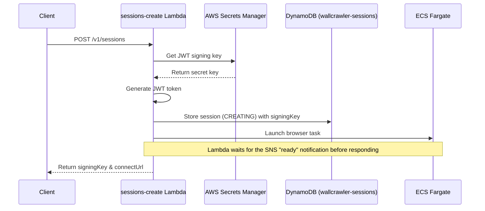
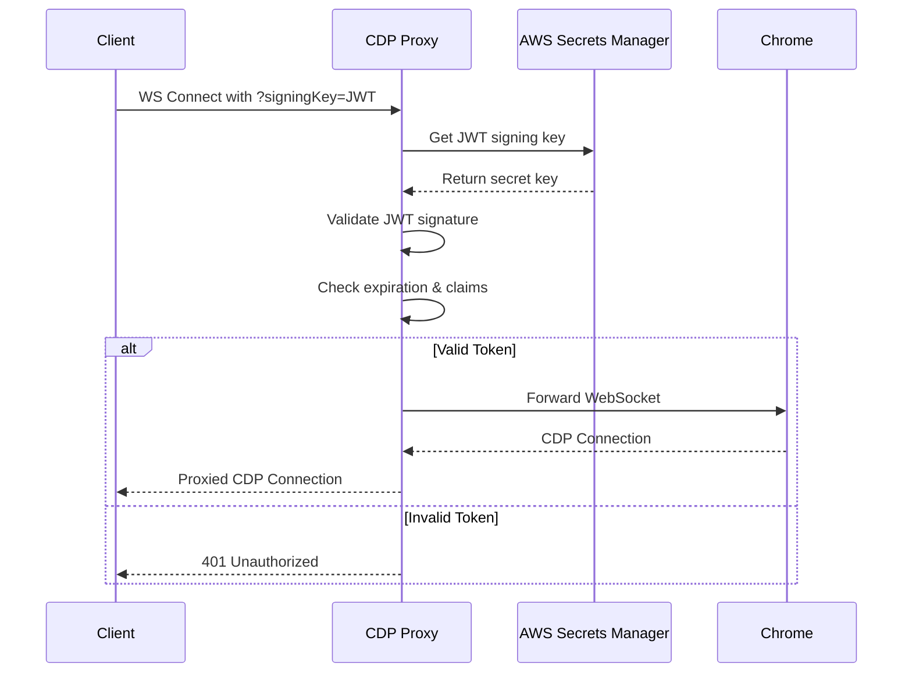

# JWT Signing Key Flow & Security

This document describes the JWT signing key authentication mechanism used in Wallcrawler for securing Chrome DevTools Protocol (CDP) access, with important security considerations for SDK usage.

## Overview

The JWT signing key is a time-limited bearer token that authenticates access to Chrome browser instances running in ECS containers. It ensures that only authorized clients can connect to the Chrome DevTools Protocol interface.

## ⚠️ Security Warning

**The Wallcrawler SDK is designed for server-side use only.** Never use the SDK directly in browser/frontend code as it will expose sensitive authentication tokens to end users.

## Architecture

```
┌─────────────┐         ┌──────────────┐         ┌─────────────────┐
│   Client    │ ──JWT──▶│  CDP Proxy   │ ──────▶ │     Chrome      │
│  (Server)   │         │  (Port 9223) │         │  (Port 9222)    │
└─────────────┘         └──────────────┘         └─────────────────┘
                               ▲
                               │ Validates JWT
                               │
                        ┌──────────────┐
                        │ AWS Secrets  │
                        │   Manager    │
                        └──────────────┘
```

## JWT Token Structure

The JWT token contains the following claims:

```json
{
  // Standard JWT Claims
  "iss": "wallcrawler",              // Issuer
  "sub": "sess_[uuid]",              // Subject (Session ID)
  "aud": ["cdp-access"],             // Audience
  "exp": 1234567890,                 // Expiration time (Unix timestamp)
  "iat": 1234567890,                 // Issued at (Unix timestamp)
  "nbf": 1234567890,                 // Not before (Unix timestamp)
  "jti": "nonce_abc123",             // JWT ID (nonce)
  
  // Custom Claims
  "sessionId": "sess_[uuid]",        // Session identifier
  "projectId": "proj_[uuid]",        // Project identifier
  "userId": "user_[uuid]",           // Optional user identifier
  "nonce": "abc123...",              // Cryptographic nonce
  "ipAddress": "1.2.3.4"             // Optional client IP
}
```

## Flow Sequence

### 1. Session Creation



1. **Client Request**: Client sends POST to `/v1/sessions` with API key and project ID
2. **Secret Retrieval**: Lambda fetches the JWT signing secret from AWS Secrets Manager
3. **Token Generation**: Lambda creates a JWT token with:
   - Session ID (format: `sess_[uuid]`)
   - Project ID
   - Expiration time (defaults to the session timeout — 1 hour unless overridden)
   - Cryptographically secure random nonce
4. **Storage**: The session record (including the JWT) is written to DynamoDB (`wallcrawler-sessions`).
5. **Provisioning**: The Lambda launches the ECS task and waits for the `sessions-stream-processor` SNS notification that signals the browser is ready.
6. **Response**: The client receives:
   - `signingKey`: The JWT token (expires with the session)
   - `connectUrl`: Pre-constructed WebSocket URL with the signing key

### 2. Connection Authentication



1. **Connection Request**: Client connects to `ws://<ip>:9223?signingKey=<jwt>`
2. **Token Extraction**: CDP proxy extracts signing key from query parameters
3. **Validation**: Proxy validates the JWT by:
   - Verifying signature using shared secret from Secrets Manager
   - Checking expiration time hasn't passed
   - Validating required claims (sessionId, projectId)
   - Confirming token hasn't been used before expiration
4. **Connection**: If valid, proxy establishes WebSocket connection to Chrome on localhost:9222
5. **Rejection**: If invalid, returns 401 Unauthorized

## Security Considerations

### Bearer Token Risk

**The JWT token is a bearer token** - anyone who possesses it can use it to control the browser instance. This means:

1. **No Additional Authentication Required**: The token itself is the complete authentication
2. **Full Browser Control**: Token holders can:
   - Navigate to any website
   - Execute JavaScript
   - Extract cookies and local storage
   - Take screenshots
   - Download files
   - Access any data the browser can access

### Attack Scenarios

#### If Tokens Are Exposed in Frontend Code:

```javascript
// ❌ WRONG: Browser code exposes tokens
const session = await wallcrawler.sessions.create({ projectId });
// Token is now visible in:
// - Browser DevTools Network tab
// - JavaScript console
// - Client-side code bundles
```

**Attackers Could:**
1. **Resource Theft**: Use your browser instances for their own automation
2. **Data Extraction**: Access any data your application loads
3. **Billing Fraud**: Run expensive operations on your account
4. **Network Access**: If browsers are in your VPC, access internal resources

## Secure Implementation Patterns

### ✅ Correct: Server-Side Usage with Next.js

```javascript
// pages/api/browser/scrape.js (or app/api/browser/scrape/route.js)
import { Wallcrawler } from '@wallcrawler/sdk';
import { Stagehand } from '@wallcrawler/stagehand';

const wallcrawler = new Wallcrawler({
  apiKey: process.env.WALLCRAWLER_API_KEY,
});

export async function POST(request) {
  try {
    // Create session - credentials stay on server
    const session = await wallcrawler.sessions.create({
      projectId: process.env.WALLCRAWLER_PROJECT_ID,
    });
    
    // Use browser - all server-side
    // Ensure WALLCRAWLER_API_URL is set to your CloudFront/API Gateway domain
    const stagehand = new Stagehand({
      env: 'WALLCRAWLER',
      useAPI: false,
      apiKey: process.env.WALLCRAWLER_API_KEY,
      projectId: process.env.WALLCRAWLER_PROJECT_ID,
      browserbaseSessionID: session.id,
      disablePino: true,
    });

    await stagehand.init();
    
    const { url, selector } = await request.json();
    await stagehand.page.goto(url);
    const data = await stagehand.page.extract(selector);
    
    // Return ONLY results, never credentials
    return Response.json({ 
      success: true,
      data,
      // Never include: connectUrl, signingKey, seleniumRemoteUrl
    });
  } catch (error) {
    console.error('Server error:', error); // Log details server-side
    return Response.json(
      { success: false, error: 'Operation failed' }, // Generic error for client
      { status: 500 }
    );
  }
}
```

```javascript
// Frontend component - no SDK usage
export default function ScraperComponent() {
  const handleScrape = async () => {
    // Call your API route, not Wallcrawler directly
    const response = await fetch('/api/browser/scrape', {
      method: 'POST',
      headers: { 'Content-Type': 'application/json' },
      body: JSON.stringify({
        url: 'https://example.com',
        selector: '.price',
      }),
    });
    
    const result = await response.json();
    // Only receives scraped data, no tokens
  };
}
```

### ❌ Wrong: Frontend SDK Usage

```javascript
// NEVER DO THIS in browser code
'use client';
import { Wallcrawler } from '@wallcrawler/sdk-node';

export default function BadComponent() {
  const handleAction = async () => {
    // This exposes all tokens to the browser!
    const wallcrawler = new Wallcrawler({
      apiKey: 'key_...', // Visible in browser
    });
    const session = await wallcrawler.sessions.create({
      projectId: 'proj_...', // Also visible
    });
    // connectUrl and signingKey now exposed to end users
  };
}
```

## Security Features

### 1. Time-Limited Access
- Tokens expire after a configurable duration (default matches the session timeout, 1 hour)
- Expiration is enforced at validation time
- No token refresh mechanism - clients must create new sessions

### 2. Cryptographic Security
- HMAC-SHA256 signing algorithm
- Shared secret stored in AWS Secrets Manager
- Secret key caching with 5-minute TTL to reduce API calls
- Cryptographically secure random nonce in each token

### 3. Network Isolation
- Chrome CDP port (9222) bound to localhost only
- All external access through authenticated proxy (9223)
- No direct access to Chrome without valid token

### 4. Secret Management
- JWT signing key stored in AWS Secrets Manager
- Automatic secret rotation supported
- Environment variable override for development (`WALLCRAWLER_JWT_SIGNING_KEY`)

## Best Practices

### 1. **Architecture**
- Always use server-side proxies (e.g., Next.js API routes)
- Never expose SDK responses to frontend code
- Implement proper error handling without leaking details

### 2. **Token Handling**
- Never log JWT tokens in error messages
- Use HTTPS when transmitting tokens
- Implement request signing for additional security

### 3. **Session Management**
- Create new sessions rather than trying to refresh tokens
- Clean up sessions when done to avoid resource waste
- Monitor token expiration and handle gracefully

### 4. **Security Monitoring**
- Implement rate limiting on session creation
- Monitor for unusual CDP activity patterns
- Set up alerts for suspicious usage

### 5. **Network Security**
- Ensure browser containers have minimal network access
- Use VPC security groups to restrict access
- Consider IP allowlisting for additional security

## API Response Formats

### Session Create Response
```json
{
  "id": "sess_abc123",
  "connectUrl": "ws://1.2.3.4:9223?signingKey=eyJhbGc...",
  "seleniumRemoteUrl": "http://1.2.3.4:4444/wd/hub",
  "signingKey": "eyJhbGciOiJIUzI1NiIsInR5cCI6IkpXVCJ9...",
  "status": "RUNNING",
  // ... other fields
}
```

### What to Return to Frontend Clients
```json
{
  "success": true,
  "data": {
    // Only your automation results
    "scrapedText": "...",
    "screenshot": "base64...",
  },
  // Never include: connectUrl, signingKey, seleniumRemoteUrl
}
```

## Summary

The JWT signing key provides secure, time-limited access to browser instances. However, because it's a bearer token, **it must never be exposed to frontend code**. Always use server-side proxies (like Next.js API routes) to keep credentials secure while providing browser automation capabilities to your users.
