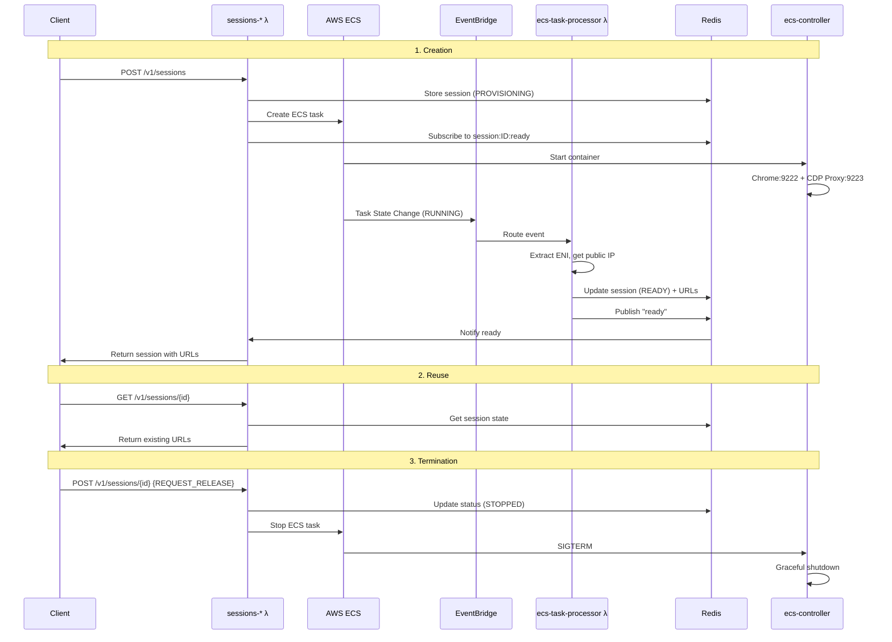
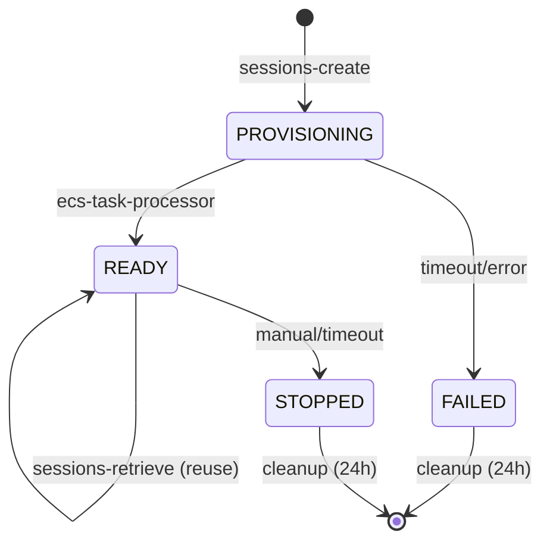

# Wallcrawler Container Lifecycle

## Overview

Wallcrawler implements a **complete ECS container lifecycle** with synchronous session creation, session reuse, manual termination, and automatic cleanup. The architecture is event-driven to eliminate polling.

## Architecture Components

| Component              | Role                                          |
| ---------------------- | --------------------------------------------- |
| **sessions-create**    | Synchronous session creation                  |
| **sessions-retrieve**  | Session reuse/reconnection                    |
| **sessions-update**    | Manual session termination                    |
| **sessions-debug**     | Live debugger URLs                            |
| **session-cleanup**    | Scheduled cleanup (5min intervals)            |
| **ecs-task-processor** | EventBridge handler, session state management |
| **ecs-controller**     | Container management (Chrome + CDP proxy)     |

## Container Lifecycle Flow



## Session States



## Key Features

### 🚀 **Synchronous API**

- Immediate response with ready-to-use URLs (Browserbase-compatible)
- Event-driven backend eliminates polling

### 🔄 **Session Reuse**

- Reconnect to existing containers without recreation cost
- Dynamic URL generation for active sessions (~200ms)

### 🧹 **Automatic Cleanup**

- 5-minute timeout for inactive sessions
- 24-hour deletion for terminated sessions
- Prevents orphaned containers and controls costs

### ⚡ **Performance Optimized**

- 50% fewer AWS API calls (ENI extraction from EventBridge)
- 8-12s creation time vs 15-30s (polling-based)

## Technical Implementation

### ENI Optimization

```go
// Extract ENI directly from EventBridge event (0 API calls)
eniID := extractENIFromEvent(event.Detail)
if eniID != "" {
    taskIP, err = utils.GetENIPublicIP(ctx, eniID)  // 1 API call
} else {
    taskIP, err = utils.GetECSTaskPublicIP(ctx, taskArn)  // 2 API calls (fallback)
}
```

### Session Reuse

```go
// Dynamic URL generation for reconnection
if sessionState.Status == "READY" && sessionState.PublicIP != "" {
    response.ConnectURL = utils.CreateAuthenticatedCDPURL(sessionState.PublicIP, sessionState.SigningKey)
    response.SeleniumRemoteURL = fmt.Sprintf("http://%s:4444/wd/hub", sessionState.PublicIP)
}
```

### Automatic Cleanup

```go
// Timeout check (5 minutes default)
if time.Since(session.CreatedAt) > 5*time.Minute && session.Status == "READY" {
    utils.UpdateSessionStatus(ctx, rdb, session.ID, "STOPPED")
    utils.StopECSTask(ctx, session.ECSTaskARN)
}
```

### Redis Pub/Sub

```go
// Real-time notification between lambdas
channel := fmt.Sprintf("session:%s:ready", sessionID)
rdb.Publish(ctx, channel, "ready")
```

## Container Resource Management

```
ECS Container Lifecycle:
1. Task Created     → PROVISIONING
2. Container Start  → Chrome + CDP Proxy startup
3. Network Ready    → ENI attached, public IP assigned
4. Services Ready   → Chrome:9222 + CDP Proxy:9223
5. Session Ready    → Status: READY, URLs available
6. Active Usage     → Client connections
7. Termination      → Manual (API) or Automatic (timeout)
8. Graceful Stop    → SIGTERM → Chrome shutdown
9. Task Stopped     → Container destroyed, IP released
10. Cleanup         → Session state updated/deleted
```

## Performance Metrics

| Metric                | Before    | After       |
| --------------------- | --------- | ----------- |
| **Session Creation**  | ~15-30s   | ~8-12s      |
| **Session Reuse**     | N/A       | ~200ms      |
| **AWS API Calls**     | 4-6 calls | 2-3 calls   |
| **Orphan Prevention** | Manual    | Auto (5min) |

## Session Events Timeline

1. **SessionCreated** - `sessions-create` (PROVISIONING)
2. **ContainerChromeReady** - `ecs-controller` (Chrome ready)
3. **TaskIPAssigned** - `ecs-task-processor` (READY + URLs)
4. **SessionRetrieved** - `sessions-retrieve` (Reconnection)
5. **SessionTerminated** - `sessions-update`/`session-cleanup`
6. **ContainerCleanupCompleted** - `ecs-controller` (Shutdown)

## Generated URLs

```go
// External client connection URLs (using ENI IP)
connectURL := fmt.Sprintf("ws://%s:9223?signingKey=%s", taskIP, jwtToken)
seleniumURL := fmt.Sprintf("http://%s:4444/wd/hub", taskIP)
debuggerURL := "https://chrome-devtools-frontend.appspot.com/..."
```

## Error Handling

- **ECS task creation fails** → Status: FAILED, cleanup triggered
- **Timeout exceeded (2.5min)** → Task stopped, session deleted
- **Chrome startup fails** → Container exits, EventBridge cleanup
- **ENI IP unavailable** → Fallback to task description method

## Monitoring

### EventBridge Events

```json
{
  "source": ["aws.ecs"],
  "detail-type": ["ECS Task State Change"],
  "detail": {
    "lastStatus": "RUNNING",
    "attachments": [{ "type": "eni", "details": [{ "name": "networkInterfaceId", "value": "eni-12345" }] }]
  }
}
```

### Redis Channels

- **`session:{sessionID}:ready`** - Session provisioning complete
- **`session:{sessionID}`** - Session state storage

## Related Documentation

- [Wallcrawler Design Doc](./wallcrawler-design-doc.md) - Overall architecture
- [API Endpoints Reference](./api/api-endpoints-reference.md) - API contracts
- [Build Commands](./build-cmds.md) - Development setup
