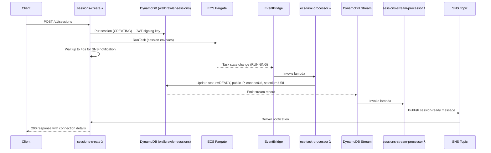
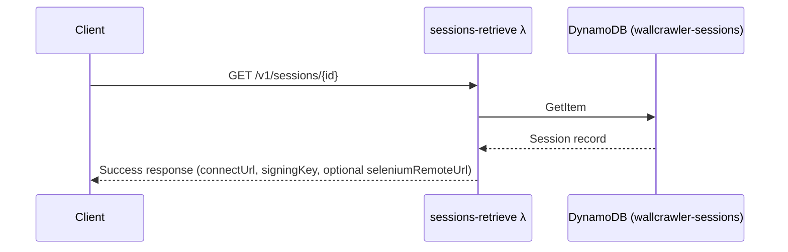
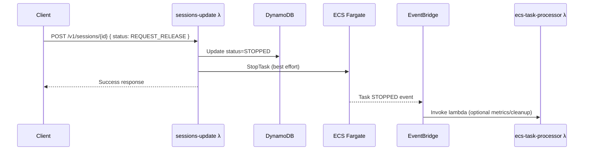
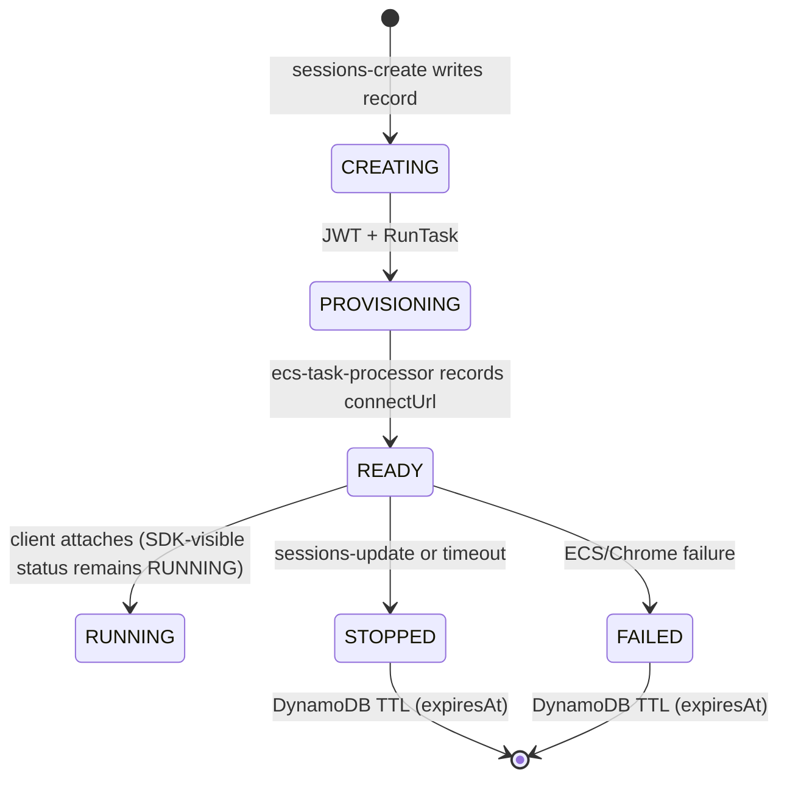

# Wallcrawler Container Lifecycle

## Overview

Wallcrawler provisions Chromium containers on demand while keeping the Browserbase-compatible API synchronous. The `sessions-create` Lambda stores session metadata in DynamoDB, launches a Fargate task, and waits (up to 45 seconds) for a "ready" notification that is delivered through DynamoDB Streams and SNS. This pipeline removes the need for polling and keeps the API latency predictable.

## Architecture Components

| Component | Role |
|-----------|------|
| **sessions-create** | Handles `POST /v1/sessions`, seeds DynamoDB, launches the ECS task, waits for SNS notification |
| **sessions-retrieve** | Returns the latest session record from DynamoDB for reconnects |
| **sessions-update** | Accepts `REQUEST_RELEASE`, stops the ECS task, and records the termination |
| **sessions-debug** | Exposes debugger URLs stored in the session record |
| **ecs-task-processor** | EventBridge target that enriches sessions when an ECS task reaches `RUNNING` (public IP, connect URL, status) |
| **sessions-stream-processor** | DynamoDB stream consumer that publishes `READY` notifications to SNS |
| **ecs-controller** | In-container agent that starts Chrome, hydrates contexts from S3, and runs the authenticated CDP proxy |
| **wallcrawler-sessions** | DynamoDB table that stores session lifecycle state with TTL on `expiresAt` |
| **wallcrawler-session-ready** | SNS topic used to wake the waiting `sessions-create` invocation |

## Session Creation Flow



## Session Reuse



## Manual Termination



## Session States



*SDK status* is derived from the internal status (`READY`, `ACTIVE`, `TERMINATING` all map to `RUNNING`). The TTL on `expiresAt` is set when the session is created (default 3600 seconds) and enforces automatic cleanup even if an explicit termination is never issued.

## Key Characteristics

- **Synchronous API**: `sessions-create` blocks until Chrome is reachable or the 45-second wait times out.
- **Strong Consistency**: All reads and writes go through DynamoDB and are visible immediately to the SDK lambdas.
- **Direct Mode Friendly**: Ready sessions always include `connectUrl` and `signingKey`, and expose `seleniumRemoteUrl` when the controller publishes it.
- **Context Hydration**: The ECS controller pulls contexts from S3 before Chrome starts and optionally persists them back when `persist` is enabled.
- **Back-pressure aware**: SNS notifications are one-to-one with the waiting Lambda invocation, eliminating polling and extra reads.

## Implementation Notes

### ENI IP Extraction

The EventBridge handler avoids additional AWS API calls by extracting the ENI ID directly from the ECS event payload before falling back to `DescribeTasks`.

```go
eniID := extractENIFromEvent(event.Detail)
if eniID != "" {
    taskIP, err = utils.GetENIPublicIP(ctx, eniID)
} else {
    taskIP, err = utils.GetECSTaskPublicIP(ctx, taskArn)
}
```

### Session Record Mutation (ecs-task-processor)

```go
sessionState.PublicIP = taskIP
sessionState.ECSTaskARN = taskArn
connectURL := utils.CreateAuthenticatedCDPURL(taskIP, *sessionState.SigningKey)
sessionState.ConnectURL = &connectURL
sessionState.InternalStatus = types.SessionStatusReady
sessionState.Status = utils.MapStatusToSDK(types.SessionStatusReady)
if err := utils.StoreSession(ctx, ddbClient, sessionState); err != nil {
    log.Printf("error storing updated session: %v", err)
}
```

### SNS Notification (sessions-stream-processor)

```go
if strings.EqualFold(newStatus, "READY") {
    message, _ := json.Marshal(notification)
    snsClient.Publish(ctx, &sns.PublishInput{
        TopicArn: aws.String(topicArn),
        Message:  aws.String(string(message)),
        MessageAttributes: map[string]types.MessageAttributeValue{
            "sessionId": { DataType: aws.String("String"), StringValue: aws.String(sessionID) },
        },
    })
}
```

### TTL and Cleanup

- `expiresAt` (numeric) is both the DynamoDB TTL attribute and the sort key for the `status-expiresAt-index` GSI.
- `sessions-create` sets `expiresAt` based on the request timeout (default 3600 seconds, capped by `WALLCRAWLER_MAX_SESSION_TIMEOUT`).
- When the TTL removes the item, no further action is required; the browser container has already been stopped by `sessions-update`, timeout logic, or task failure handling.

## Generated Connection Endpoints

```go
connectURL := fmt.Sprintf("ws://%s:%s?signingKey=%s", taskIP, proxyPort, jwtToken)
seleniumURL := fmt.Sprintf("http://%s:4444/wd/hub", taskIP) // optional when Selenium sidecar is enabled
debuggerURL := utils.CreateDebuggerURL(taskIP, jwtToken)
```

`connectUrl` and `signingKey` are only exposed to authenticated clients. Never relay them to untrusted callers—they grant full browser control.

## Observability

- CloudWatch log groups exist per Lambda (`/aws/lambda/sessions-create`, `/aws/lambda/ecs-task-processor`, `/aws/lambda/sessions-stream-processor`, etc.) and for the ECS service (`/aws/ecs/wallcrawler-controller`).
- Structured logging helpers in `internal/utils/logging.go` tag important lifecycle events (created, ready, terminated, error).
- DynamoDB Streams provide an immutable audit trail of state changes in addition to CloudWatch logs.
