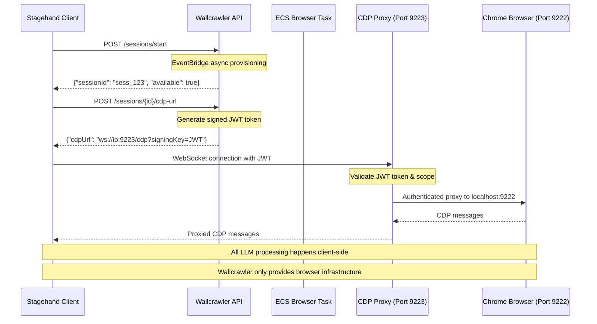

# Direct Mode Implementation Guide

## Overview

This document outlines Wallcrawler's **Direct Mode**, where Stagehand clients connect directly to Chrome's DevTools Protocol (CDP), bypassing Wallcrawler's API layer entirely. This mode prioritizes privacy and performance for clients who want direct browser control.

## Direct Mode vs API Mode

| Aspect             | Direct Mode                               | API Mode                                |
| ------------------ | ----------------------------------------- | --------------------------------------- |
| **Privacy**        | ✅ Complete - no data through Wallcrawler | ❌ Data processed by Wallcrawler        |
| **Performance**    | ✅ Direct CDP connection                  | ❌ Additional API latency               |
| **LLM Processing** | ❌ Client-side (user's API keys)          | ✅ Server-side with session config      |
| **Streaming**      | ✅ Native CDP streaming                   | ✅ Server-sent events                   |
| **Implementation** | ✅ Fully implemented                      | 🚧 Requires LLM processing work         |
| **Use Case**       | Privacy-sensitive, high-performance       | Managed service, centralized processing |

## Current Implementation Status

### ✅ **Completed Components**

| Component                | Status   | Description                            |
| ------------------------ | -------- | -------------------------------------- |
| **Session Creation**     | Complete | EventBridge-driven async provisioning  |
| **ECS Browser Tasks**    | Complete | Chrome with public IP and CDP access   |
| **Debug URL Generation** | Complete | `/sessions/{id}/debug` endpoint        |
| **IP Assignment**        | Complete | Public IP detection and URL generation |
| **Session Lifecycle**    | Complete | Proper cleanup and termination         |

### ✅ **Direct Mode Flow**



## Direct Mode Architecture

### **1. Session Provisioning (Completed)**

The session provisioning works identically to API Mode but optimizes for direct CDP access:

```go
// ECS controller already implements direct mode ready state
func (c *Controller) initCDP() error {
    wsURL := "ws://127.0.0.1:9222/devtools/browser"
    c.allocator, c.allocatorCancel = chromedp.NewRemoteAllocator(context.Background(), wsURL)
    // ... Chrome initialization for CDP access
}
```

**✅ Implementation Status**: Complete - Chrome is configured for external CDP connections

### **2. Public IP Assignment (Completed)**

```go
// ECS tasks get public IPs for direct client access
func GetECSTaskPublicIP(ctx context.Context, taskARN string) (string, error) {
    // 1. Get ENI from ECS task
    // 2. Get public IP from ENI
    // 3. Return IP for direct CDP connection
}

// Debug endpoint provides direct CDP URLs
func CreateCDPURL(taskIP string) string {
    return fmt.Sprintf("ws://%s:9222", taskIP)
}
```

**✅ Implementation Status**: Complete - Public IPs are detected and CDP URLs generated

### **3. Enterprise Security & Network Configuration (Completed)**

```go
// Chrome args configured for localhost-only access (secure)
args := []string{
    "--remote-debugging-port=9222",
    "--remote-debugging-address=127.0.0.1",  // Localhost only for security
    "--headless=new",
    // ... security and performance flags
}

// CDP Proxy provides authenticated external access on port 9223
// Clients connect to: ws://[public-ip]:9223/cdp?signingKey=JWT_TOKEN
```

**✅ Implementation Status**: Complete - Chrome configured with secure network isolation

### **4. Enterprise CDP Proxy (New - Completed)**

```go
// Enterprise CDP Proxy provides comprehensive security and monitoring
type CDPProxy struct {
    chromeAddr        string              // localhost:9222
    activeConnections map[string]*Connection
    rateLimiter       *RateLimiter        // 100 req/min per session
    circuitBreaker    *CircuitBreaker     // Chrome connectivity protection
    errorTracker      *ErrorTracker       // Pattern analysis
    metrics           *ProxyMetrics       // Performance monitoring
}

// JWT-based authentication for all CDP access
func (p *CDPProxy) authMiddleware(next http.Handler) http.Handler {
    // Validate signed CDP URLs with time-limited JWT tokens
    // Scope-based permissions: "cdp-direct", "debug", "screencast"
}
```

**✅ Implementation Status**: Complete - Enterprise-grade CDP proxy with monitoring

### **5. Signed CDP URL Generation (New - Completed)**

```go
// New endpoint for generating signed CDP URLs
// POST /sessions/{sessionId}/cdp-url
func Handler(ctx context.Context, request events.APIGatewayProxyRequest) {
    // 1. Validate API key and session
    // 2. Generate time-limited JWT token (10 min expiry)
    // 3. Return signed CDP URL with authentication
    // Example: ws://54.123.45.67:9223/cdp?signingKey=eyJhbGciOi...
}
```

**✅ Implementation Status**: Complete - Browserbase-compatible signed URL generation

### **6. Client Integration (Stagehand Ready)**

Direct Mode leverages Stagehand's existing CDP integration:

```typescript
// Stagehand client usage with Direct Mode (Secure)
const stagehand = new Stagehand({
  env: 'LOCAL', // Use local CDP connection
  debugMode: true,
});

// 1. Get signed CDP URL (enterprise security)
const response = await fetch('/sessions/sess_123/cdp-url', {
  method: 'POST',
  headers: { 'x-wc-api-key': 'your-api-key' },
  body: JSON.stringify({ scope: 'cdp-direct' }),
});
const { cdpUrl } = await response.json();
// cdpUrl: "ws://54.123.45.67:9223/cdp?signingKey=eyJhbGciOi..."

// 2. Connect to authenticated CDP proxy
const page = await stagehand.page(cdpUrl);

// 3. All operations happen client-side with secure connection
await page.act('Click the login button');
await page.extract('Get user profile data');
```

**✅ Implementation Status**: Complete - No additional Stagehand changes needed

## Direct Mode Benefits

### **1. Privacy Protection**

- **Zero Data Processing**: Wallcrawler never sees DOM content or LLM interactions
- **Client-Side LLM**: Users control their own API keys and model selection
- **Audit Trail**: Complete client control over data handling

### **2. Performance Advantages**

- **Reduced Latency**: No API proxy layer
- **Direct Streaming**: Native CDP WebSocket streaming
- **Bandwidth Efficiency**: No intermediate data serialization

### **3. Cost Efficiency**

- **No LLM Costs**: Users manage their own LLM API usage
- **Reduced Compute**: Wallcrawler only provides browser infrastructure
- **Simple Billing**: Pay only for ECS task time

## Direct Mode Use Cases

### **Enterprise Privacy Requirements**

```typescript
// Financial services with strict data privacy
const stagehand = new Stagehand({
  env: 'LOCAL',
  modelApiKey: process.env.COMPANY_OPENAI_KEY, // Company-controlled
  debugMode: true,
});

// Connect to Wallcrawler browser
const page = await stagehand.page(wallcrawlerCDPUrl);

// All sensitive data stays within company infrastructure
await page.extract('Extract account balances', accountSchema);
```

### **High-Performance Automation**

```typescript
// Trading algorithms requiring minimal latency
const browser = await connect(wallcrawlerCDPUrl);

// Direct CDP commands for speed
await browser.Runtime.evaluate({
  expression: "document.querySelector('#price').textContent",
});
```

### **Development & Testing**

```typescript
// Development environments with direct control
const stagehand = new Stagehand({
  env: 'LOCAL',
  debugMode: true,
  verbose: 2, // Full debugging
});

// Test against Wallcrawler infrastructure
await page.goto('https://example.com');
await page.act('Fill form with test data');
```

## Direct Mode Limitations

### **1. Client Complexity**

- **LLM Integration**: Clients must handle LLM API calls
- **Error Handling**: No server-side retry logic
- **Model Management**: Clients choose and configure models

### **2. Network Requirements**

- **Public Internet**: ECS tasks need public IPs
- **Firewall Configuration**: Port 9222 must be accessible
- **Connection Stability**: Direct WebSocket connection reliability

### **3. Resource Management**

- **Client Responsibility**: Clients must manage session cleanup
- **Timeout Handling**: No server-side session timeout management
- **Cost Tracking**: Manual usage monitoring

## Monitoring & Observability

### **Wallcrawler Metrics (Limited)**

```go
// ECS controller tracks basic usage
log.Printf("Direct mode session %s: CDP connections=%d, duration=%s",
    sessionID, connectionCount, duration)

// Network usage monitoring
log.Printf("Direct mode session %s: bytes_in=%d, bytes_out=%d",
    sessionID, bytesIn, bytesOut)
```

**Available Metrics**:

- Session duration
- CDP connection count
- Network usage
- Task resource utilization

**Not Available**:

- LLM usage (client-side)
- Operation details (private)
- Error analysis (client-side)

### **Client-Side Monitoring**

```typescript
// Clients implement their own monitoring
const stagehand = new Stagehand({
  env: 'LOCAL',
  logger: (message) => {
    // Send to company monitoring system
    companyLogger.log(message);
  },
});
```

## Deployment Considerations

### **Network Security**

```yaml
# ECS Security Group
WallcrawlerECSSecurityGroup:
  Type: AWS::EC2::SecurityGroup
  Properties:
    GroupDescription: 'Wallcrawler ECS Direct Mode Access'
    SecurityGroupIngress:
      - IpProtocol: tcp
        FromPort: 9222
        ToPort: 9222
        CidrIp: 0.0.0.0/0 # Allow global CDP access
        Description: 'Chrome DevTools Protocol'
```

### **Resource Optimization**

```dockerfile
# ECS task optimized for Direct Mode
FROM alpine:latest

# Only Chrome + basic controller needed
RUN apk add --no-cache chromium

# No LLM processing dependencies
# No complex API handlers
# Minimal resource footprint

CMD ["./direct-mode-controller"]
```

### **Cost Structure**

| Component            | Direct Mode Cost               | API Mode Cost            |
| -------------------- | ------------------------------ | ------------------------ |
| **ECS Tasks**        | ✅ Standard rate               | ✅ Standard rate         |
| **Lambda Functions** | ✅ Minimal (session mgmt only) | ❌ High (LLM processing) |
| **LLM API Calls**    | ✅ Client pays directly        | ❌ Wallcrawler overhead  |
| **Data Transfer**    | ✅ Direct connection           | ❌ API proxy overhead    |

## Best Practices

### **Session Management**

```typescript
// Always clean up sessions
const session = await wallcrawler.createSession();
try {
  const page = await stagehand.page(session.cdpUrl);
  await page.act('Perform automation');
} finally {
  await wallcrawler.endSession(session.id);
}
```

### **Error Handling**

```typescript
// Implement robust client-side error handling
const stagehand = new Stagehand({
  env: 'LOCAL',
  enableCaching: true,
  selfHeal: true, // Auto-retry failed actions
  retries: 3,
});

try {
  await page.act('Complex action');
} catch (error) {
  if (error.code === 'CONNECTION_LOST') {
    // Reconnect logic
    await reconnectToCDP();
  }
}
```

### **Performance Optimization**

```typescript
// Use connection pooling for multiple operations
const connectionPool = new CDPPool({
  maxConnections: 5,
  baseUrl: wallcrawlerCDPUrl,
});

// Reuse connections across operations
const page1 = await connectionPool.getPage();
const page2 = await connectionPool.getPage();
```

## Security Considerations

### **Network Security**

- **VPC Configuration**: Consider VPC peering for enterprise clients
- **IP Whitelisting**: Restrict CDP access to known client IPs
- **TLS Termination**: Use load balancers for TLS encryption

### **Data Privacy**

- **No Logging**: Minimize ECS controller logging in Direct Mode
- **Temporary Storage**: Ensure no client data persists on ECS tasks
- **Memory Management**: Clear browser memory between sessions

### **Compliance**

- **GDPR**: No personal data processing by Wallcrawler
- **SOC 2**: Infrastructure controls only
- **HIPAA**: Client-controlled data handling

## Migration Path

### **API Mode → Direct Mode**

```typescript
// 1. Update Stagehand configuration
const stagehand = new Stagehand({
  env: 'LOCAL', // Change from "BROWSERBASE"
  modelApiKey: process.env.YOUR_OPENAI_KEY,
});

// 2. Update session creation
const session = await wallcrawler.createSession();
const cdpUrl = await wallcrawler.getDebugUrl(session.id);

// 3. Connect directly to CDP
const page = await stagehand.page(cdpUrl);

// 4. Same Stagehand API, direct execution
await page.act('Click button');
await page.extract('Get data');
```

## Conclusion

Direct Mode provides a complete solution for privacy-conscious and performance-critical browser automation. The implementation is already complete and ready for production use, offering:

- **Full Privacy Control**: Zero data processing by Wallcrawler
- **Maximum Performance**: Direct CDP connections
- **Cost Efficiency**: Pay only for infrastructure
- **Enterprise Ready**: Suitable for regulated industries

Direct Mode complements API Mode by providing choice: clients can select the approach that best fits their privacy, performance, and operational requirements.
