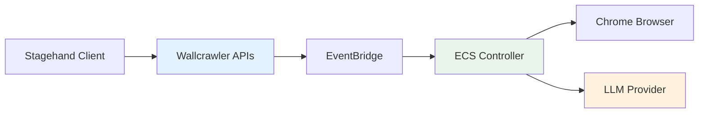
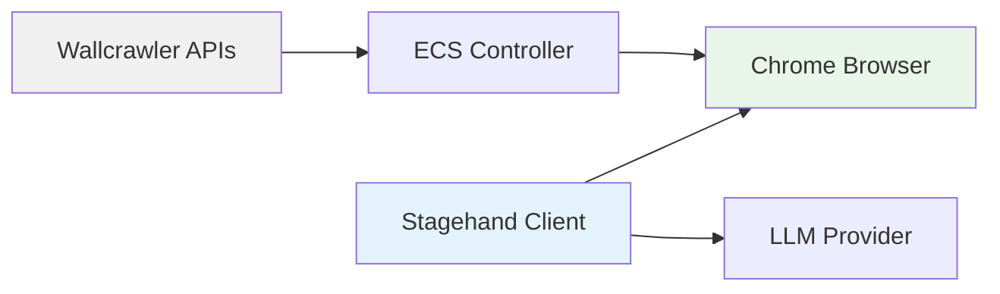

# Wallcrawler Implementation Overview

## Introduction

Wallcrawler provides two distinct modes for browser automation, each optimized for different use cases and requirements. This document provides a high-level overview of both modes and their current implementation status.

## Architecture Modes

### 🔄 **API Mode** - Managed Service Approach



**Current Status**: 🚧 **Partial Implementation**

- ✅ Complete API endpoints and EventBridge architecture
- ❌ Missing LLM processing in ECS controller

### 🔗 **Direct Mode** - Infrastructure-Only Approach



**Current Status**: ✅ **Fully Implemented with Enterprise Features**

- ✅ Complete session provisioning and secure CDP access
- ✅ Enterprise-grade security with JWT authentication and CDP proxy
- ✅ Production monitoring with rate limiting and circuit breaker
- ✅ Native Chrome screencast implementation
- ✅ Ready for production use

## Mode Comparison

| Feature                   | API Mode                      | Direct Mode                       | Winner      |
| ------------------------- | ----------------------------- | --------------------------------- | ----------- |
| **Implementation Status** | 🚧 Partial                    | ✅ Complete                       | Direct Mode |
| **Privacy**               | Data processed by Wallcrawler | Zero data through Wallcrawler     | Direct Mode |
| **Performance**           | API + LLM latency             | Direct CDP connection             | Direct Mode |
| **Ease of Use**           | Managed LLM processing        | Client manages LLM                | API Mode    |
| **Enterprise Features**   | Centralized monitoring        | Enterprise CDP proxy + monitoring | Tie         |
| **Security**              | API key + managed auth        | JWT signed URLs + rate limiting   | Direct Mode |
| **Cost Model**            | All-inclusive pricing         | Infrastructure + client LLM costs | Depends     |
| **Compliance**            | Wallcrawler SOC 2             | Client-controlled                 | Direct Mode |

## Current Implementation Status

### ✅ **Completed Infrastructure (Both Modes)**

| Component                      | Status      | Description                            |
| ------------------------------ | ----------- | -------------------------------------- |
| **Session Management**         | ✅ Complete | EventBridge-driven async lifecycle     |
| **ECS Browser Infrastructure** | ✅ Complete | Chrome with CDP access                 |
| **Enterprise CDP Proxy**       | ✅ Complete | JWT auth, rate limiting, monitoring    |
| **WebSocket Streaming**        | ✅ Complete | Native Chrome screencast               |
| **Network & Security**         | ✅ Complete | Secure localhost + authenticated proxy |
| **API Endpoints**              | ✅ Complete | All Stagehand-compatible + cdp-url     |

### 🚧 **API Mode Remaining Work**

| Component                         | Priority | Effort | Description                |
| --------------------------------- | -------- | ------ | -------------------------- |
| **Accessibility Tree Extraction** | High     | Medium | CDP-based DOM processing   |
| **LLM Client Integration**        | High     | Medium | OpenAI/Anthropic clients   |
| **Action Execution Engine**       | High     | Large  | CDP command execution      |
| **Result Streaming**              | Medium   | Medium | Real-time Lambda responses |
| **Error Handling**                | Medium   | Small  | Robust retry logic         |

### ✅ **Direct Mode Ready Features**

| Component                   | Status   | Description                              |
| --------------------------- | -------- | ---------------------------------------- |
| **Secure CDP Access**       | ✅ Ready | JWT-authenticated CDP proxy on port 9223 |
| **Public IP Assignment**    | ✅ Ready | ECS tasks get accessible IPs             |
| **Signed URL Generation**   | ✅ Ready | `/sessions/{id}/cdp-url` endpoint        |
| **Debug URL Generation**    | ✅ Ready | `/sessions/{id}/debug` endpoint          |
| **Enterprise Monitoring**   | ✅ Ready | Rate limiting, circuit breaker, metrics  |
| **Native Screencast**       | ✅ Ready | Chrome DevTools native screencast        |
| **Stagehand Compatibility** | ✅ Ready | Minimal client changes (new endpoint)    |

## Use Case Recommendations

### Choose **API Mode** When:

- 🏢 **Enterprise Management**: Need centralized LLM processing and monitoring
- 🛡️ **Simplified Operations**: Want managed service with less client complexity
- 📊 **Usage Analytics**: Need detailed operation monitoring and billing
- 🔄 **Consistent Performance**: Prefer server-side LLM optimization
- 👥 **Team Collaboration**: Multiple users sharing sessions and configurations

**⚠️ Note**: API Mode requires completing the LLM processing implementation

### Choose **Direct Mode** When:

- 🔒 **Privacy Requirements**: Must keep data out of third-party systems
- ⚡ **Performance Critical**: Need minimal latency for time-sensitive operations
- 💰 **Cost Optimization**: Want to manage LLM costs directly
- 🏛️ **Regulatory Compliance**: Operating in heavily regulated industries
- 🛠️ **Full Control**: Need complete control over LLM models and prompts

**✅ Note**: Direct Mode is production-ready today

## Implementation Roadmap

### Phase 1: Direct Mode Production (Complete)

```mermaid
gantt
    title Direct Mode Implementation
    dateFormat X
    axisFormat %s

    section Infrastructure
    Session Management     :done, 0, 1
    ECS Browser Tasks      :done, 0, 1
    CDP Configuration      :done, 0, 1
    Public IP Assignment   :done, 0, 1
    Debug URLs            :done, 0, 1

    section Ready for Use
    Production Deployment  :milestone, 1, 0
```



### Phase 2: API Mode Completion (Remaining Work)

```mermaid
gantt
    title API Mode Implementation
    dateFormat X
    axisFormat %s

    section Foundation (Complete)
    API Endpoints         :done, 0, 1
    EventBridge Architecture :done, 0, 1
    Session Management    :done, 0, 1

    section Core Implementation (TODO)
    Accessibility Tree    :todo1, 1, 3
    LLM Integration      :todo2, 1, 3
    Action Execution     :todo3, 2, 4

    section Enhancement (TODO)
    Result Streaming     :todo4, 4, 2
    Error Handling       :todo5, 5, 1
    Performance Optimization :todo6, 6, 2

    section Ready for Use
    Production Deployment :milestone, 8, 0
```



## Technical Documentation

### For Implementers

- **[API Mode Implementation Guide](./api-mode-implementation.md)** - Complete technical specification for remaining LLM processing work
- **[Direct Mode Implementation Guide](./direct-mode-implementation.md)** - Usage patterns and best practices for Direct Mode

### For Users

- **[Wallcrawler Design Document](./wallcrawler-design-doc.md)** - Complete architectural overview and system design

## Quick Start Guides

### Direct Mode (Ready Now)

```typescript
// 1. Create session
const response = await fetch('/sessions/start', {
  method: 'POST',
  headers: { 'x-wc-api-key': 'your-key' },
  body: JSON.stringify({ modelName: 'gpt-4', modelApiKey: 'your-openai-key' }),
});
const { sessionId } = await response.json();

// 2. Get signed CDP URL (enterprise security)
const cdpResponse = await fetch(`/sessions/${sessionId}/cdp-url`, {
  method: 'POST',
  headers: { 'x-wc-api-key': 'your-key' },
  body: JSON.stringify({ scope: 'cdp-direct' }),
});
const { cdpUrl } = await cdpResponse.json();

// 3. Connect Stagehand to authenticated CDP proxy
const stagehand = new Stagehand({ env: 'LOCAL' });
const page = await stagehand.page(cdpUrl);

// 4. Automate (client-side LLM processing, secure connection)
await page.act('Click the login button');
await page.extract('Get user data');
```

### API Mode (When Complete)

```typescript
// 1. Create session
const response = await fetch('/sessions/start', {
  method: 'POST',
  headers: { 'x-wc-api-key': 'your-key' },
  body: JSON.stringify({ modelName: 'gpt-4', modelApiKey: 'your-openai-key' }),
});
const { sessionId } = await response.json();

// 2. Use streaming API endpoints (server-side LLM processing)
const extractResponse = await fetch(`/sessions/${sessionId}/extract`, {
  method: 'POST',
  headers: { 'x-stream-response': 'true' },
  body: JSON.stringify({ instruction: 'Extract user data' }),
});

// 3. Stream results
const reader = extractResponse.body.getReader();
// Process server-sent events...
```

## Migration Strategy

### From Other Platforms

1. **Start with Direct Mode**: Get immediate compatibility with existing Stagehand workflows
2. **Evaluate API Mode**: When LLM processing is complete, consider migrating for managed features
3. **Hybrid Usage**: Use Direct Mode for sensitive operations, API Mode for standard automation

### Between Modes

- **Direct → API**: Minimal changes - same session creation, different connection method
- **API → Direct**: Remove server-side dependencies, add client-side LLM handling

## Support & Resources

### Production Ready (Direct Mode)

- ✅ Complete implementation
- ✅ Stagehand compatibility
- ✅ Enterprise-grade infrastructure
- ✅ Privacy and compliance features

### Development Required (API Mode)

- 📋 Detailed implementation guide available
- 🛠️ Clear technical specifications
- 📊 Modular development approach
- 🧪 Comprehensive testing strategy

## Conclusion

Wallcrawler offers a unique dual-mode architecture that serves different market needs:

- **Direct Mode** provides immediate value for privacy-conscious and performance-critical use cases
- **API Mode** will provide a managed service experience once LLM processing is implemented

The infrastructure foundation is complete for both modes, with Direct Mode ready for production use and API Mode requiring focused development on LLM processing components.
