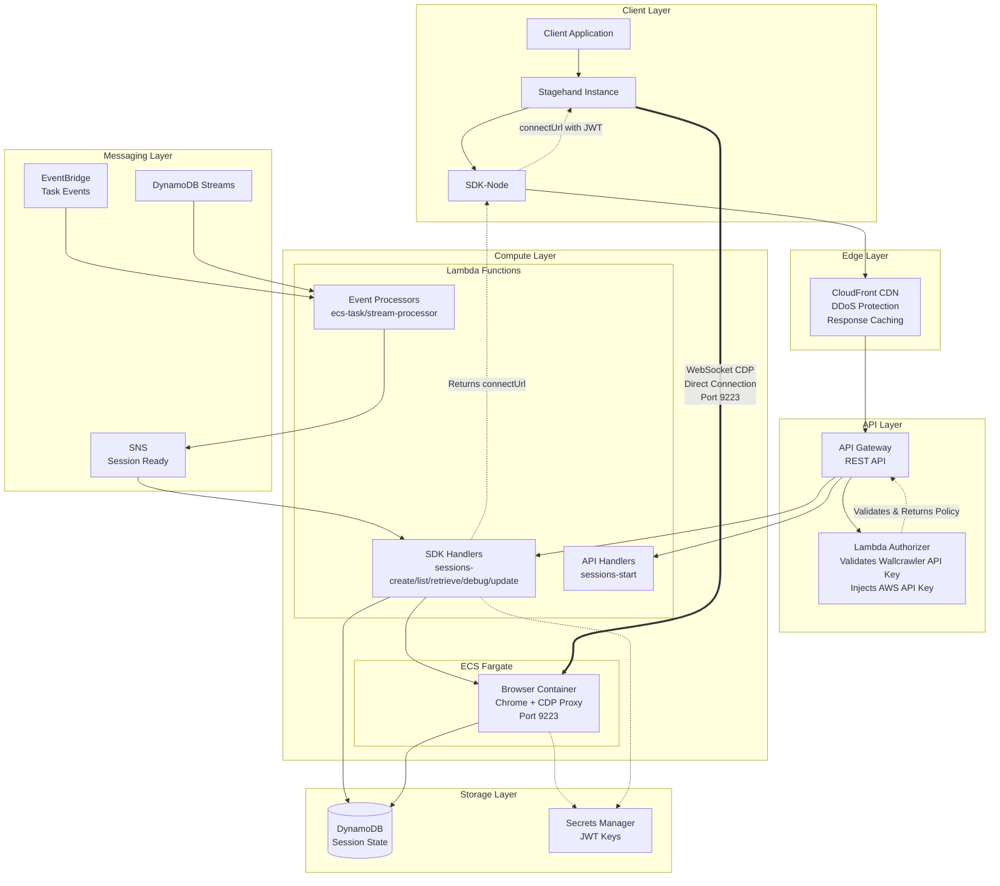
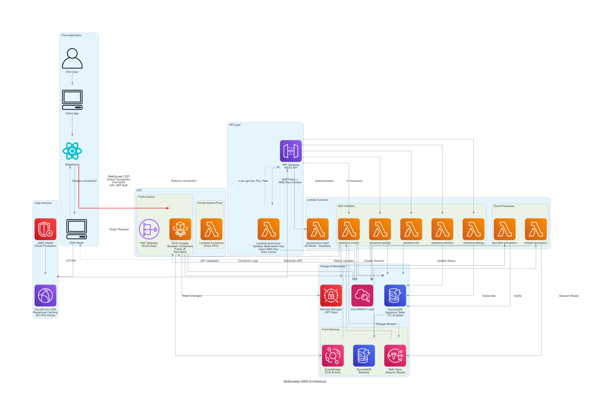
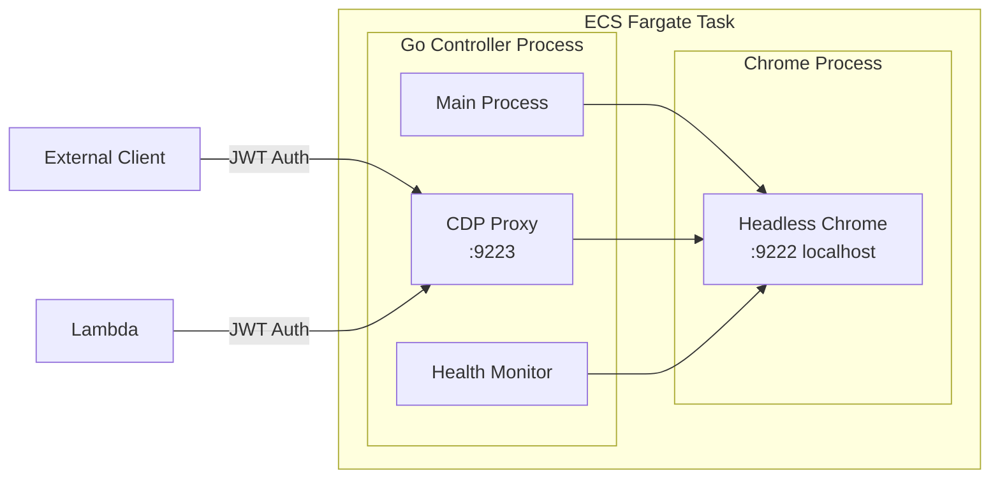
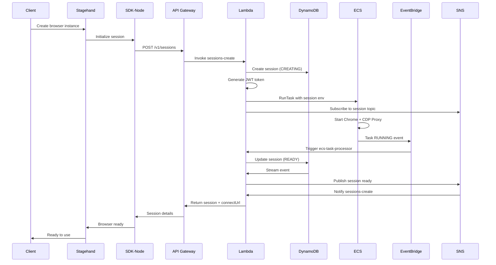
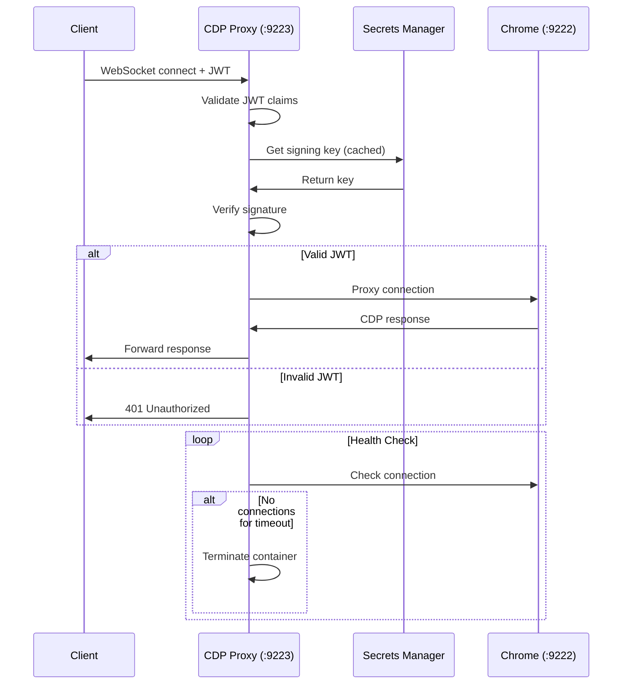
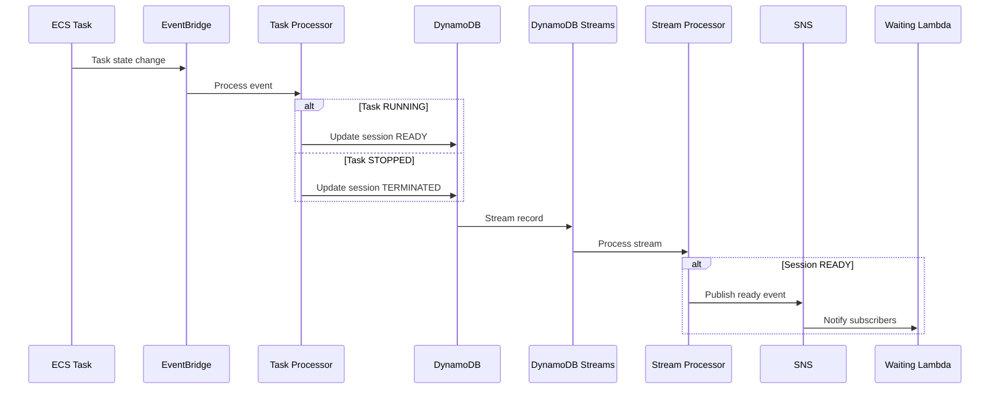
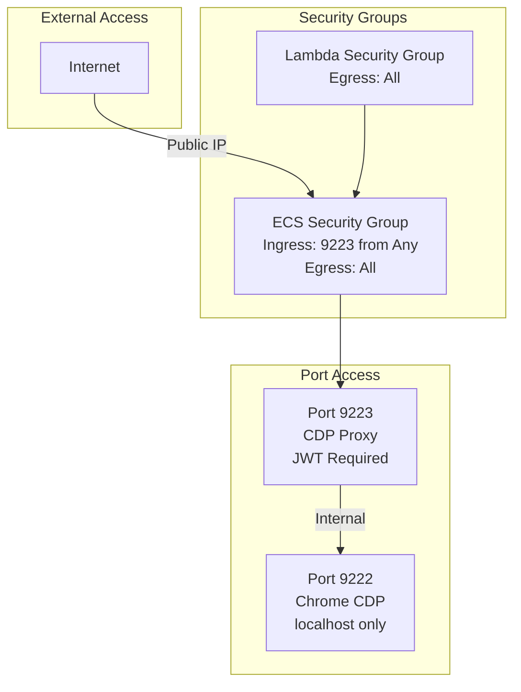

# Wallcrawler Backend Architecture

## Overview

Wallcrawler is a distributed, serverless browser automation platform that provides remote browser access through Chrome DevTools Protocol (CDP). The system supports both SDK-based session management (compatible with Browserbase) and AI-powered automation (Stagehand AI).

## High-Level Architecture



## AWS Infrastructure Diagram



## Component Details

### API Architecture

```
CloudFront CDN (d1234abcd.cloudfront.net)
└── API Gateway (with Lambda Authorizer)
    ├── /v1/                    # SDK-Compatible Endpoints
    │   ├── /sessions
    │   │   ├── POST           # Create session
    │   │   ├── GET            # List sessions
    │   │   └── /{id}
    │   │       ├── GET        # Get session
    │   │       ├── POST       # Update session
    │   │       ├── /debug     # Debug URLs
    │   │       ├── /downloads # Downloads
    │   │       ├── /logs      # Logs
    │   │       └── /recording # Recording
    │   ├── /contexts          # Context management
    │   ├── /extensions        # Extension management
    │   └── /projects          # Project management
    └── /sessions/             # Stagehand AI Endpoints
        └── /start             # AI-powered session creation
```

**Authentication Flow:**
1. Client sends request with `x-wc-api-key` header
2. Lambda Authorizer validates Wallcrawler API key
3. Authorizer injects AWS API key into request context
4. API Gateway forwards request to backend Lambda with AWS key

### Lambda Functions

| Function | Handler | Purpose |
|----------|---------|---------|
| **Authentication** | | |
| AuthorizerLambda | `authorizer` | Validate Wallcrawler API keys, inject AWS key |
| **SDK Handlers** | | |
| SDKSessionsCreate | `sdk/sessions-create` | Synchronous session creation |
| SDKSessionsList | `sdk/sessions-list` | List sessions with filters |
| SDKSessionsRetrieve | `sdk/sessions-retrieve` | Get session details |
| SDKSessionsDebug | `sdk/sessions-debug` | Generate debug URLs |
| SDKSessionsUpdate | `sdk/sessions-update` | Terminate sessions |
| **API Handlers** | | |
| APISessionsStart | `api/sessions-start` | AI-powered sessions (stubbed) |
| **Event Processors** | | |
| ECSTaskProcessor | `ecs-task-processor` | Handle ECS state changes |
| StreamProcessor | `sessions-stream-processor` | Process DynamoDB streams |

### ECS Container Architecture



## Sequence Diagrams

### Session Creation Flow



### CDP Authentication Flow



### Event Processing Flow



## Security Architecture

### Authentication Layers

1. **API Layer**: Wallcrawler API key (`x-wc-api-key` header)
2. **CDP Layer**: JWT tokens with session-specific claims
3. **AWS Layer**: IAM roles and policies

### Network Security



## Data Storage

### DynamoDB Schema

**Table: wallcrawler-sessions**

| Attribute | Type | Description |
|-----------|------|-------------|
| sessionId (PK) | String | Unique session identifier |
| status | String | CREATING, READY, TERMINATED |
| projectId | String | Project identifier |
| createdAt | Number | Unix timestamp |
| expiresAt | Number | TTL for automatic cleanup |
| taskArn | String | ECS task identifier |
| connectUrl | String | WebSocket CDP URL |
| publicIp | String | Container public IP |

**Global Secondary Indexes:**
- `projectId-createdAt-index`: Query sessions by project
- `status-expiresAt-index`: Find active/expired sessions

## Deployment Modes

### Development Mode
- No NAT Gateway (saves $45/month)
- Lambdas run outside VPC
- DynamoDB on-demand billing
- Single public subnet

### Production Mode
- NAT Gateway for private subnet egress
- Lambdas in private subnet
- WAF protection enabled
- Multi-AZ deployment

## Architectural Benefits

### CloudFront + Lambda Authorizer Design
1. **43% Cost Reduction**: Eliminated proxy Lambda and public API Gateway
2. **Free DDoS Protection**: AWS Shield Standard included with CloudFront
3. **Better Performance**: Edge caching for 401/403 responses
4. **Simpler Architecture**: Single API Gateway with authorizer pattern
5. **Result Caching**: 5-minute authorizer cache reduces Lambda invocations

### Cost Optimization
1. **Self-terminating containers**: ECS tasks monitor CDP connections and terminate when idle
2. **Serverless architecture**: Pay-per-use Lambda and DynamoDB
3. **Development mode**: Reduced infrastructure for non-production
4. **TTL cleanup**: Automatic session expiration in DynamoDB
5. **Edge caching**: CloudFront reduces backend load

## Monitoring & Observability

- **CloudWatch Logs**: All Lambda and ECS container logs
- **Container Insights**: ECS cluster metrics
- **EventBridge**: Audit trail for all session events
- **DynamoDB Streams**: Real-time session state changes

## Future Enhancements

1. **AI Mode Implementation**: Complete Stagehand AI endpoints (act, extract, observe)
2. **Multi-region Support**: Global browser deployment
3. **Session Recording**: Video capture of browser sessions
4. **Advanced Analytics**: Usage metrics and performance monitoring
5. **WebRTC Support**: Real-time browser streaming