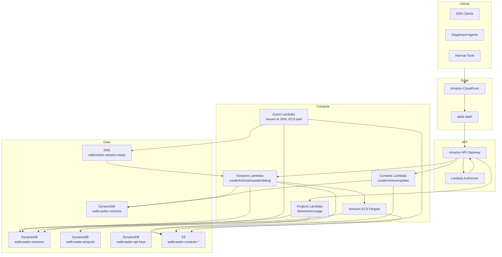
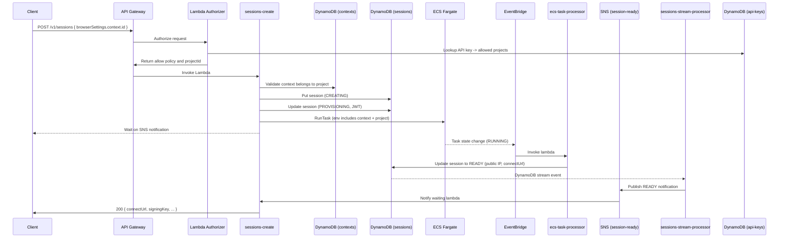
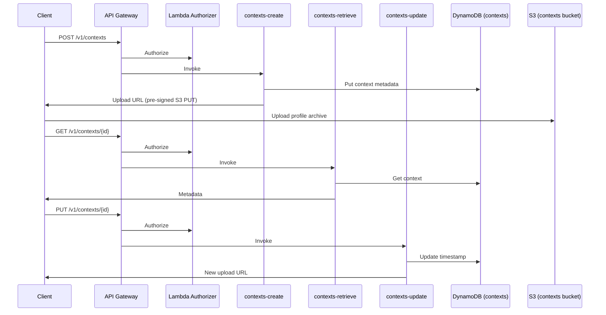
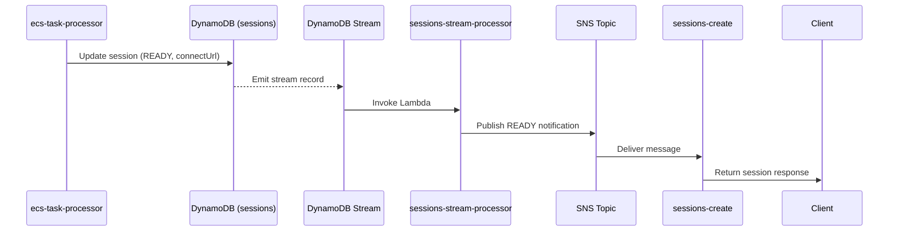
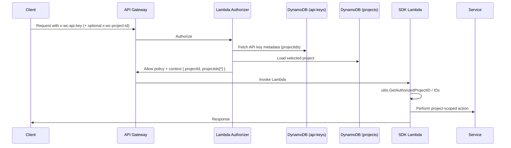

# Wallcrawler Architecture

## AWS Infrastructure



## Sequence Diagrams

### Session Creation (with context reuse)



### Context Lifecycle



### Session Ready Notification



### Multi-Project Authorization



## Notes

- Contexts, sessions, projects, and API keys are isolated per project. Multi-project keys are allowed; the authorizer enforces project membership on every request.
- Context archives are stored in S3 and hydrated by the ECS controller. When `persist` is true, the controller re-uploads the profile on shutdown.
- End-user isolation (per `ownerId`) should be implemented in the consumer application by tagging contexts and filtering before calling the Wallcrawler API.
```
