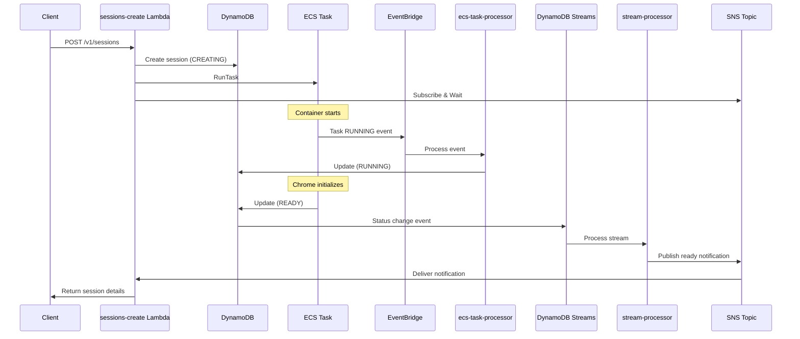

# Event Systems Architecture

## Overview

Wallcrawler uses three complementary event systems to enable synchronous browser session creation on serverless infrastructure:

1. **EventBridge** - AWS infrastructure events
2. **DynamoDB Streams** - Application state changes  
3. **SNS** - Synchronous communication

## Why Three Event Systems?

### The Core Challenge
The API provides synchronous session creation (`POST /v1/sessions`) where clients wait up to 45 seconds for a fully ready browser with connection details. This requires coordinating:
- Container lifecycle (AWS infrastructure)
- Application readiness (Chrome + CDP proxy)
- API response delivery (Lambda coordination)

### Each System's Role

#### EventBridge
- **Source**: AWS ECS service
- **Events**: Task state changes (PROVISIONING → RUNNING → STOPPED)
- **Purpose**: Monitor container lifecycle and failures
- **Consumer**: `ecs-task-processor` Lambda

#### DynamoDB Streams  
- **Source**: Session table updates
- **Events**: All session state changes
- **Purpose**: Capture application-level state transitions
- **Consumer**: `sessions-stream-processor` Lambda

#### SNS
- **Source**: Stream processor Lambda
- **Events**: Session ready notifications
- **Purpose**: Wake up waiting Lambda functions
- **Consumer**: `sessions-create` Lambda

## Session Creation Flow

## Key Design Decisions

### Container Updates vs EventBridge Updates
- **EventBridge**: Knows when container is RUNNING (infrastructure ready)
- **Container**: Knows when Chrome is READY (application ready)
- Both update DynamoDB for complete visibility

### Why Not Just Polling?
- Would require multiple DynamoDB reads
- Higher latency (polling intervals)
- More expensive and less efficient

### Why Not Just EventBridge?
- EventBridge alone can't wake a waiting Lambda
- No way to correlate container events with API requests
- Missing application-level readiness signals

## Benefits of This Architecture

1. **Loose Coupling**: Each component has minimal dependencies
2. **Reliability**: Multiple checkpoints ensure session readiness
3. **Observability**: Every state change is tracked
4. **Real-time**: Push-based notifications minimize latency
5. **Fault Tolerance**: Failed containers are detected via EventBridge

## Alternative Approaches Considered

1. **Step Functions**: Added complexity for simple wait pattern
2. **SQS Long Polling**: Required message correlation logic
3. **Direct Container-to-SNS**: Tighter coupling, more permissions
4. **Pure Polling**: Inefficient and higher latency

The current design elegantly solves synchronous session creation while maintaining serverless best practices.