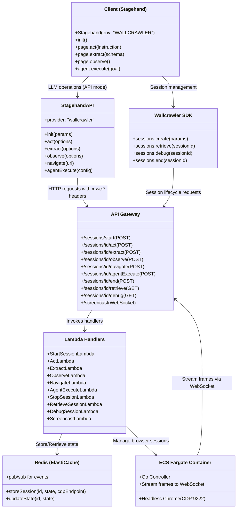
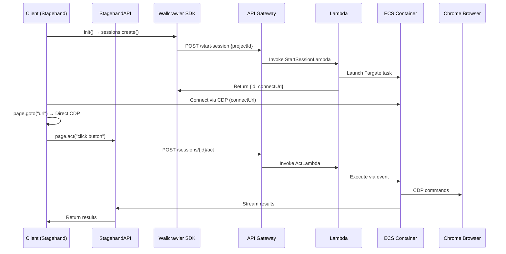

# Wallcrawler

The documentation is structured as follows:

- **Consolidated File Structure**: Updated monorepo structure with minimal Stagehand integration
- **Mermaid Diagrams**: Architecture and flow diagrams
- **Stagehand Integration Strategy**: How Stagehand works with Wallcrawler via provider configuration
- **Package Specifications**: Detailed specs for each package

## Consolidated File Structure

Wallcrawler integrates with the existing Stagehand library through provider configuration rather than extensive modifications. The monorepo includes packages for SDK, components, backend, and infrastructure.

```
wallcrawler/
├── packages/
│   ├── util-ts/          # Shared TypeScript types and utilities
│   │   └── src/
│   │       ├── types.ts  # Shared types: SessionMetadata, ActOptions, ObserveResult, Session, SessionCreateParams, StreamData
│   │       └── utils.ts  # Shared functions: parseLLMResponse, validateScript, decodeStreamFrame
│   ├── util-go/          # Shared Go utilities for backend handlers and ECS controller
│   │   ├── parse_script.go  # Parses script strings into Action structs
│   │   └── redis_client.go  # Helpers for Redis operations
│   ├── sdk/              # Wallcrawler SDK package (mirrors Browserbase SDK)
│   │   └── src/
│   │       ├── index.ts     # Main Wallcrawler class with APIClient
│   │       ├── sessions.ts  # Sessions resource for create/retrieve/debug/end
│   │       ├── core.ts      # Core APIClient and APIResource classes
│   │       └── error.ts     # Custom errors (e.g., WallcrawlerError)
│   ├── components/       # React components for client-side UI
│   │   └── src/
│   │       ├── BrowserViewer.tsx  # React component to display WebSocket stream
│   │       └── index.ts          # Exports BrowserViewer
│   ├── aws-cdk/          # AWS Infrastructure as Code (TypeScript CDK stack)
│   │   ├── lib/
│   │   │   └── wallcrawler-stack.ts  # Defines AWS resources
│   │   └── bin/
│   │       └── wallcrawler.ts  # CDK app entry
│   ├── backend-go/       # Go code for Lambda handlers and ECS controller
│   │   ├── cmd/
│   │   │   ├── start-session/   # StartSessionLambda
│   │   │   ├── act/            # ActLambda
│   │   │   ├── observe/        # ObserveLambda
│   │   │   ├── extract/        # ExtractLambda
│   │   │   ├── navigate/       # NavigateLambda
│   │   │   ├── agent-execute/  # AgentExecuteLambda
│   │   │   ├── resume-session/ # ResumeSessionLambda
│   │   │   ├── stop-session/   # StopSessionLambda
│   │   │   ├── retrieve/       # RetrieveSessionLambda
│   │   │   ├── debug/          # DebugSessionLambda
│   │   │   ├── screencast/     # ScreencastLambda
│   │   │   └── ecs-controller/ # ECS Go controller
│   │   ├── Dockerfile          # Docker image for ECS container
│   │   └── go.mod              # Go dependencies
│   ├── client-nextjs/    # Demo Next.js app using Stagehand with Wallcrawler
│   │   ├── src/
│   │   │   └── pages/index.tsx  # Example usage with BrowserViewer
│   │   └── package.json
│   └── stagehand/        # Stagehand library (used as-is with provider config)
├── pnpm-workspace.yaml   # Defines monorepo packages
└── README.md             # Project overview and setup instructions
```

## Stagehand Integration Strategy

**Key Insight**: Stagehand already supports provider configuration through `StagehandAPI`. No extensive modifications needed.

### API Mode (Primary)

Stagehand uses `StagehandAPI` with `provider="wallcrawler"` configuration:

```typescript
// Stagehand automatically uses WallcrawlerAPI when env="WALLCRAWLER"
const stagehand = new Stagehand({
  env: 'WALLCRAWLER',
  apiKey: process.env.WALLCRAWLER_API_KEY,
  projectId: process.env.WALLCRAWLER_PROJECT_ID,
});

await stagehand.init();
await stagehand.page.goto('https://example.com');
await stagehand.page.act('click the button');
const data = await stagehand.page.extract({ schema: mySchema });
```

**Hybrid Architecture**:

- **LLM Operations** → HTTP requests to Wallcrawler API
- **Browser Control** → Direct CDP connection to remote browser
- **Session Management** → Wallcrawler SDK for session lifecycle

### Direct Browser Mode (Fallback)

For development or when API is unavailable, Stagehand connects directly to remote browser via CDP using Wallcrawler SDK for session management.

## Mermaid Diagrams

### 1. Architecture Overview



### 2. Session Flow (API Mode)



## Package Specifications

### 1. Wallcrawler SDK (`packages/sdk`)

**Purpose**: Minimal session management mirroring Browserbase SDK.

**Core Methods**:

```typescript
class Sessions {
  create(params: SessionCreateParams): Promise<SessionCreateResponse>;
  retrieve(sessionId: string): Promise<Session>;
  debug(sessionId: string): Promise<SessionDebugResponse>;
  end(sessionId: string): Promise<void>;
}
```

**Usage**:

```typescript
const wallcrawler = new Wallcrawler({
  apiKey: process.env.WALLCRAWLER_API_KEY,
});

const session = await wallcrawler.sessions.create({
  projectId: 'proj_123',
});

// Connect to browser via CDP
const browser = await chromium.connectOverCDP(session.connectUrl);
```

### 2. Components Package (`packages/components`)

**Purpose**: React components for UI integration.

**BrowserViewer Component**:

```typescript
interface BrowserViewerProps {
  sessionId: string;
  apiKey?: string;
  onError?: (error: Error) => void;
  width?: number;
  height?: number;
}

// Usage
<BrowserViewer
  sessionId={sessionId}
  width={1280}
  height={720}
  onError={(err) => console.error(err)}
/>
```

### 3. Backend Go (`packages/backend-go`)

**Lambda Handlers**: Each handler implements the Stagehand API contract:

- **StartSessionLambda**: Creates ECS task, returns session metadata
- **ActLambda**: Processes act requests with LLM integration
- **ExtractLambda**: Handles data extraction with schema validation
- **ObserveLambda**: Returns observable elements
- **NavigateLambda**: Handles page navigation
- **AgentExecuteLambda**: Executes multi-step agent workflows

**Request/Response Format**:

```json
// Request
{
  "instruction": "click the submit button",
  "useVision": true
}

// Response
{
  "success": true,
  "data": {
    "result": "clicked submit button",
    "screenshot": "base64..."
  }
}
```

### 4. AWS CDK (`packages/aws-cdk`)

**Infrastructure Components**:

- API Gateway with Wallcrawler-specific routing
- Lambda functions for each action type
- ECS Fargate cluster for browser sessions
- Redis ElastiCache for session state
- EventBridge for async communication
- WebSocket API for screencast streaming

**Key Configuration**:

```typescript
// API Gateway headers
const corsHeaders = {
  'x-wc-api-key': 'required',
  'x-wc-project-id': 'required',
  'x-wc-session-id': 'required',
  'x-stream-response': 'true',
};
```

## API Endpoints Specification

Wallcrawler API must implement these endpoints for Stagehand compatibility:

```
POST   /sessions/start          → Create session & return metadata
POST   /sessions/{id}/act       → Execute actions with LLM
POST   /sessions/{id}/extract   → Extract data with schema validation
POST   /sessions/{id}/observe   → Return observable elements
POST   /sessions/{id}/navigate  → Handle navigation requests
POST   /sessions/{id}/agentExecute → Execute agent workflows
POST   /sessions/{id}/end       → Terminate session
GET    /sessions/{id}/retrieve  → Get session status
GET    /sessions/{id}/debug     → Get CDP endpoint
WebSocket /screencast           → Stream browser frames
```

**Headers**:

- `x-wc-api-key`: Authentication
- `x-wc-project-id`: Project identification
- `x-wc-session-id`: Session identification
- `x-stream-response: "true"`: Enable streaming responses

**Response Format**:

```json
{
  "success": true,
  "data": {
    /* action results */
  }
}
```

## Quickstart

### Prerequisites

- Node.js 20+ (recommended via nvm)
- pnpm, npm, or yarn as package manager

### Steps

1. **Create a new project using create-browser-app** (adapted for Wallcrawler):

```bash
pnpm create browser-app my-wallcrawler-app
```

Answer the prompts:

- Project name: my-wallcrawler-app
- Quickstart example: Yes
- AI model: e.g., Anthropic Claude 3.5 Sonnet
- Run locally or on Browserbase: Browserbase (but we'll configure for Wallcrawler)
- Headless mode: No

2. **Install dependencies**:

```bash
cd my-wallcrawler-app
pnpm install
```

3. **Set up environment variables** in .env:

```
WALLCRAWLER_API_KEY=your_wallcrawler_api_key
WALLCRAWLER_PROJECT_ID=your_wallcrawler_project_id
ANTHROPIC_API_KEY=your_anthropic_api_key  # Or appropriate model key
```

4. **Update the script** (e.g., in index.ts) to use Wallcrawler:

```typescript
// packages/client-nextjs/src/pages/index.tsx
import { Stagehand } from '@browserbasehq/stagehand';  // Or use local packages/stagehand if developing in monorepo
import { BrowserViewer } from '@wallcrawler/components';
import { z } from 'zod';
import { useState } from 'react';
import dotenv from 'dotenv';

dotenv.config();  // Load env vars (in production, use process.env directly)

export default function Demo() {
  const [sessionId, setSessionId] = useState<string>();

  const runExample = async () => {
    const stagehand = new Stagehand({
      env: "WALLCRAWLER",
      apiKey: process.env.WALLCRAWLER_API_KEY,
      projectId: process.env.WALLCRAWLER_PROJECT_ID,
      modelName: 'anthropic/claude-3-5-sonnet',  // Specify model
      modelClientOptions: { apiKey: process.env.ANTHROPIC_API_KEY },  // Model API key
    });

    try {
      const { sessionId } = await stagehand.init();
      setSessionId(sessionId);

      // Navigate using direct browser connection
      await stagehand.page.goto("https://example.com");

      // Actions use Wallcrawler API for LLM processing
      await stagehand.page.act("click the search button");

      // Extract data using Wallcrawler API (added instruction for reliability)
      const data = await stagehand.page.extract({
        instruction: "Extract the page title and meta description",
        schema: z.object({
          title: z.string(),
          description: z.string(),
        }),
      });

      console.log(data);
    } catch (error) {
      console.error("Error in example:", error);
    } finally {
      await stagehand.close();  // Clean up session
    }
  };

  return (
    <div>
      <button onClick={runExample}>Run Example</button>
      {sessionId && (
        <BrowserViewer
          sessionId={sessionId}
          width={1280}
          height={720}
        />
      )}
    </div>
  );
}
```

5. **Run the script**:

```bash
pnpm run start
```

This quickstart uses Stagehand with Wallcrawler provider for remote browser control. For local mode, set env: 'LOCAL'."
