# Wallcrawler Design Document

## Table of Contents

1. [Overview](#overview)
2. [Architecture Overview](#architecture-overview)
3. [Core Components](#core-components)
4. [Data Flow](#data-flow)
5. [API Design](#api-design)
6. [Session Management](#session-management)
7. [Infrastructure](#infrastructure)
8. [Security](#security)
9. [Performance & Scaling](#performance--scaling)
10. [Deployment](#deployment)

## Overview

Wallcrawler is a serverless browser automation platform that provides Stagehand-compatible remote browser sessions running on AWS infrastructure. It enables LLM-driven browser automation through a modern, event-driven architecture powered by AWS EventBridge.

### Key Features

- **Event-Driven Architecture**: AWS EventBridge orchestrates all session lifecycle events for reliability and scalability
- **Remote Browser Sessions**: ECS Fargate containers running Chrome with remote debugging
- **Stagehand Integration**: Compatible API for seamless Stagehand integration
- **Dual Mode Support**:
  - **API Mode**: Full proxy through Wallcrawler APIs with streaming responses
  - **Direct Mode**: Direct Chrome DevTools Protocol (CDP) access for privacy
- **WebSocket Streaming**: Real-time browser viewport streaming with EventBridge coordination
- **Serverless Architecture**: AWS Lambda functions with EventBridge-driven workflows
- **Hybrid State Management**: EventBridge for lifecycle orchestration, Redis for real-time operations
- **Enterprise Reliability**: Automatic retry, dead letter queues, and comprehensive observability

### System Boundaries

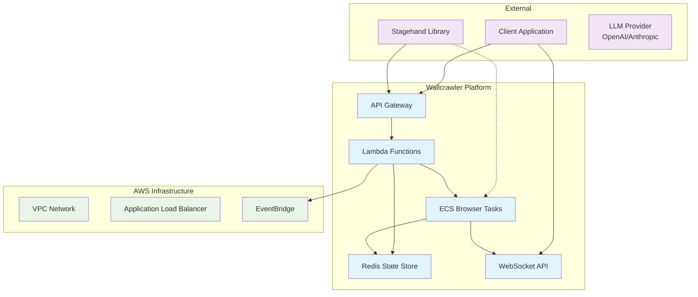

## Architecture Overview

Wallcrawler follows a serverless, event-driven architecture designed for scalability and cost-effectiveness.

### High-Level Architecture

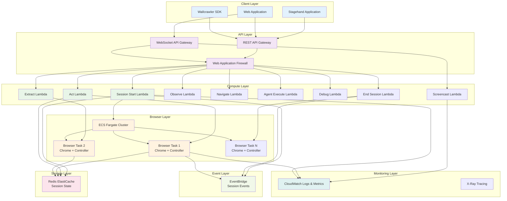

## Core Components

### 1. API Gateway & Lambda Functions

The API layer handles all incoming requests and routes them to appropriate Lambda functions.

### 2. ECS Browser Tasks

Each browser session runs in a dedicated ECS Fargate task containing:

- Chrome browser with remote debugging enabled
- Go controller for session management
- WebSocket communication for real-time updates

### 3. Redis State Store

Centralized session state management with automatic expiration and cleanup.

### 4. WebSocket API

Real-time streaming for browser screencast and bidirectional communication.

## Data Flow

### EventBridge-Driven Session Creation Flow

Wallcrawler uses EventBridge as the central coordination layer for all session lifecycle events, providing reliable, scalable, and observable session management.

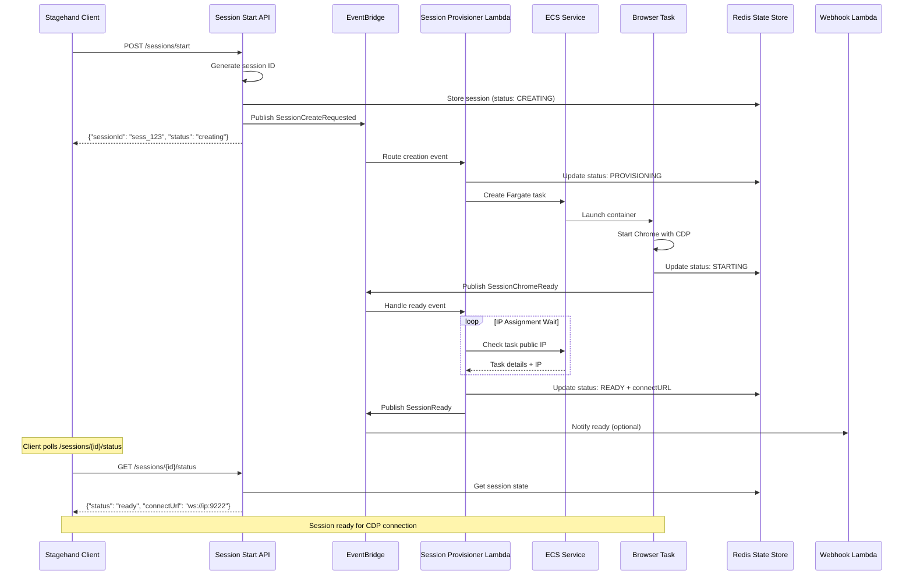

### Session Interaction Flow (EventBridge Coordination)

All session interactions are coordinated through EventBridge for reliability and observability:

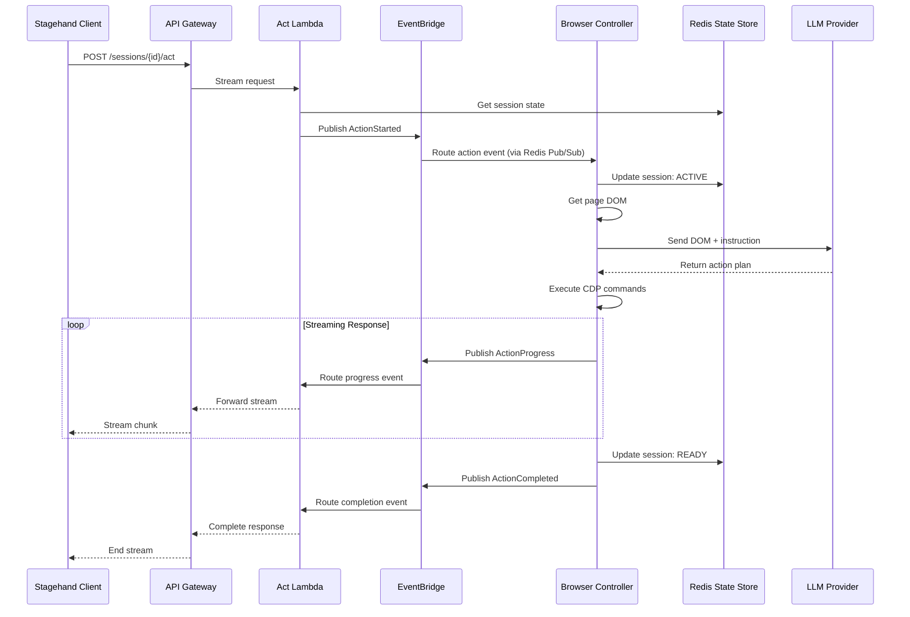

### Enhanced Session Termination Flow

EventBridge orchestrates comprehensive session cleanup with automatic retry and error handling:

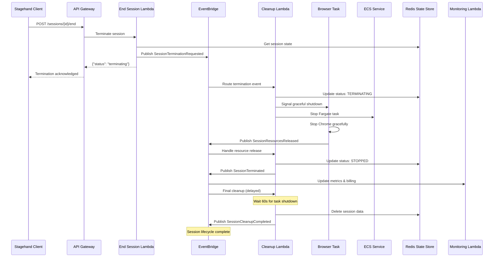

### Direct Mode Connection Flow

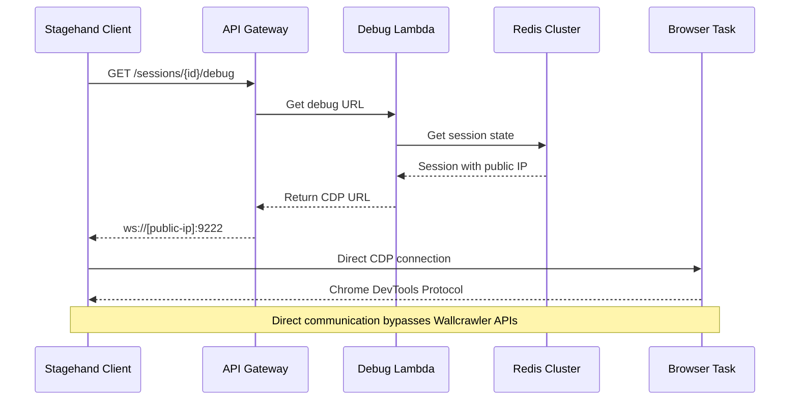

### Enhanced WebSocket Flow with EventBridge Coordination

WebSocket operations are coordinated through EventBridge for better reliability and monitoring:

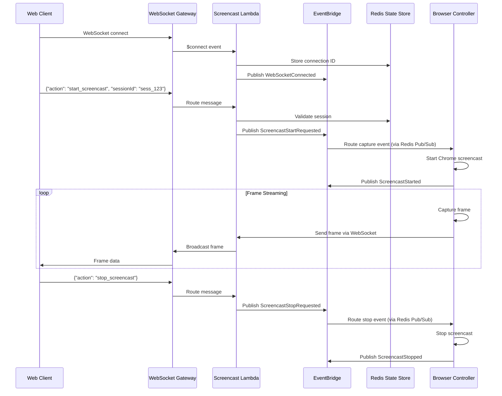

## Architecture Decision: EventBridge vs Redis

Understanding the distinct roles of EventBridge and Redis is crucial to Wallcrawler's architecture design.

### EventBridge: Session Lifecycle Orchestration

**Primary Role**: Event-driven coordination of session lifecycle and cross-service communication

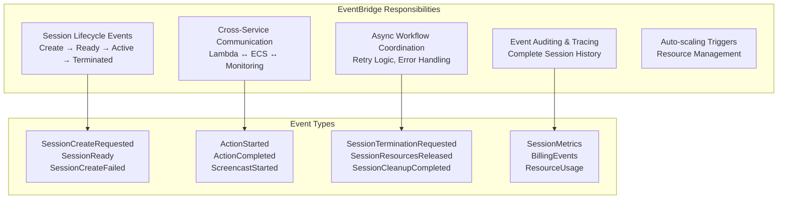

**Why EventBridge for Session Management:**

1. **🔄 Reliable Event Delivery**: Built-in retry mechanisms and dead letter queues
2. **📊 Complete Audit Trail**: Every session lifecycle event is tracked and traceable
3. **🎯 Decoupled Architecture**: Services don't need direct communication
4. **⚡ Auto-scaling**: Resource creation/cleanup based on demand patterns
5. **🛡️ Error Resilience**: Automatic retry and failure handling workflows
6. **🔍 Observability**: CloudWatch integration for metrics and monitoring

### Redis: Real-time State and Communication

**Primary Role**: High-performance state storage and real-time inter-service communication

```mermaid
graph TB
    subgraph "Redis Responsibilities"
        SessionState[Session State Storage<br/>Current Status, Metadata, Config]
        RealTime[Real-time Communication<br/>Pub/Sub for Immediate Actions]
        Caching[High-speed Data Cache<br/>Session Lookups, Connection Data]
        Temporary[Temporary Data Storage<br/>Action Results, Frame Buffers]
        Coordination[ECS Task Coordination<br/>Direct Browser ↔ Lambda Communication]
    end

    subgraph "Data Patterns"
        StateData[session:{id} → Session State<br/>session:{id}:viewers → WebSocket Connections]
        PubSubChannels[session:{id}:events → Real-time Commands<br/>screencast:{id} → Frame Data]
        Cache[task_ips:{taskId} → Public IPs<br/>connection_sessions → WebSocket Mapping]
    end

    SessionState --> StateData
    RealTime --> PubSubChannels
    Caching --> Cache
```

**Why Redis for Real-time Operations:**

1. **⚡ Sub-millisecond Performance**: Critical for real-time browser operations
2. **🔄 Pub/Sub Messaging**: Direct communication between ECS tasks and Lambda functions
3. **📱 WebSocket State**: Managing active WebSocket connections and viewers
4. **🎯 Session Lookups**: Fast session state retrieval for API requests
5. **🔄 Atomic Operations**: Session status updates and viewer count management
6. **⏰ TTL Support**: Automatic cleanup of expired session data

### Hybrid Communication Architecture

```mermaid
graph TB
    subgraph "EventBridge Flow (Lifecycle Events)"
        EB1[Session Creation] --> EB2[Resource Provisioning]
        EB2 --> EB3[Session Ready]
        EB3 --> EB4[Session Termination]
        EB4 --> EB5[Cleanup Complete]
    end

    subgraph "Redis Flow (Real-time Operations)"
        R1[Action Commands] --> R2[Browser Execution]
        R2 --> R3[Status Updates]
        R3 --> R4[Response Streaming]
        R4 --> R5[WebSocket Broadcasting]
    end

    subgraph "Integration Points"
        EventBridge --> Redis
        Redis --> EventBridge
    end

    Note1[EventBridge: Reliable, Auditable, Async]
    Note2[Redis: Fast, Real-time, Direct]

    style EventBridge fill:#e3f2fd
    style Redis fill:#fce4ec
```

### Event Types and Patterns

| Category                | Event Type                    | Source                | Target                  | Purpose                        |
| ----------------------- | ----------------------------- | --------------------- | ----------------------- | ------------------------------ |
| **Session Lifecycle**   | `SessionCreateRequested`      | `sessions-start`      | `session-provisioner`   | Trigger async session creation |
|                         | `SessionReady`                | `session-provisioner` | `webhook-notifications` | Notify session availability    |
|                         | `SessionTerminationRequested` | `end-session`         | `cleanup-handler`       | Initiate graceful shutdown     |
|                         | `SessionCleanupCompleted`     | `cleanup-handler`     | `monitoring`            | Session fully terminated       |
| **Browser Operations**  | `ActionStarted`               | `act-lambda`          | `monitoring`            | Track action execution         |
|                         | `ActionCompleted`             | `browser-controller`  | `act-lambda`            | Signal action completion       |
|                         | `ScreencastStarted`           | `browser-controller`  | `monitoring`            | WebSocket streaming active     |
| **Resource Management** | `ECSTaskStarted`              | `session-provisioner` | `monitoring`            | Track resource usage           |
|                         | `ECSTaskFailed`               | `ecs-monitor`         | `error-handler`         | Handle task failures           |
|                         | `ResourceQuotaExceeded`       | `resource-monitor`    | `scaling-handler`       | Trigger scaling decisions      |
| **Error Handling**      | `SessionCreateFailed`         | `session-provisioner` | `retry-handler`         | Retry failed sessions          |
|                         | `SessionTimeout`              | `timeout-monitor`     | `cleanup-handler`       | Clean up stale sessions        |

### Performance Characteristics

| Aspect         | EventBridge               | Redis                      |
| -------------- | ------------------------- | -------------------------- |
| **Latency**    | 10-100ms (async)          | <1ms (real-time)           |
| **Durability** | Persistent, replicated    | In-memory with persistence |
| **Ordering**   | Event ordering guarantees | Pub/Sub immediate delivery |
| **Scaling**    | Auto-scaling, unlimited   | Single-node or cluster     |
| **Use Case**   | Workflow coordination     | Real-time operations       |
| **Cost**       | Pay per event             | Fixed infrastructure cost  |

## API Design

### REST API Endpoints

Wallcrawler provides a Stagehand-compatible API with additional native endpoints.

```mermaid
graph TB
    subgraph "Session Management"
        StartSession[POST /sessions/start<br/>Stagehand Compatible]
        StartNative[POST /start-session<br/>Wallcrawler Native]
        RetrieveSession[GET /sessions/{id}/retrieve]
        DebugSession[GET /sessions/{id}/debug]
        CDPURLSession[POST /sessions/{id}/cdp-url<br/>Signed CDP URLs]
        EndSession[POST /sessions/{id}/end]
    end

    subgraph "Browser Operations (Streaming)"
        Act[POST /sessions/{id}/act]
        Extract[POST /sessions/{id}/extract]
        Observe[POST /sessions/{id}/observe]
        Navigate[POST /sessions/{id}/navigate]
        AgentExecute[POST /sessions/{id}/agentExecute]
    end

    subgraph "Real-time Communication"
        WSConnect[WebSocket /screencast]
        WSEvents[Event Broadcasting]
    end

    StartSession --> Lambda1[sessions-start Lambda]
    StartNative --> Lambda2[start-session Lambda]
    RetrieveSession --> Lambda3[retrieve Lambda]
    DebugSession --> Lambda4[debug Lambda]
    CDPURLSession --> Lambda7[cdp-url Lambda]
    EndSession --> Lambda5[end Lambda]

    Act --> Lambda6[act Lambda]
    Extract --> Lambda7[extract Lambda]
    Observe --> Lambda8[observe Lambda]
    Navigate --> Lambda9[navigate Lambda]
    AgentExecute --> Lambda10[agent-execute Lambda]

    WSConnect --> Lambda11[screencast Lambda]
    WSEvents --> Lambda11


```

### Authentication & Headers

All API requests require authentication and specific headers:

```yaml
Headers:
  x-wc-api-key: 'your-api-key' # API authentication
  x-wc-project-id: 'project-id' # Project identification
  x-wc-session-id: 'session-id' # Session context (optional)
  x-model-api-key: 'llm-api-key' # LLM provider API key
  x-stream-response: 'true' # Enable streaming responses
  Content-Type: 'application/json'
```

### Response Format

All responses follow a consistent format:

```typescript
// Success Response
{
  "success": true,
  "data": {
    // Response data
  }
}

// Error Response
{
  "success": false,
  "message": "Error description"
}

// Streaming Response (Server-Sent Events)
data: {"type": "log", "data": {"level": "info", "message": "Starting action..."}}
data: {"type": "result", "data": {"success": true, "action": "click"}}
data: {"type": "system", "data": {"status": "complete"}}
```

## Session Management

### Enhanced Session Lifecycle with EventBridge

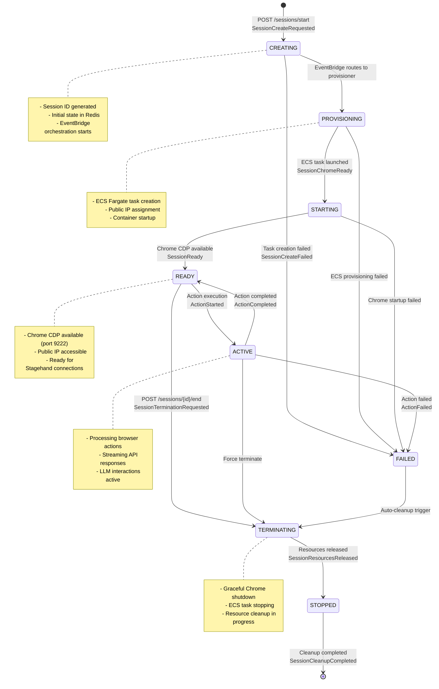

### Session State Schema with EventBridge Integration

```typescript
interface EnhancedSessionState {
  id: string; // Unique session identifier
  status: SessionStatus; // Current lifecycle status
  projectId: string; // Project identification
  connectUrl?: string; // Chrome CDP WebSocket URL
  ecsTaskArn?: string; // AWS ECS task ARN
  publicIP?: string; // ECS task public IP
  userMetadata?: object; // User-defined metadata
  modelConfig?: ModelConfig; // LLM configuration

  // EventBridge Integration
  eventHistory: SessionEvent[]; // Complete event audit trail
  lastEventTimestamp: Date; // Last EventBridge event
  retryCount?: number; // Failed creation retry attempts

  // Performance Tracking
  createdAt: Date; // Session creation time
  provisioningStartedAt?: Date; // ECS task creation started
  readyAt?: Date; // Chrome CDP available
  lastActiveAt?: Date; // Last action execution
  terminatedAt?: Date; // Session termination time

  // Resource Management
  resourceLimits?: ResourceLimits; // CPU, memory, timeout limits
  billingInfo?: BillingInfo; // Usage tracking
}

interface SessionEvent {
  eventType: string; // EventBridge event type
  timestamp: Date; // Event occurrence time
  source: string; // Event source service
  detail: object; // Event-specific data
  correlationId?: string; // Request correlation
}

interface ResourceLimits {
  maxCPU: number; // Maximum CPU allocation
  maxMemory: number; // Maximum memory (MB)
  maxDuration: number; // Maximum session duration (seconds)
  maxActions: number; // Maximum actions per session
}

enum SessionStatus {
  CREATING = 'CREATING', // Initial state, EventBridge triggered
  PROVISIONING = 'PROVISIONING', // ECS task being created
  STARTING = 'STARTING', // Chrome initializing
  READY = 'READY', // Available for actions
  ACTIVE = 'ACTIVE', // Processing actions
  TERMINATING = 'TERMINATING', // Shutdown in progress
  STOPPED = 'STOPPED', // Fully terminated
  FAILED = 'FAILED', // Error state
}
```

### EventBridge-Driven Architecture Benefits

Leveraging EventBridge as the central coordination layer provides significant advantages over traditional synchronous architectures:

#### **1. Operational Resilience**

- **Automatic Retry**: Failed session creation automatically retries with exponential backoff
- **Dead Letter Queues**: Permanently failed requests are captured for analysis
- **Circuit Breaker**: System automatically stops creating sessions when ECS is at capacity
- **Graceful Degradation**: API remains responsive even during high load or ECS issues

#### **2. Cost Optimization**

- **Reduced Lambda Duration**: Session start API returns immediately instead of waiting 60+ seconds
- **Pay-per-Event**: Only pay for actual EventBridge events, not Lambda wait time
- **Resource Efficiency**: Separate provisioner Lambda only runs during active work
- **Auto-scaling**: Resources scale based on actual demand patterns

#### **3. Enhanced Observability**

- **Complete Audit Trail**: Every session event is tracked from creation to termination
- **Performance Metrics**: Detailed timing data for each lifecycle stage
- **Error Analysis**: Failed session patterns and retry statistics
- **Billing Accuracy**: Precise resource usage tracking for cost allocation

#### **4. Scalability & Performance**

- **Decoupled Services**: Session creation doesn't block API availability
- **Independent Scaling**: API and provisioning layers scale independently
- **Burst Handling**: EventBridge can queue thousands of session requests
- **Multi-Region**: Easy extension to multiple AWS regions

#### **5. Developer Experience**

- **Event-Driven Debugging**: Easy to trace session issues through event history
- **A/B Testing**: Different provisioning strategies through event routing
- **Feature Flags**: Conditional session creation based on user attributes
- **Webhook Integration**: Real-time notifications to external systems

```mermaid
graph TB
    subgraph "Traditional Sync Architecture"
        SyncAPI[API Request] --> SyncWait[60s Wait] --> SyncResponse[Response]
        SyncWait --> SyncTimeout[Timeout Risk]
        SyncWait --> SyncCost[High Lambda Cost]
    end

    subgraph "EventBridge Architecture"
        AsyncAPI[API Request] --> AsyncEvent[EventBridge] --> AsyncWork[Background Work]
        AsyncAPI --> AsyncResponse[Immediate Response]
        AsyncEvent --> AsyncRetry[Auto Retry]
        AsyncEvent --> AsyncScale[Auto Scale]
        AsyncEvent --> AsyncMonitor[Full Observability]
    end

    SyncTimeout --> AsyncRetry
    SyncCost --> AsyncScale

    style "Traditional Sync Architecture" fill:#ffebee
    style "EventBridge Architecture" fill:#e8f5e8
```

This EventBridge-driven approach transforms Wallcrawler from a traditional request-response system into a modern, event-driven platform capable of handling enterprise-scale browser automation workloads with reliability and cost efficiency.

## Infrastructure

### AWS Architecture Components

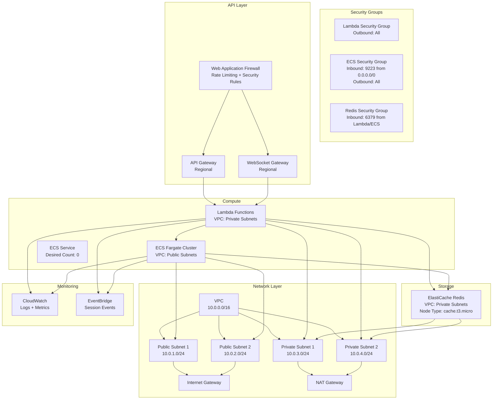

### ECS Task Architecture

```mermaid
graph TB
    subgraph "ECS Fargate Task"
        subgraph "Container: wallcrawler-controller"
            Chrome[Google Chrome<br/>--remote-debugging-port=9222<br/>--remote-debugging-address=0.0.0.0]
            Controller[Go Controller<br/>Session Management<br/>WebSocket Communication<br/>CDP Proxy]
            Stagehand[Stagehand Library<br/>LLM Integration<br/>Action Processing]
        end

        subgraph "Task Configuration"
            CPU[CPU: 1024<br/>Memory: 2048 MB]
            Network[Network Mode: awsvpc<br/>Public IP: Enabled]
            Platform[Platform: Linux/x86_64]
        end

        subgraph "Environment Variables"
            SessionID[SESSION_ID]
            RedisAddr[REDIS_ADDR]
            ECSCluster[ECS_CLUSTER]
            WSEndpoint[WEBSOCKET_API_ENDPOINT]
            Region[AWS_REGION]
        end

        subgraph "Port Mappings"
            Port9222[Container Port: 9222<br/>Protocol: TCP<br/>Chrome CDP (localhost)]
            Port9223[Container Port: 9223<br/>Protocol: TCP<br/>CDP Proxy (public)]
        end
    end

    subgraph "External Access"
        SignedCDP[Signed CDP Access<br/>ws://[public-ip]:9223/cdp?signingKey=JWT]
        StagehandClient[Stagehand Client<br/>API Mode]
        WebSocketClient[WebSocket Client<br/>Screencast via CDP Proxy]
    end

    Chrome --> Port9222
    Controller --> Chrome
    Controller --> Port9223
    Controller --> Stagehand
    Controller --> SessionID
    Controller --> RedisAddr
    Controller --> WSEndpoint

    SignedCDP --> Port9223
    Port9223 --> Port9222
    StagehandClient --> Controller
    WebSocketClient --> Port9223


```

### Resource Specifications

| Component        | Specification                                    | Scaling      |
| ---------------- | ------------------------------------------------ | ------------ |
| Lambda Functions | Runtime: Go 1.21, Memory: 1024MB, Timeout: 15min | Auto-scaling |
| ECS Tasks        | CPU: 1 vCPU, Memory: 2GB, Platform: Fargate      | On-demand    |
| Redis            | Node Type: cache.t3.micro, Engine: Redis 7.0     | Single node  |
| VPC              | CIDR: 10.0.0.0/16, AZs: 2, NAT: 1                | Static       |

## Security

### Authentication & Authorization

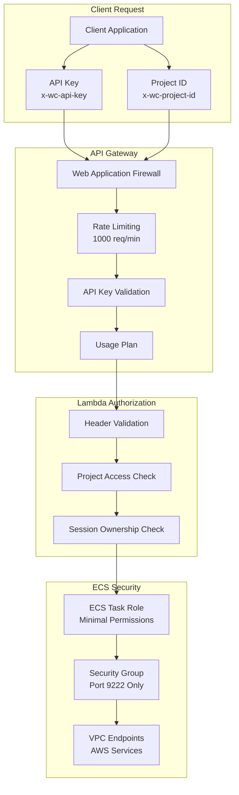

### Security Features

1. **API Key Authentication**: All REST API requests require valid API keys (`x-wc-api-key`)
2. **JWT Signed CDP URLs**: Time-limited, scope-based authentication for CDP access
3. **CDP Proxy Security**: Enterprise-grade proxy with rate limiting and circuit breaker
4. **Network Isolation**: Chrome listens only on localhost (127.0.0.1:9222), proxy on 9223
5. **Project Isolation**: Sessions are isolated by project ID
6. **Enterprise Monitoring**: Rate limiting, error tracking, and comprehensive metrics
7. **Network Security**: VPC with security groups and NACLs
8. **WAF Protection**: DDoS protection and common attack mitigation
9. **Encryption**: Data in transit and at rest encryption
10. **IAM Roles**: Least privilege access for all components

## Performance & Scaling

### Auto-Scaling Configuration

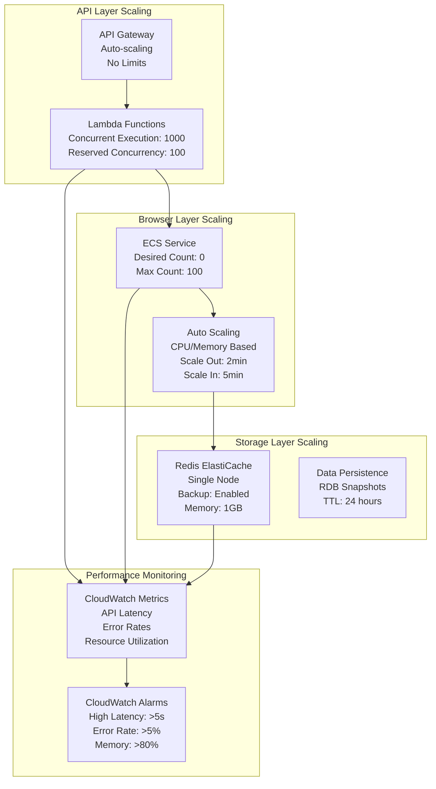

### Performance Targets

| Metric                        | Target          | EventBridge Benefit                              | Monitoring         |
| ----------------------------- | --------------- | ------------------------------------------------ | ------------------ |
| Session Start API Response    | < 500ms         | ✅ Immediate response, no 60s wait               | CloudWatch         |
| Session Ready Time            | < 30 seconds    | ✅ Async provisioning with progress tracking     | EventBridge Events |
| WebSocket Latency             | < 100ms         | ✅ EventBridge coordination for connection state | Custom Metrics     |
| Browser Task Startup          | < 20 seconds    | ✅ Parallel provisioning and health checks       | ECS + EventBridge  |
| Concurrent Sessions           | 500+ per region | ✅ EventBridge queuing and burst handling        | Auto-scaling       |
| Session Creation Success Rate | > 99%           | ✅ Automatic retry and dead letter queues        | EventBridge DLQ    |
| Error Recovery Time           | < 60 seconds    | ✅ Circuit breaker and automated cleanup         | EventBridge Rules  |

## Deployment

### CI/CD Pipeline

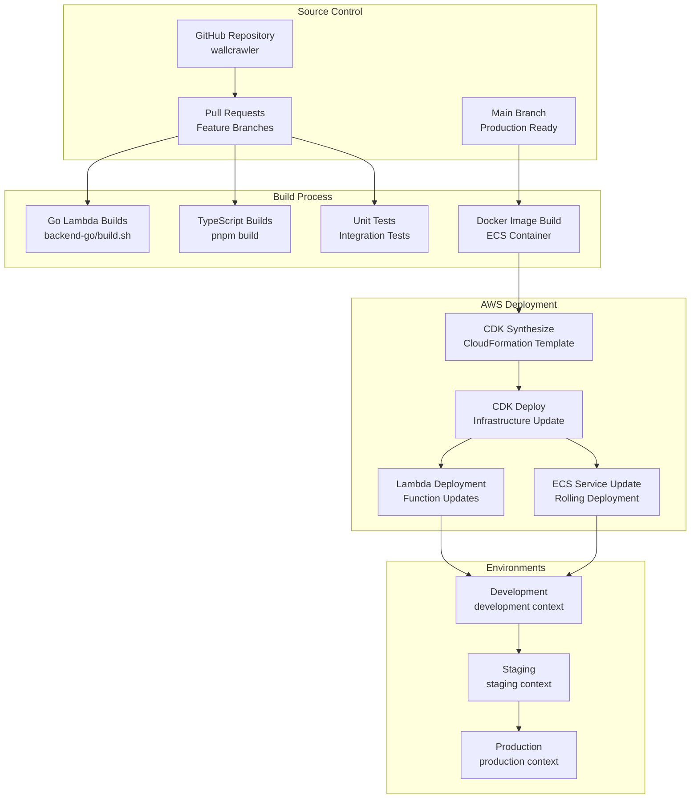

### Deployment Commands

```bash
# Development deployment
pnpm install
pnpm build
cd packages/aws-cdk
cdk deploy --context environment=development

# Production deployment
pnpm install
pnpm build
cd packages/backend-go && ./build.sh
cd ../aws-cdk
cdk deploy --context environment=production --context domainName=api.wallcrawler.com
```

### Environment Configuration

Each environment uses CDK context for configuration:

```json
{
  "development": {
    "environment": "development",
    "ecsDesiredCount": 0,
    "redisNodeType": "cache.t3.micro",
    "lambdaMemory": 1024
  },
  "production": {
    "environment": "production",
    "domainName": "api.wallcrawler.com",
    "ecsDesiredCount": 0,
    "redisNodeType": "cache.r6g.large",
    "lambdaMemory": 2048
  }
}
```

---

This design document provides a comprehensive overview of the Wallcrawler architecture. For implementation details, refer to the individual package documentation in `/packages/*/README.md`.
