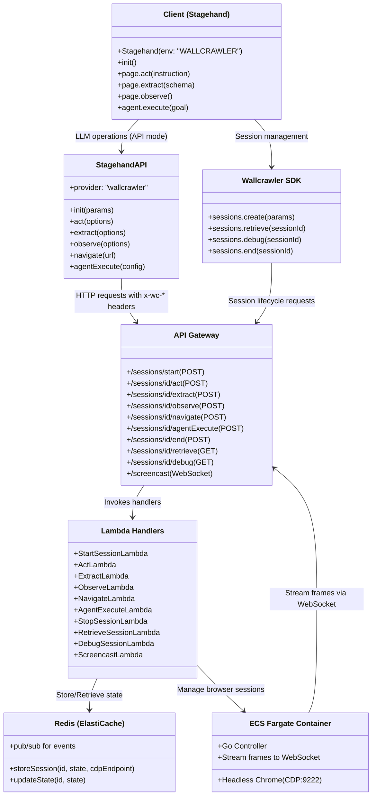
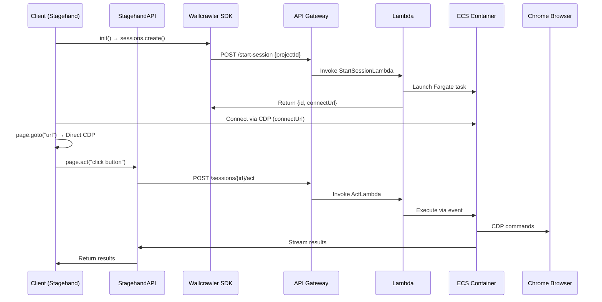
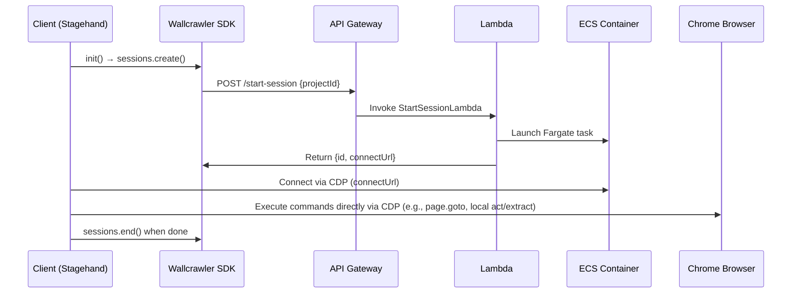

# Wallcrawler

The documentation is structured as follows:

- **Consolidated File Structure**: Updated monorepo structure with minimal Stagehand integration
- **Mermaid Diagrams**: Architecture and flow diagrams
- **Stagehand Integration Strategy**: How Stagehand works with Wallcrawler via provider configuration
- **Package Specifications**: Detailed specs for each package

## Consolidated File Structure

Wallcrawler integrates with the existing Stagehand library through provider configuration rather than extensive modifications. The monorepo includes packages for SDK, components, backend, and infrastructure.

```
wallcrawler/
├── packages/
│   ├── util-ts/          # Shared TypeScript types and utilities
│   │   └── src/
│   │       ├── types.ts  # Shared types: SessionMetadata, ActOptions, ObserveResult, Session, SessionCreateParams, StreamData
│   │       └── utils.ts  # Shared functions: parseLLMResponse, validateScript, decodeStreamFrame
│   ├── util-go/          # Shared Go utilities for backend handlers and ECS controller
│   │   ├── parse_script.go  # Parses script strings into Action structs
│   │   └── redis_client.go  # Helpers for Redis operations
│   ├── sdk/              # Wallcrawler SDK package (mirrors Browserbase SDK)
│   │   └── src/
│   │       ├── index.ts     # Main Wallcrawler class with APIClient
│   │       ├── sessions.ts  # Sessions resource for create/retrieve/debug/end
│   │       ├── core.ts      # Core APIClient and APIResource classes
│   │       └── error.ts     # Custom errors (e.g., WallcrawlerError)
│   ├── components/       # React components for client-side UI
│   │   └── src/
│   │       ├── BrowserViewer.tsx  # React component to display WebSocket stream
│   │       └── index.ts          # Exports BrowserViewer
│   ├── aws-cdk/          # AWS Infrastructure as Code (TypeScript CDK stack)
│   │   ├── lib/
│   │   │   └── wallcrawler-stack.ts  # Defines AWS resources
│   │   └── bin/
│   │       └── wallcrawler.ts  # CDK app entry
│   ├── backend-go/       # Go code for Lambda handlers and ECS controller
│   │   ├── cmd/
│   │   │   ├── start-session/   # StartSessionLambda
│   │   │   ├── act/            # ActLambda
│   │   │   ├── observe/        # ObserveLambda
│   │   │   ├── extract/        # ExtractLambda
│   │   │   ├── navigate/       # NavigateLambda
│   │   │   ├── agent-execute/  # AgentExecuteLambda
│   │   │   ├── resume-session/ # ResumeSessionLambda
│   │   │   ├── stop-session/   # StopSessionLambda
│   │   │   ├── retrieve/       # RetrieveSessionLambda
│   │   │   ├── debug/          # DebugSessionLambda
│   │   │   ├── screencast/     # ScreencastLambda
│   │   │   └── ecs-controller/ # ECS Go controller
│   │   ├── Dockerfile          # Docker image for ECS container
│   │   └── go.mod              # Go dependencies
│   ├── client-nextjs/    # Demo Next.js app using Stagehand with Wallcrawler
│   │   ├── src/
│   │   │   └── pages/index.tsx  # Example usage with BrowserViewer
│   │   └── package.json
│   └── stagehand/        # Stagehand library (used as-is with provider config)
├── pnpm-workspace.yaml   # Defines monorepo packages
└── README.md             # Project overview and setup instructions
```

## Stagehand Integration Strategy

**Key Insight**: We extended Stagehand's `StagehandAPI` to support custom providers, adding 'wallcrawler' with minimal modifications to enable compatibility without altering core logic.

### Direct vs API Modes

- **API Mode** (default): API mode offloads LLM inference and browser commands to Wallcrawler's remote API via HTTP requests, allowing seamless integration without local browser management. This is the primary mode for production use, where Stagehand acts as a client sending instructions and receiving streamed results.

- **Direct Mode** (usingAPI: false): Similar to local mode in that commands are executed locally via Playwright, but uses Wallcrawler's SDK to manage remote browser sessions and connect via CDP. This provides remote browser benefits (e.g., scalability, anti-detection) without full API offloading. It's not identical to purely local mode, as the browser runs in the cloud—ideal for hybrid setups.

For purely local execution (no remote infra), use env: "LOCAL".

Stagehand uses `StagehandAPI` with `provider="wallcrawler"` configuration:

```typescript
// Stagehand automatically uses WallcrawlerAPI when env="WALLCRAWLER"
const stagehand = new Stagehand({
  env: 'WALLCRAWLER',
  apiKey: process.env.WALLCRAWLER_API_KEY,
  projectId: process.env.WALLCRAWLER_PROJECT_ID,
});

await stagehand.init();
await stagehand.page.goto('https://example.com');
await stagehand.page.act('click the button');
const data = await stagehand.page.extract({ schema: mySchema });
```

**Hybrid Architecture**:

- **LLM Operations** → HTTP requests to Wallcrawler API
- **Browser Control** → Direct CDP connection to remote browser
- **Session Management** → Wallcrawler SDK for session lifecycle

### Direct Browser Mode (Fallback)

For development or when API is unavailable, Stagehand connects directly to remote browser via CDP using Wallcrawler SDK for session management.

## Mermaid Diagrams

### 1. Architecture Overview



### 2. Session Flow (API Mode)



### 3. Session Flow (Direct Mode)

In direct mode (usingAPI: false), Stagehand uses the SDK for session management and connects directly via CDP for browser control, bypassing the API for operations. This is similar for Browserbase (using their SDK), but shown here for Wallcrawler.



## Package Specifications

### 1. Wallcrawler SDK (`packages/sdk-node`)

We forked the Browserbase SDK and extended it to create the Wallcrawler SDK. This approach ensures compatibility with Stagehand while customizing for Wallcrawler's API endpoints, authentication, and session management. The SDK handles essential operations like session creation, retrieval, debugging, and termination, making it suitable for both API mode and direct (CDP) mode in Stagehand.

**Approach**:

- **Forked Structure**: Based on Browserbase's SDK, with core logic in `src/core.ts`, errors in `src/error.ts`, and resources in `src/resources/`.
- **Consolidated Implementation**: Class definitions for `Browserbase` and `Wallcrawler` are consolidated in `src/index.ts`, extending an abstract `BrowserClient` from `src/base.ts`. This eliminates duplication by centralizing shared logic (e.g., API requests, headers, timeouts) in the base class, with service-specific overrides for base URL, auth headers, and environment variables.
- **Key Customizations**:
  - Uses Wallcrawler-specific headers (e.g., `x-wc-api-key`) and base URL (`https://api.wallcrawler.dev/v1`).
  - Supports dual compatibility: Can instantiate either `Browserbase` or `Wallcrawler` clients.
  - Removed redundant files (`browserbase.ts`, `wallcrawler.ts`) for a single source of truth in `index.ts`.
- **TypeScript-Focused**: Full type safety with no `any` or `unknown`, including detailed types for sessions, contexts, extensions, and projects.
- **Integration with Stagehand**: Used in Stagehand's `getBrowser()` for env: 'WALLCRAWLER' in direct mode, enabling remote session creation and CDP connection without full API dependency.

**Core Methods** (via `Wallcrawler` class):

```typescript
class Wallcrawler {
  sessions: Sessions;
  // Other resources: contexts, extensions, projects
}

interface Sessions {
  create(params: SessionCreateParams): Promise<SessionCreateResponse>;
  retrieve(sessionId: string): Promise<Session>;
  debug(sessionId: string): Promise<SessionDebugResponse>;
  end(sessionId: string): Promise<void>;
}
```

**Usage Example**:

```typescript
import { Wallcrawler } from '@wallcrawler/sdk';

const wallcrawler = new Wallcrawler({ apiKey: 'wc_...' });
const session = await wallcrawler.sessions.create({ projectId: 'proj_123' });
// Connect via CDP: chromium.connectOverCDP(session.connectUrl)
```

This forked and consolidated approach reduces maintenance overhead while ensuring seamless integration with Stagehand and full support for Wallcrawler's infrastructure.

### 2. Components Package (`packages/components`)

**Purpose**: React components for UI integration.

**BrowserViewer Component**:

```typescript
interface BrowserViewerProps {
  sessionId: string;
  apiKey?: string;
  onError?: (error: Error) => void;
  width?: number;
  height?: number;
}

// Usage
<BrowserViewer
  sessionId={sessionId}
  width={1280}
  height={720}
  onError={(err) => console.error(err)}
/>
```

### 3. Backend Go (`packages/backend-go`)

**Lambda Handlers**: Each handler implements the Stagehand API contract:

- **StartSessionLambda**: Creates ECS task, returns session metadata
- **ActLambda**: Processes act requests with LLM integration
- **ExtractLambda**: Handles data extraction with schema validation
- **ObserveLambda**: Returns observable elements
- **NavigateLambda**: Handles page navigation
- **AgentExecuteLambda**: Executes multi-step agent workflows

**Request/Response Format**:

```json
// Request
{
  "instruction": "click the submit button",
  "useVision": true
}

// Response
{
  "success": true,
  "data": {
    "result": "clicked submit button",
    "screenshot": "base64..."
  }
}
```

### 4. AWS CDK (`packages/aws-cdk`)

**Infrastructure Components**:

- API Gateway with Wallcrawler-specific routing
- Lambda functions for each action type
- ECS Fargate cluster for browser sessions
- Redis ElastiCache for session state
- EventBridge for async communication
- WebSocket API for screencast streaming

**Key Configuration**:

```typescript
// API Gateway headers
const corsHeaders = {
  'x-wc-api-key': 'required',
  'x-wc-project-id': 'required',
  'x-wc-session-id': 'required',
  'x-stream-response': 'true',
};
```

## API Endpoints Specification

Wallcrawler API must implement these endpoints for Stagehand compatibility:

```
POST   /sessions/start          → Create session & return metadata
POST   /sessions/{id}/act       → Execute actions with LLM
POST   /sessions/{id}/extract   → Extract data with schema validation
POST   /sessions/{id}/observe   → Return observable elements
POST   /sessions/{id}/navigate  → Handle navigation requests
POST   /sessions/{id}/agentExecute → Execute agent workflows
POST   /sessions/{id}/end       → Terminate session
GET    /sessions/{id}/retrieve  → Get session status
GET    /sessions/{id}/debug     → Get CDP endpoint
WebSocket /screencast           → Stream browser frames
```

**Headers**:

- `x-wc-api-key`: Authentication
- `x-wc-project-id`: Project identification
- `x-wc-session-id`: Session identification
- `x-stream-response: "true"`: Enable streaming responses

**Response Format**:

```json
{
  "success": true,
  "data": {
    /* action results */
  }
}
```

## Quickstart

### Prerequisites

- Node.js 20+ (recommended via nvm)
- pnpm, npm, or yarn as package manager

### Steps

1. **Create a new project using create-browser-app** (adapted for Wallcrawler):

```bash
pnpm create browser-app my-wallcrawler-app
```

Answer the prompts:

- Project name: my-wallcrawler-app
- Quickstart example: Yes
- AI model: e.g., Anthropic Claude 3.5 Sonnet
- Run locally or on Browserbase: Browserbase (but we'll configure for Wallcrawler)
- Headless mode: No

2. **Install dependencies**:

```bash
cd my-wallcrawler-app
pnpm install
```

3. **Set up environment variables** in .env:

```
WALLCRAWLER_API_KEY=your_wallcrawler_api_key
WALLCRAWLER_PROJECT_ID=your_wallcrawler_project_id
ANTHROPIC_API_KEY=your_anthropic_api_key  # Or appropriate model key
```
