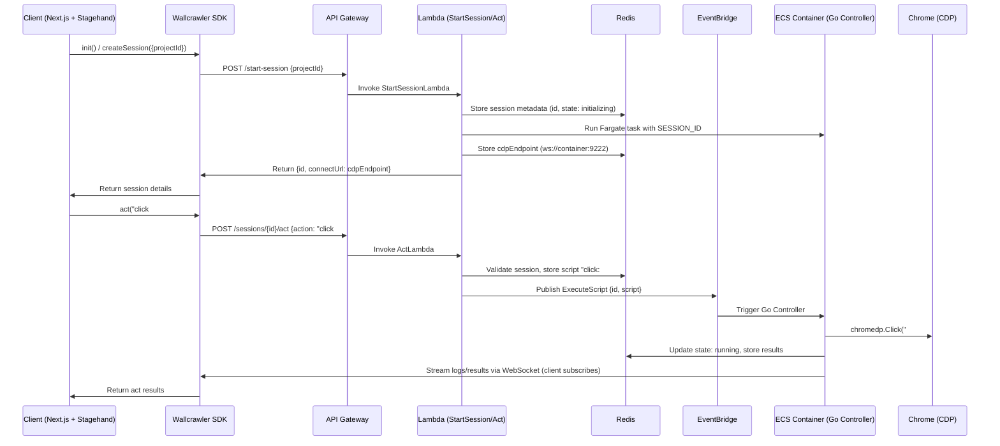
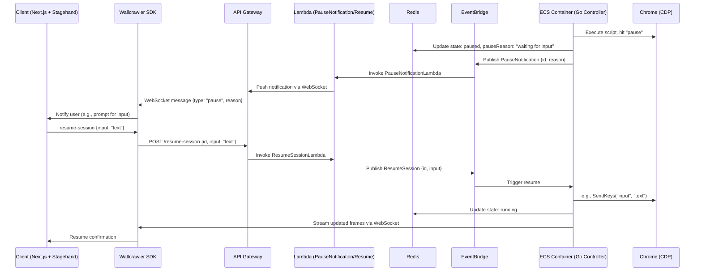

# Wallcrawler

The documentation is structured as follows:

- **Consolidated File Structure**: Updated to include the `components` package.
- **Mermaid Diagrams**: Included with fixed syntax for core flows and architecture.
- **In-Depth Notes and Code Examples for Adapted Stagehand Pieces**: Enhanced with more details, including how the new `components` package integrates.
- **New Package Spec: `components`**: Detailed spec, rationale, and code examples.

## Consolidated File Structure

The monorepo now includes the `components` package, which exports React components like `BrowserViewer`. It depends on `util-ts` for shared types (e.g., stream data formats) and is used in `client-nextjs` for stream rendering.

```
wallcrawler/
├── packages/
│   ├── util-ts/          # Shared TypeScript types and utilities (centralized to avoid duplication)
│   │   └── src/
│   │       ├── types.ts  # Shared types: SessionMetadata, ActOptions, ObserveResult, Session, SessionCreateParams, StreamData (new for BrowserViewer)
│   │       └── utils.ts  # Shared functions: parseLLMResponse, validateScript, decodeStreamFrame (new)
│   ├── util-go/          # Shared Go utilities (modules for backend handlers and ECS controller)
│   │   ├── parse_script.go  # Parses script strings into Action structs
│   │   └── redis_client.go  # Helpers for Redis operations (e.g., UpdateState, StoreScript, StoreCdpEndpoint)
│   ├── wallcrawler-sdk/  # Client-side SDK package (equivalent to Browserbase)
│   │   └── src/
│   │       ├── index.ts  # Main Wallcrawler class with APIClient
│   │       ├── sessions.ts  # Sessions resource for create/retrieve/debug
│   │       ├── core.ts   # Core APIClient and APIResource classes
│   │       └── error.ts  # Custom errors (e.g., WallcrawlerError)
│   ├── components/       # New package: React components for client-side UI (e.g., BrowserViewer for screencast stream)
│   │   └── src/
│   │       ├── BrowserViewer.tsx  # React component to display WebSocket stream
│   │       └── index.ts          # Exports BrowserViewer
│   ├── aws-cdk/          # AWS Infrastructure as Code (TypeScript CDK stack)
│   │   ├── lib/
│   │   │   └── wallcrawler-stack.ts  # Defines AWS resources (API Gateway, Lambda, ECS, Redis, EventBridge)
│   │   └── bin/
│   │       └── wallcrawler.ts  # CDK app entry
│   ├── backend-go/       # Go code for Lambda handlers and ECS controller
│   │   ├── cmd/
│   │   │   ├── start-session/   # StartSessionLambda: Launches ECS task, stores metadata
│   │   │   │   └── main.go
│   │   │   ├── act/            # ActLambda: Processes act requests
│   │   │   │   └── main.go
│   │   │   ├── observe/        # ObserveLambda: Handles observe requests
│   │   │   │   └── main.go
│   │   │   ├── agent-execute/  # AgentExecuteLambda: Executes agent scripts
│   │   │   │   └── main.go
│   │   │   ├── resume-session/ # ResumeSessionLambda: Handles user inputs
│   │   │   │   └── main.go
│   │   │   ├── stop-session/   # StopSessionLambda: Terminates ECS tasks
│   │   │   │   └── main.go
│   │   │   ├── pause-notification/ # PauseNotificationLambda: Notifies clients of pauses
│   │   │   │   └── main.go
│   │   │   ├── retrieve/       # RetrieveSessionLambda: Fetches session status
│   │   │   │   └── main.go
│   │   │   ├── debug/          # DebugSessionLambda: Returns CDP endpoint
│   │   │   │   └── main.go
│   │   │   ├── screencast/     # ScreencastLambda: Handles WebSocket for frames
│   │   │   │   └── main.go
│   │   │   └── ecs-controller/ # ECS Go controller: Executes scripts via CDP
│   │   │       └── main.go
│   │   ├── Dockerfile          # Docker image for ECS container (headless Chrome + Go)
│   │   └── go.mod              # Go dependencies (e.g., chromedp, redis, aws-sdk)
│   ├── client-nextjs/    # Demo Next.js app using Stagehand, Wallcrawler SDK, and components
│   │   ├── src/
│   │   │   └── pages/index.tsx  # Example usage: Init session, act, screencast with BrowserViewer
│   │   └── package.json
│   └── stagehand/        # Git submodule: Forked Stagehand library
│       ├── src/
│       │   ├── Stagehand.ts    # Adapted Stagehand class using Wallcrawler SDK
│       │   ├── getBrowser.ts   # Adapted getBrowser using Wallcrawler
│       │   ├── StagehandPage.ts # Adapted for CDP connection via Wallcrawler
│       │   └── ... (other Stagehand files)
│       └── package.json
├── pnpm-workspace.yaml   # Defines monorepo packages
├── .gitmodules           # Config for stagehand submodule
└── README.md             # Project overview, setup instructions, and diagrams
```

## Mermaid Diagrams

Mermaid diagrams are used to visualize the architecture and flows. Copy the code into a Mermaid renderer (e.g., https://mermaid.live/) for graphical output. Below are the diagrams with fixed syntax (e.g., replaced `{id}` with `id` to avoid parse errors).

### 1. Architecture Overview (Class Diagram Style)

This diagram shows component relationships. Fixed by changing method names to `/sessions/id/act (POST)` to avoid `{` parse issues.

```mermaid
classDiagram
    class Client["Client (Next.js + Stagehand)"] {
        +initSession()
        +act(instruction)
        +observe(instruction)
        +agent.execute(goal)
        +renderStream(BrowserViewer)
    }
    class SDK["Wallcrawler SDK"] {
        +createSession(params)
        +retrieve(sessionId)
        +debug(sessionId)
        +request(path, opts)
    }
    class API["API Gateway"] {
        +/start-session (POST)
        +/sessions/id/act (POST)
        +/sessions/id/observe (POST)
        +/sessions/id/agent-execute (POST)
        +/sessions/id/resume-session (POST)
        +/sessions/id/end (POST)
        +/sessions/id/retrieve (GET)
        +/sessions/id/debug (GET)
        +/screencast (WebSocket)
    }
    class Lambda["Lambda Handlers"] {
        +StartSessionLambda
        +ActLambda
        +ObserveLambda
        +AgentExecuteLambda
        +ResumeSessionLambda
        +StopSessionLambda
        +PauseNotificationLambda
        +RetrieveSessionLambda
        +DebugSessionLambda
        +ScreencastLambda
    }
    class Redis["Redis (ElastiCache)"] {
        +storeSession(id, state, script, cdpEndpoint, results)
        +updateState(id, state)
        +pub/sub for events
    }
    class EventBridge["EventBridge"] {
        +ExecuteScript {sessionId, script}
        +ResumeSession {sessionId, input}
        +PauseNotification {sessionId, reason}
    }
    class ECS["ECS Fargate Container"] {
        +Headless Chrome (CDP:9222)
        +Go Controller: parseScript, execute via chromedp
        +Listen for events
        +Stream frames to WebSocket
    }
    class Chrome["Headless Chrome"]

    Client --> SDK : Uses SDK for API calls
    SDK --> API : HTTP/WebSocket requests
    API --> Lambda : Invokes handlers
    Lambda --> Redis : Store/Retrieve state
    Lambda --> EventBridge : Publish events
    EventBridge --> ECS : Trigger controller
    ECS --> Redis : Update state/results
    ECS --> Chrome : Execute CDP commands
    ECS --> API : Stream frames via API
```

### 2. Session Initialization and Act Execution (Sequence Diagram)

This diagram illustrates the flow from client init to act execution.



### 3. Pause and Resume Flow (Sequence Diagram)

This diagram shows how pauses are handled and resumed.



## In-Depth Notes and Code Examples for Adapted Stagehand Pieces

The adaptations focus on replacing Browserbase with Wallcrawler SDK, ensuring CDP connections to remote ECS containers, and integrating the `BrowserViewer` component from the new `components` package for stream rendering. Below are enhanced notes with more depth, including potential edge cases, performance considerations, and code examples.

### 1. `getBrowser` Function

**In-Depth Notes**:

- Original: Creates or retrieves Browserbase sessions, connects via CDP, supports local fallback with persistent context and stealth scripts. Handles session resumption and logging.
- Adaptation Rationale: Replace Browserbase with Wallcrawler SDK to interface with AWS. When `env: 'WALLCRAWLER'`, create/retrieve sessions, fetch `connectUrl` (CDP endpoint from ECS), and connect. Maintain local env for development. Add Wallcrawler-specific error handling (e.g., session not running). Apply stealth scripts to remote context via CDP. Performance: Cold starts in ECS may delay connection (mitigate with provisioned tasks). Edge Cases: Invalid API keys (throw error); session expiration (auto-recreate); no geo-tagged posts (irrelevant, but ensure robust logging); WebSocket disconnect during init (retry logic).
- Key Changes: Import `Wallcrawler`; map `browserbaseSessionID` to Wallcrawler; return compatible `BrowserResult`; log with Wallcrawler-specific messages.
- Potential Issues: CDP latency over network (optimize with AWS regions close to client); secure connectUrl (use wss:// with auth).

**Code Example**:

```typescript
// packages/stagehand/src/getBrowser.ts
import { chromium } from 'playwright';
import { Wallcrawler } from '@wallcrawler/wallcrawler-sdk';
import { LogLine } from '@wallcrawler/util-ts';
import { StagehandError } from './types/stagehandErrors';

async function getBrowser(stagehand: any): Promise<any> {
  const { apiKey, projectId, _env, headless, logger, browserbaseSessionID, browserbaseSessionCreateParams } = stagehand;

  if (_env === 'WALLCRAWLER') {
    if (!apiKey || !projectId) {
      throw new StagehandError('WALLCRAWLER_API_KEY and WALLCRAWLER_PROJECT_ID are required');
    }

    const wallcrawler = new Wallcrawler({ apiKey });

    let sessionId: string;
    let connectUrl: string;

    if (browserbaseSessionID) {
      const session = await wallcrawler.sessions.retrieve(browserbaseSessionID);
      if (session.status !== 'RUNNING') {
        throw new StagehandError(`Session ${browserbaseSessionID} is not running (status: ${session.status})`);
      }
      sessionId = browserbaseSessionID;
      connectUrl = session.connectUrl;
      logger({
        category: 'init',
        message: 'resuming existing wallcrawler session...',
        level: 1,
        auxiliary: { sessionId: { value: sessionId, type: 'string' } },
      });
    } else {
      logger({
        category: 'init',
        message: 'creating new wallcrawler session...',
        level: 1,
      });
      const session = await wallcrawler.sessions.create({
        projectId,
        ...browserbaseSessionCreateParams,
        userMetadata: { ...(browserbaseSessionCreateParams?.userMetadata || {}), stagehand: 'true' },
      });
      sessionId = session.id;
      connectUrl = session.connectUrl;
      logger({
        category: 'init',
        message: 'created new wallcrawler session',
        level: 1,
        auxiliary: { sessionId: { value: sessionId, type: 'string' } },
      });
    }

    const browser = await chromium.connectOverCDP(connectUrl);
    const { debuggerUrl } = await wallcrawler.sessions.debug(sessionId);

    logger({
      category: 'init',
      message: browserbaseSessionID ? 'wallcrawler session resumed' : 'wallcrawler session started',
      auxiliary: {
        sessionUrl: { value: `https://api.yourdomain.com/sessions/${sessionId}`, type: 'string' },
        debugUrl: { value: debuggerUrl, type: 'string' },
        sessionId: { value: sessionId, type: 'string' },
      },
    });

    const context = browser.contexts()[0];
    await applyStealthScripts(context); // Apply stealth as in original
    return {
      browser,
      context,
      debugUrl: debuggerUrl,
      sessionUrl: `https://api.yourdomain.com/sessions/${sessionId}`,
      sessionId,
      env: 'WALLCRAWLER',
    };
  }

  // LOCAL env (unchanged from original, for fallback)
  const browser = await chromium.launch({ headless });
  const context = await browser.newContext();
  logger({
    category: 'init',
    message: 'local browser started successfully.',
  });
  await applyStealthScripts(context);
  return { browser, context, env: 'LOCAL' };
}
```

### 2. `Stagehand` Class

**In-Depth Notes**:

- Original: Handles initialization, LLM providers, session IDs, and env configuration. Uses Browserbase for remote sessions in `init`.
- Adaptation Rationale: Support 'WALLCRAWLER' env; instantiate `Wallcrawler` SDK; map legacy `browserbaseSessionID` to Wallcrawler. In `init`, use Wallcrawler for session creation and CDP setup. Proxy methods like `act`, `observe`, `agent.execute` to Wallcrawler requests. Add `wallcrawler` property for access in `StagehandPage`. Performance: Cache session IDs to reduce API calls; use maxRetries in SDK for reliability. Edge Cases: Env mismatch (throw error); API key missing (error); cleanup on SIGINT/SIGTERM (register handlers); LLM failures (client-side, handle in LLMProvider).
- Key Changes: Constructor adds `wallcrawler`; `init` uses Wallcrawler; `close` calls Wallcrawler end; methods proxy to Wallcrawler.
- Potential Issues: LLM API keys in client (secure with env vars); rate limiting on Wallcrawler API (handle in SDK with retries); signal handling in browser environments (ignore if not Node).

**Code Example**:

```typescript
// packages/stagehand/src/Stagehand.ts
import { Wallcrawler } from '@wallcrawler/wallcrawler-sdk';
import { LLMProvider } from './llm/LLMProvider';
import { StagehandLogger } from './logger';
import { StagehandPage } from './StagehandPage';
import { StagehandContext } from './StagehandContext';
import { LogLine, ActOptions, ObserveResult, StartSessionResult } from '@wallcrawler/util-ts';
import { StagehandNotInitializedError, StagehandError } from './types/stagehandErrors';

export class Stagehand {
  private stagehandPage!: StagehandPage;
  private stagehandContext!: StagehandContext;
  public wallcrawler: Wallcrawler;
  private sessionId?: string;
  public llmProvider: LLMProvider;
  public logger: (logLine: LogLine) => void;
  private stagehandLogger: StagehandLogger;
  public verbose: 0 | 1 | 2;
  public modelName: string;
  private modelClientOptions: any;
  public _env: 'LOCAL' | 'WALLCRAWLER';
  public browserbaseSessionID?: string; // For compatibility

  constructor({
    env = 'WALLCRAWLER',
    apiKey = process.env.WALLCRAWLER_API_KEY,
    projectId = process.env.WALLCRAWLER_PROJECT_ID,
    verbose = 0,
    llmProvider,
    modelName = 'openai/gpt-4.1-mini',
    modelClientOptions,
    logger,
    browserbaseSessionID,
  }: any = {}) {
    this.stagehandLogger = new StagehandLogger({ pretty: true, usePino: true }, logger);
    this.logger = (logLine: LogLine) => this.stagehandLogger.log(logLine);
    this.wallcrawler = new Wallcrawler({ apiKey, baseURL: process.env.WALLCRAWLER_BASE_URL });
    this.llmProvider = llmProvider || new LLMProvider(this.logger, false);
    this.verbose = verbose;
    this.modelName = modelName;
    this.modelClientOptions = modelClientOptions;
    this._env = env;
    this.browserbaseSessionID = browserbaseSessionID;

    if (this._env === 'WALLCRAWLER' && (!apiKey || !projectId)) {
      throw new StagehandError('WALLCRAWLER_API_KEY and WALLCRAWLER_PROJECT_ID are required');
    }
  }

  async init(): Promise<StartSessionResult> {
    if (this._env === 'WALLCRAWLER') {
      const result = await this.wallcrawler.sessions.create({
        projectId: process.env.WALLCRAWLER_PROJECT_ID!,
      });
      this.sessionId = result.id;
      this.browserbaseSessionID = result.id;
      this.stagehandContext = new StagehandContext({});
      this.stagehandPage = new StagehandPage(
        {},
        this,
        this.stagehandContext,
        this.llmProvider.getClient(this.modelName, this.modelClientOptions)
      );
      return {
        sessionId: result.id,
        debugUrl: result.connectUrl,
        sessionUrl: `https://api.yourdomain.com/sessions/${result.id}`,
      };
    }
    // LOCAL env handled by original getBrowser logic
    const result = await getBrowser(this);
    this.sessionId = result.sessionId;
    this.browserbaseSessionID = result.sessionId;
    this.stagehandContext = await StagehandContext.init(result.context, this);
    this.stagehandPage = (await this.stagehandContext.getStagehandPages())[0];
    return result;
  }

  async close(): Promise<void> {
    if (this.sessionId && this._env === 'WALLCRAWLER') {
      await this.wallcrawler.sessions.request(`/sessions/${this.sessionId}/end`, { method: 'POST' });
    }
    if (this.stagehandContext) {
      await this.stagehandContext.close();
    }
  }

  get page() {
    if (!this.stagehandContext) {
      throw new StagehandNotInitializedError('page');
    }
    return this.stagehandPage;
  }

  async act(actionOrOptions: string | ActOptions | ObserveResult): Promise<any> {
    return this.wallcrawler.sessions
      .request(`/sessions/${this.sessionId}/act`, {
        method: 'POST',
        body: JSON.stringify(actionOrOptions),
      })
      .then((res) => res.json())
      .then((body) => body.data);
  }

  async observe(instructionOrOptions?: string | any): Promise<any> {
    return this.wallcrawler.sessions
      .request(`/sessions/${this.sessionId}/observe`, {
        method: 'POST',
        body: JSON.stringify(instructionOrOptions || {}),
      })
      .then((res) => res.json())
      .then((body) => body.data);
  }

  agent(options?: any): { execute: (instructionOrOptions: string | any) => Promise<any> } {
    return {
      execute: async (instructionOrOptions: string | any) => {
        const executeOptions =
          typeof instructionOrOptions === 'string' ? { instruction: instructionOrOptions } : instructionOrOptions;
        return this.wallcrawler.sessions
          .request(`/sessions/${this.sessionId}/agent-execute`, {
            method: 'POST',
            body: JSON.stringify({ agentConfig: options, executeOptions }),
          })
          .then((res) => res.json())
          .then((body) => body.data);
      },
    };
  }
}
```

### 3. `StagehandPage` Class

**In-Depth Notes**:

- Original: Manages page interactions, CDP sessions, enhanced methods (`act`, `extract`, `observe`). Uses Browserbase for session retrieval and CDP.
- Adaptation Rationale: Adapt `getCDPClient` to fetch CDP endpoint from Wallcrawler's `retrieve` and `debug`. For remote env, proxy actions to Wallcrawler requests. `_waitForSettledDom` uses remote CDP for network events (e.g., monitor inflight requests). Ensure stealth scripts are applied via CDP. Performance: Cache CDP sessions to reduce latency; handle timeouts in `_waitForSettledDom`. Edge Cases: OOPIF frames (use root session fallback); CAPTCHA waiting (adapt `waitForCaptchaSolve` to Wallcrawler notifications); DOM settle timeouts (log pending requests); frame ID encoding for multi-frames (use `ordinalForFrameId` with remote checks).
- Key Changes: Constructor accepts Wallcrawler; `getCDPClient` uses Wallcrawler for remote; `act`/`observe` proxy to Wallcrawler if remote; init uses remote CDP.
- Potential Issues: Network latency in remote CDP (mitigate with regional AWS); frame ID encoding for multi-frames.

**Code Example**:

```typescript
// packages/stagehand/src/StagehandPage.ts
import { CDPSession, Page as PlaywrightPage, Frame } from 'playwright';
import { chromium } from 'playwright';
import { Stagehand } from './Stagehand';
import { StagehandContext } from './StagehandContext';
import { LLMClient } from './llm/LLMClient';
import { StagehandActHandler } from './handlers/actHandler';
import { StagehandExtractHandler } from './handlers/extractHandler';
import { StagehandObserveHandler } from './handlers/observeHandler';
import {
  ActOptions,
  ActResult,
  ExtractOptions,
  ExtractResult,
  ObserveOptions,
  ObserveResult,
} from '@wallcrawler/util-ts';
import { StagehandNotInitializedError } from './types/stagehandErrors';

export class StagehandPage {
  private stagehand: Stagehand;
  private rawPage: PlaywrightPage;
  private intPage: PlaywrightPage; // Proxy page
  private intContext: StagehandContext;
  private actHandler: StagehandActHandler;
  private extractHandler: StagehandExtractHandler;
  private observeHandler: StagehandObserveHandler;
  private llmClient: LLMClient;
  private cdpClients = new WeakMap<PlaywrightPage | Frame, CDPSession>();

  constructor(page: PlaywrightPage, stagehand: Stagehand, context: StagehandContext, llmClient: LLMClient) {
    this.stagehand = stagehand;
    this.rawPage = page;
    this.intContext = context;
    this.llmClient = llmClient;

    // Proxy for method interception
    this.intPage = new Proxy(page, {
      get: (target, prop) => {
        if (prop === 'getCDPClient') {
          return this.getCDPClient.bind(this);
        }
        // Other proxies as in original
        return target[prop as keyof PlaywrightPage];
      },
    });

    this.actHandler = new StagehandActHandler({
      logger: this.stagehand.logger,
      stagehandPage: this,
      selfHeal: this.stagehand.selfHeal,
    });
    // Similar for extractHandler, observeHandler
  }

  async getCDPClient(target: PlaywrightPage | Frame = this.rawPage): Promise<CDPSession> {
    const cached = this.cdpClients.get(target);
    if (cached) return cached;

    if (this.stagehand._env === 'WALLCRAWLER') {
      const session = await this.stagehand.wallcrawler.sessions.retrieve(this.stagehand.sessionId!);
      const browser = await chromium.connectOverCDP(session.connectUrl);
      const cdpSession = await browser.contexts()[0].newCDPSession(target);
      this.cdpClients.set(target, cdpSession);
      return cdpSession;
    }

    // Local fallback as in original
    return this.intContext.newCDPSession(target);
  }

  async act(actionOrOptions: string | ActOptions | ObserveResult): Promise<ActResult> {
    if (this.stagehand._env === 'WALLCRAWLER') {
      return this.stagehand.wallcrawler.sessions
        .request(`/sessions/${this.stagehand.sessionId}/act`, {
          method: 'POST',
          body: JSON.stringify(actionOrOptions),
        })
        .then((res) => res.json())
        .then((body) => body.data);
    }
    // Original local act logic
    return this.actHandler.actFromObserveResult(actionOrOptions as ObserveResult);
  }

  // Similar adaptations for observe, extract, init, _waitForSettledDom (use remote CDP for Network/Page events)
}
```

## New Package Spec: `components`

**Package Overview**: The `components` package is a React library providing UI components for Wallcrawler clients. It focuses on `BrowserViewer`, which connects to the screencast WebSocket, receives frames, and renders them in a canvas for video-like playback. This decouples UI from logic, allowing easy use in Next.js or other React apps.

**Spec Details**:

- **Dependencies**: `react`, `@wallcrawler/wallcrawler-sdk` (for fetching WebSocket URL), `@wallcrawler/util-ts` (for types like StreamData).
- **Exports**: `BrowserViewer` (main component).
- **Props for BrowserViewer**:
  - `sessionId: string` (required): Session to stream from.
  - `apiKey?: string`: For Wallcrawler SDK (optional, fallback to env).
  - `onError?: (error: Error) => void`: Error callback.
  - `width?: number`, `height?: number`: Canvas dimensions (default 1280x720).
  - `frameRate?: number`: Throttle frame rendering (default 30 FPS).
- **Features**: WebSocket connection with reconnect logic; base64 JPEG frame decoding; canvas rendering for smooth playback; loading/error states.
- **Rationale**: Enables clients to easily visualize remote browser streams without custom code. Performance: Uses requestAnimationFrame for efficient rendering. Edge Cases: WebSocket disconnect (auto-reconnect); invalid frames (skip); browser compatibility (fallback to img tag).
- **CDK/Backend Integration**: WebSocket endpoint (`/screencast`) streams frames from ECS via `ScreencastLambda`.
- **Usage in client-nextjs**: Import and render `<BrowserViewer sessionId={id} />`.

**Code Example for BrowserViewer**:

```typescript
// packages/components/src/BrowserViewer.tsx
import React, { useEffect, useRef, useState } from 'react';
import { Wallcrawler } from '@wallcrawler/wallcrawler-sdk';
import { StreamData } from '@wallcrawler/util-ts'; // Shared type for frame data

interface BrowserViewerProps {
  sessionId: string;
  apiKey?: string;
  onError?: (error: Error) => void;
  width?: number;
  height?: number;
  frameRate?: number;
}

const BrowserViewer: React.FC<BrowserViewerProps> = ({
  sessionId,
  apiKey,
  onError,
  width = 1280,
  height = 720,
  frameRate = 30,
}) => {
  const canvasRef = useRef<HTMLCanvasElement>(null);
  const [loading, setLoading] = useState(true);
  const wallcrawler = new Wallcrawler({ apiKey });
  const lastFrameTime = useRef(0);

  useEffect(() => {
    const connect = async () => {
      try {
        const wsUrl = `wss://api.yourdomain.com/screencast/${sessionId}`;
        const ws = new WebSocket(wsUrl);

        ws.onopen = () => setLoading(false);
        ws.onmessage = (event) => {
          const now = performance.now();
          if (now - lastFrameTime.current < 1000 / frameRate) return;

          const data: StreamData = JSON.parse(event.data);
          if (data.type === 'frame') {
            const img = new Image();
            img.src = `data:image/jpeg;base64,${data.data}`;
            img.onload = () => {
              const ctx = canvasRef.current?.getContext('2d');
              if (ctx) {
                ctx.drawImage(img, 0, 0, width, height);
              }
              lastFrameTime.current = now;
            };
          }
        };
        ws.onclose = () => {
          setLoading(true);
          // Auto-reconnect after 1s
          setTimeout(connect, 1000);
        };
        ws.onerror = (err) => onError?.(new Error('WebSocket error'));

        return () => ws.close();
      } catch (err) {
        onError?.(err as Error);
      }
    };

    connect();
  }, [sessionId, apiKey, onError, frameRate, width, height]);

  return (
    <div>
      {loading && <p>Loading stream...</p>}
      <canvas ref={canvasRef} width={width} height={height} style={{ border: '1px solid black' }} />
    </div>
  );
};

export default BrowserViewer;
```

**Index Export**:

```typescript
// packages/components/src/index.ts
export { default as BrowserViewer } from './BrowserViewer';
```

**Integration Example in client-nextjs**:

```typescript
// packages/client-nextjs/src/pages/index.tsx
import BrowserViewer from '@wallcrawler/components/src/BrowserViewer';

// Inside useEffect
<BrowserViewer sessionId={sessionId} onError={(err) => console.error(err)} />
```
