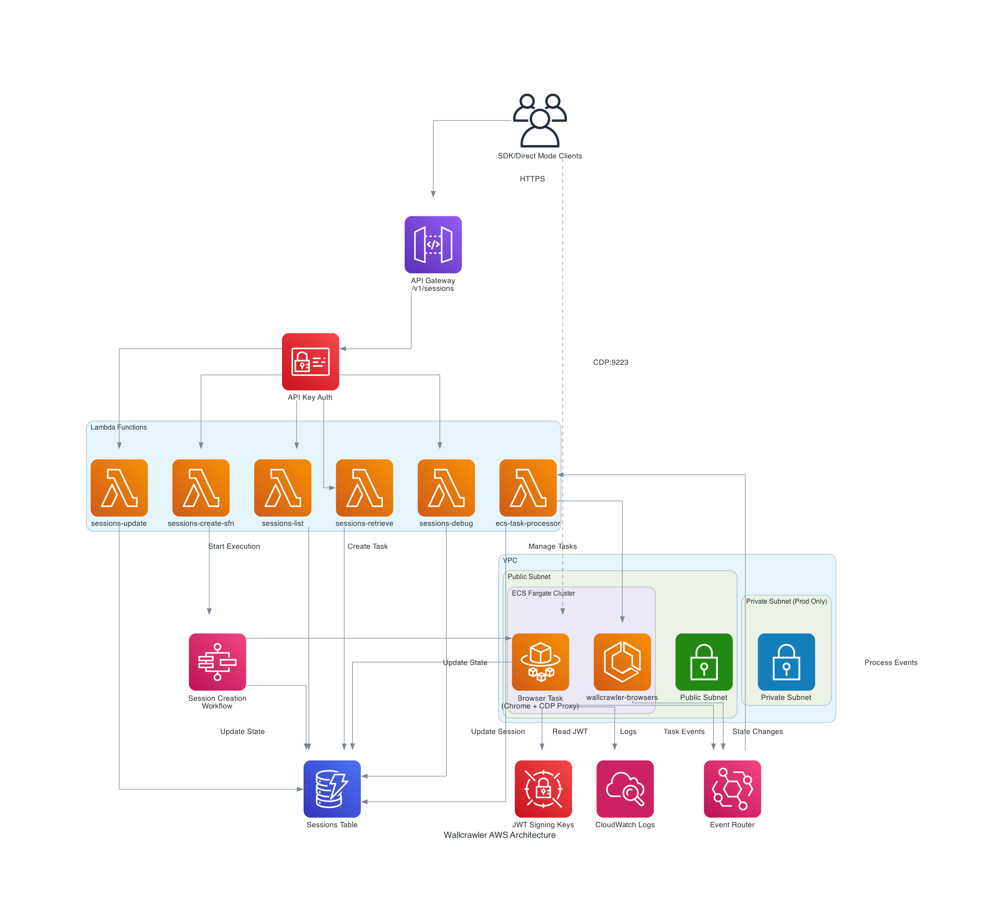

# Wallcrawler AWS Architecture

## Overview

Wallcrawler is a remote browser automation platform that provides Browserbase-compatible APIs for managing browser sessions in the cloud. The architecture leverages AWS services to create a scalable, secure, and cost-effective solution.

## Key Features

- **Browserbase-Compatible API**: Drop-in replacement for Browserbase SDK
- **Dual Access Modes**: REST API via SDK or Direct CDP connection
- **Auto-scaling**: Browser containers scale based on demand
- **Cost-Optimized**: Different configurations for dev/staging/production
- **Secure**: JWT authentication, VPC isolation, and API key management
- **Observable**: Comprehensive logging and monitoring via CloudWatch

## Architecture Diagram

The diagram shows the complete AWS architecture with proper AWS service icons and relationships. Key components include:

- **Client Access**: Both SDK and Direct CDP mode connections
- **API Gateway**: REST API with API key authentication
- **Lambda Functions**: Multiple functions for session management
- **Step Functions**: Orchestrates session creation workflow
- **ECS Fargate**: Runs browser containers with Chrome and CDP proxy
- **DynamoDB**: Stores session state with TTL
- **EventBridge**: Routes events between services
- **VPC**: Network isolation with public/private subnets

## Component Details

### API Gateway
- **Purpose**: RESTful API endpoint for all client interactions
- **Authentication**: API Key-based authentication with usage plans
- **Endpoints**: 
  - `/v1/sessions/*` - Browserbase-compatible session management
  - `/v1/contexts/*` - Context management endpoints
  - `/api/*` - Stagehand AI-powered endpoints

### Lambda Functions

#### SDK Handlers (Browserbase-compatible)
- **sessions-create-sfn**: Initiates session creation via Step Functions
- **sessions-list**: Lists all sessions with filtering support
- **sessions-retrieve**: Gets session details and status
- **sessions-debug**: Provides debug/live view URLs
- **sessions-update**: Updates session state (e.g., REQUEST_RELEASE)

#### Internal Handlers
- **ecs-task-processor**: Processes ECS task state changes and session events
- **sessions-start**: API mode session creation (Stagehand AI)

### Step Functions
- **Type**: Standard workflow (supports WAIT_FOR_TASK_TOKEN)
- **Purpose**: Orchestrates asynchronous session creation
- **Timeout**: 5 minutes per session creation

### ECS Fargate
- **Cluster**: Managed container cluster for browser instances
- **Task Definition**: 
  - CPU: 1024 (1 vCPU)
  - Memory: 2048 MiB
  - Container: Custom Go controller + Chrome with CDP
- **Networking**: 
  - Development: Public subnet only (no NAT costs)
  - Production: Private subnet with NAT Gateway

### DynamoDB
- **Table**: `wallcrawler-sessions`
- **Billing**: On-demand (pay per request)
- **Indexes**:
  - Primary: sessionId
  - GSI: projectId-createdAt (for project queries)
  - GSI: status-expiresAt (for active session queries)
- **TTL**: Automatic cleanup via `expiresAt` attribute

### Container Details
Each browser container includes:
- **Chrome Browser**: Headless Chrome with remote debugging
- **CDP Proxy** (Port 9223): Authenticated proxy for Chrome DevTools Protocol
- **Go Controller**: Manages browser lifecycle and session state
- **Auto-termination**: Containers self-terminate on CDP disconnect

## Data Flow

### Session Creation Flow
1. Client calls `POST /v1/sessions` with configuration
2. API Gateway triggers Step Functions workflow
3. Step Functions invokes `sessions-create-sfn` Lambda
4. Lambda creates DynamoDB entry and ECS task
5. ECS starts browser container with Chrome
6. Container notifies Step Functions of readiness
7. Step Functions returns session details to client

### Direct Mode Connection
1. Client receives `connectUrl` from session creation
2. Client connects directly to container port 9223
3. CDP Proxy validates JWT token
4. Proxy forwards CDP commands to Chrome (port 9222)
5. Container monitors connection health
6. On disconnect, container initiates cleanup

### Session Lifecycle Events
1. Container publishes events to EventBridge
2. EventBridge routes to `ecs-task-processor`
3. Lambda updates DynamoDB state
4. Lambda handles cleanup if needed

## Security Architecture

### Network Security
- **VPC Isolation**: All resources within custom VPC
- **Security Groups**: 
  - Lambda SG: Outbound only
  - ECS SG: Inbound on 9223, outbound all
- **Production**: Private subnets with NAT Gateway

### Authentication & Authorization
- **API Access**: API Key required for all endpoints
- **Direct Mode**: JWT token validation at CDP proxy
- **Secrets**: JWT signing key in AWS Secrets Manager
- **IAM Roles**: Least-privilege access for all components

### Data Protection
- **Encryption at Rest**: DynamoDB, Secrets Manager
- **Encryption in Transit**: HTTPS for API, TLS for CDP
- **No Persistent Storage**: Containers are ephemeral

## Environment Configurations

### Development (`dev`)
- **Cost Optimization**: ~$10/month
- No NAT Gateway (public subnets only)
- DynamoDB on-demand billing
- Minimal logging retention (1 week)

### Production (`prod`)
- **High Availability**: ~$60/month base
- NAT Gateway for private subnet egress
- Enhanced monitoring and logging
- Optional custom domain support

## Monitoring & Observability

### CloudWatch Logs
- Lambda execution logs
- Container stdout/stderr
- Step Functions execution history
- API Gateway access logs

### Metrics
- Lambda invocations and errors
- ECS task count and resource utilization
- DynamoDB read/write capacity
- API Gateway request count and latency

### Events
- Session lifecycle events via EventBridge
- ECS task state changes
- Lambda function errors

## Cost Breakdown

### Fixed Costs (Monthly)
| Component | Dev | Production |
|-----------|-----|------------|
| NAT Gateway | $0 | $45 |
| Load Balancer | $0 | $0 |
| Data Transfer | ~$1 | ~$5 |

### Variable Costs (Per Request)
- Lambda: $0.0000002 per request
- DynamoDB: $0.25 per million reads/writes
- ECS Fargate: $0.04/vCPU/hour + $0.004/GB/hour
- API Gateway: $3.50 per million requests

## Deployment

See [DEPLOYMENT.md](./DEPLOYMENT.md) for detailed deployment instructions.

## Future Enhancements

1. **Redis Integration**: Session metadata caching
2. **S3 Storage**: Screenshot and recording storage
3. **Multi-region**: Geographic distribution
4. **WebRTC**: Live session viewing
5. **Kubernetes**: Alternative to ECS for container orchestration