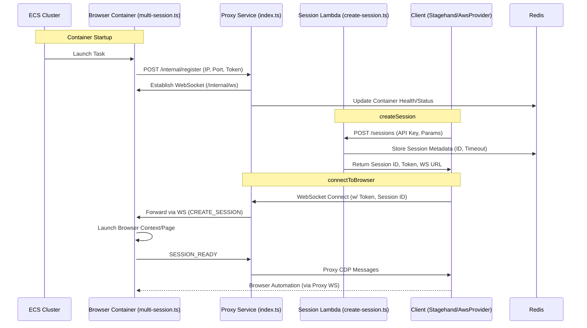

# WallCrawler AWS CDK

This package contains the AWS CDK code for deploying the WallCrawler infrastructure.

## Quick Start

1. Install dependencies:

   ```bash
   pnpm install
   ```

2. Build:

   ```bash
   pnpm build
   ```

3. Deploy:
   ```bash
   ./deploy.sh
   ```

For detailed architecture, see [ARCHITECTURE.md](./ARCHITECTURE.md).

## Architecture Flow

The following sequence diagram illustrates how components interact during container registration, session creation, and browser connection:



This flow shows how registration enables dynamic routing for sessions and connections.

## Environment Variables

- `CDK_DEFAULT_ACCOUNT`: AWS account ID
- `CDK_DEFAULT_REGION`: AWS region

## Context Parameters

Use with `cdk deploy --context key=value`:

- `environment`: dev/prod
- `projectName`: wallcrawler
- `allowedApiKeys`: comma-separated keys
- `maxSessionsPerContainer`: default 20

## Outputs

After deployment:

- APIUrl: Session management endpoint
- WebSocketUrl: Browser connection URL
- ECRRepositoryUri: For pushing container images

## Security

- **WAF Protection**: AWS WAF protects the ALB from common attacks
- **VPC Isolation**: All resources run in private subnets
- **Secrets Management**: Sensitive data stored in AWS Secrets Manager
- **JWE Token Encryption**: Session tokens are encrypted using JSON Web Encryption (JWE)
  - Symmetric encryption with A256GCM algorithm
  - Encryption key derived from shared secret using SHA-256
  - Provides both confidentiality and integrity
  - No KMS asymmetric keys required - simpler and more cost-effective

## Technology Stack

- **Runtime**: Node.js for container and Lambda execution (with optional Bun for specific components)
- **Container Orchestration**: AWS ECS Fargate
- **Browser Automation**: Playwright with Chromium
- **Token Security**: jose library for JWE symmetric encryption
- **Infrastructure**: AWS CDK v2 for infrastructure as code

## Development

### Prerequisites

- Node.js 18+ (for compatibility with Playwright)
- AWS CDK CLI
- AWS credentials configured

### Local Development

```bash
# Install dependencies
npm install

# Run CDK commands
npx cdk synth
npx cdk diff
npx cdk deploy
```

### Service Dependencies

Each service (proxy, container app, lambda) has its own package.json with specific dependencies:

- **Proxy Service**: Uses Bun runtime with jose for JWE token verification
- **Container App**: Playwright-based with Bun runtime
- **Lambda Functions**: Node.js runtime with shared dependencies layer
