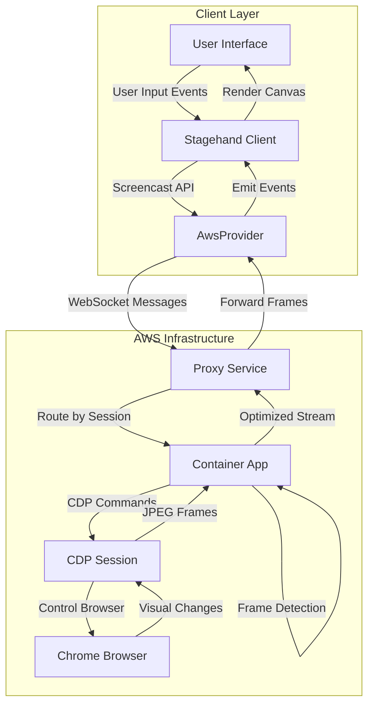
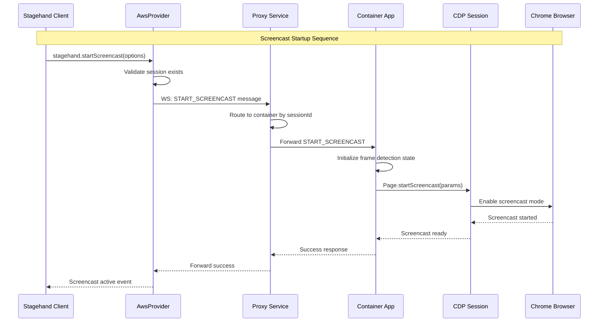
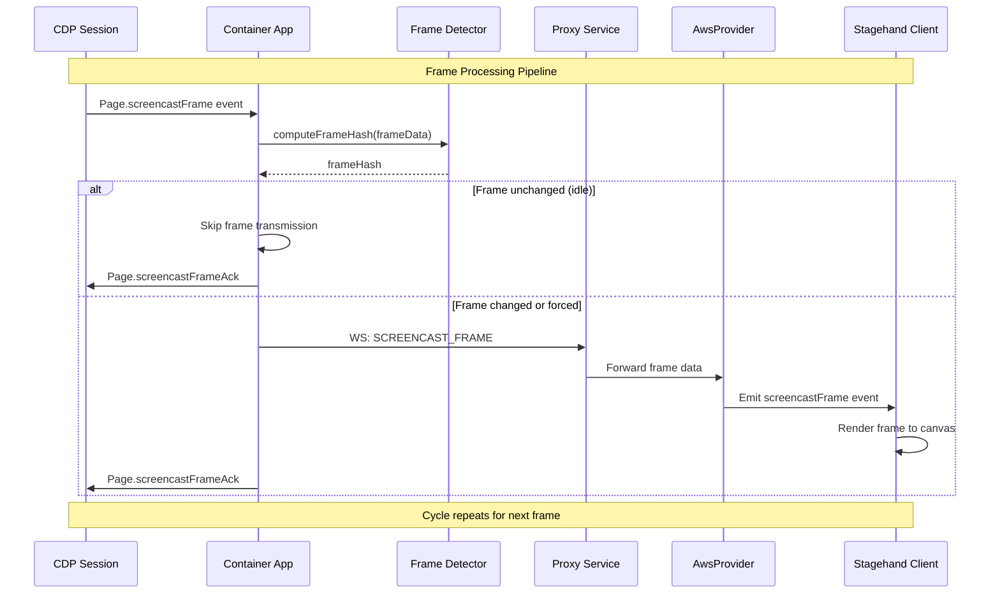
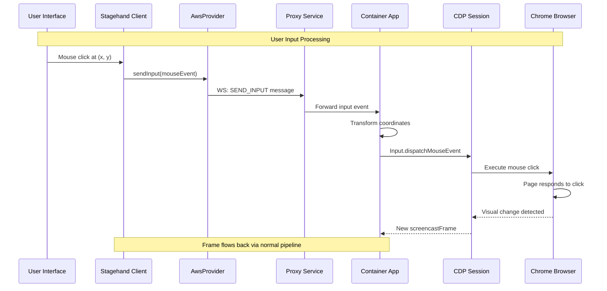
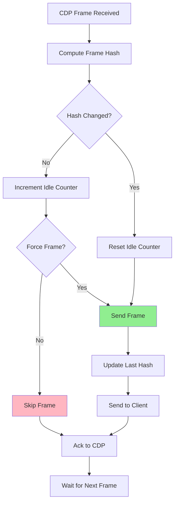

# WallCrawler Screencast Implementation Design

## Overview

This document outlines the implementation of low-latency browser screencasting with user interaction capabilities using Chrome DevTools Protocol (CDP). The solution provides real-time visual feedback for browser automation sessions while optimizing bandwidth by only streaming when page content changes.

## Architecture

### Core Components

1. **CDP Screencast**: Uses `Page.startScreencast` and `Page.stopScreencast` for JPEG frame capture
2. **Frame Change Detection**: Compares consecutive frames to avoid streaming identical content
3. **User Input Forwarding**: Captures mouse/keyboard events and forwards them via CDP
4. **WebSocket Messaging**: Extends existing two-hop WebSocket architecture
5. **Session Management**: Per-session screencast state with start/stop controls

### Key Benefits

- **Low Latency**: JPEG frames over WebSocket (~100-300ms end-to-end)
- **Bandwidth Optimization**: 50-90% reduction during idle periods
- **Real-time Interaction**: Mouse and keyboard input forwarding
- **Session Isolation**: Multi-session support with independent streams
- **Cost Efficiency**: Reduced AWS egress and container CPU usage

## System Architecture



## Message Protocol

### WebSocket Message Types

#### Screencast Control Messages

```typescript
// Start screencast
{
  type: 'START_SCREENCAST',
  sessionId: string,
  params: {
    quality?: number,        // JPEG quality 1-100 (default: 80)
    everyNthFrame?: number, // Frame sampling rate (default: 10)
    detectIdle?: boolean,   // Enable idle detection (default: true)
    idleThreshold?: number, // Change threshold 0-1 (default: 0.01)
    maxWidth?: number,      // Max frame width (default: 1024)
    maxHeight?: number      // Max frame height (default: 768)
  }
}

// Stop screencast
{
  type: 'STOP_SCREENCAST',
  sessionId: string
}
```

#### Frame Data Messages

```typescript
// Screencast frame (Container → Client)
{
  type: 'SCREENCAST_FRAME',
  sessionId: string,
  data: string,           // Base64 JPEG data
  metadata: {
    timestamp: number,
    offsetTop: number,
    offsetLeft: number,
    pageScaleFactor: number,
    deviceWidth: number,
    deviceHeight: number,
    scrollOffsetX: number,
    scrollOffsetY: number
  }
}

// Frame acknowledgment (Client → Container)
{
  type: 'SCREENCAST_FRAME_ACK',
  sessionId: string,
  ackId: number
}
```

#### User Input Messages

```typescript
// Mouse events
{
  type: 'SEND_INPUT',
  sessionId: string,
  event: {
    type: 'mousePressed' | 'mouseReleased' | 'mouseMoved',
    x: number,
    y: number,
    button?: 'left' | 'right' | 'middle',
    clickCount?: number,
    modifiers?: number
  }
}

// Keyboard events
{
  type: 'SEND_INPUT',
  sessionId: string,
  event: {
    type: 'keyDown' | 'keyUp' | 'char',
    text?: string,
    key?: string,
    code?: string,
    modifiers?: number
  }
}

// Scroll events
{
  type: 'SEND_INPUT',
  sessionId: string,
  event: {
    type: 'mouseWheel',
    x: number,
    y: number,
    deltaX: number,
    deltaY: number
  }
}
```

## Detailed Flow Diagrams

### 1. Screencast Initialization Flow



### 2. Frame Streaming with Idle Detection



### 3. User Interaction Flow



### 4. Bandwidth Optimization Strategy



## Implementation Details

### Frame Change Detection Algorithm

```typescript
interface FrameDetectionState {
  lastFrameHash: string | null;
  idleFrameCount: number;
  lastForcedTime: number;
  options: ScreencastOptions;
}

async function shouldSendFrame(frameData: string, state: FrameDetectionState): Promise<boolean> {
  const currentHash = await computeImageHash(frameData);
  const now = Date.now();

  // Always send first frame
  if (state.lastFrameHash === null) {
    state.lastFrameHash = currentHash;
    return true;
  }

  // Check for visual changes
  const hasChanged = currentHash !== state.lastFrameHash;

  // Force frame every 5 seconds to keep connection alive
  const shouldForce = now - state.lastForcedTime > 5000;

  if (hasChanged || shouldForce) {
    state.lastFrameHash = currentHash;
    state.idleFrameCount = 0;
    if (shouldForce) state.lastForcedTime = now;
    return true;
  }

  // Skip idle frame
  state.idleFrameCount++;
  return false;
}
```

### Input Coordinate Transformation

```typescript
function transformCoordinates(
  clientX: number,
  clientY: number,
  metadata: ScreencastMetadata,
  canvasWidth: number,
  canvasHeight: number
): { x: number; y: number } {
  // Scale coordinates from canvas to browser viewport
  const scaleX = metadata.deviceWidth / canvasWidth;
  const scaleY = metadata.deviceHeight / canvasHeight;

  return {
    x: clientX * scaleX + metadata.offsetLeft + metadata.scrollOffsetX,
    y: clientY * scaleY + metadata.offsetTop + metadata.scrollOffsetY,
  };
}
```

## Performance Characteristics

### Expected Metrics

| Metric                   | Target   | Notes                          |
| ------------------------ | -------- | ------------------------------ |
| Frame-to-Display Latency | <300ms   | End-to-end via WebSocket       |
| Bandwidth (Active)       | ~200KB/s | At 3fps, 80% quality           |
| Bandwidth (Idle)         | <10KB/s  | Heartbeat frames only          |
| CPU Overhead             | <10%     | Per container during streaming |
| Memory Usage             | <50MB    | Frame buffers and detection    |

### Bandwidth Optimization Results

- **Static Pages**: 90% reduction (login forms, documentation)
- **Slow Animation**: 60% reduction (loading spinners)
- **Fast Animation**: 20% reduction (videos, games)
- **Typing/Forms**: 70% reduction (intermittent changes)

## Error Handling and Edge Cases

### Connection Failures

1. **WebSocket Disconnect**: Automatically stop CDP screencast, cleanup state
2. **Container Restart**: Client receives disconnect event, can retry
3. **Proxy Failover**: Session routing ensures continuity

### Frame Processing Errors

1. **Hash Computation Failure**: Fall back to sending all frames
2. **Memory Pressure**: Reduce frame quality automatically
3. **CDP Errors**: Retry screencast startup with backoff

### Input Validation

1. **Coordinate Bounds**: Clamp to viewport dimensions
2. **Event Rate Limiting**: Prevent input flooding
3. **Session Validation**: Verify input sender matches session owner

## Security Considerations

### Input Validation

- Sanitize all input coordinates and event types
- Rate limit input events per session (max 50 events/second)
- Validate session ownership before processing inputs

### Frame Data Protection

- Screencast frames contain potentially sensitive page content
- Ensure HTTPS/WSS for all frame transmission
- No frame persistence beyond current session

### Access Control

- JWT validation for all screencast operations
- Session-based isolation prevents cross-session access
- Optional disable flag for security-sensitive environments

## Testing Strategy

### Unit Tests

1. **Frame Detection**: Test hash comparison and idle detection
2. **Input Transformation**: Verify coordinate mapping accuracy
3. **Message Routing**: Ensure proper WebSocket message handling

### Integration Tests

1. **End-to-End Latency**: Measure frame display time
2. **Bandwidth Measurement**: Validate idle optimization
3. **Multi-Session**: Concurrent screencast sessions

### Performance Tests

1. **Load Testing**: Multiple active streams
2. **Memory Profiling**: Frame buffer management
3. **CPU Monitoring**: Container resource usage

## Configuration Options

### Provider Configuration

```typescript
interface ScreencastConfig {
  enabled: boolean; // Enable screencast features
  maxConcurrentStreams: number; // Per container limit
  defaultQuality: number; // JPEG quality 1-100
  defaultFrameRate: number; // Frames per second
  idleDetection: boolean; // Enable bandwidth optimization
  maxFrameSize: {
    // Dimension limits
    width: number;
    height: number;
  };
}
```

### Runtime Options

```typescript
interface ScreencastOptions {
  quality?: number; // Override quality
  everyNthFrame?: number; // Frame sampling
  detectIdle?: boolean; // Idle detection
  idleThreshold?: number; // Change sensitivity
  maxWidth?: number; // Frame width limit
  maxHeight?: number; // Frame height limit
}
```

## Deployment Considerations

### Container Resources

- **CPU**: Add 0.2-0.5 vCPU per active stream
- **Memory**: Add 100-200MB per stream for frame buffers
- **Network**: Plan for 200KB/s per active stream

### Auto-scaling Triggers

- Monitor active screencast count in CloudWatch
- Scale containers based on stream density
- Alert on high bandwidth usage

### Cost Impact

- **Bandwidth**: ~$0.09/GB for AWS egress (10 hours = ~$0.60)
- **CPU**: Minimal increase in container costs
- **Storage**: No persistent storage required

This design provides a comprehensive foundation for implementing the screencast feature while maintaining the architectural integrity of WallCrawler's existing infrastructure.
